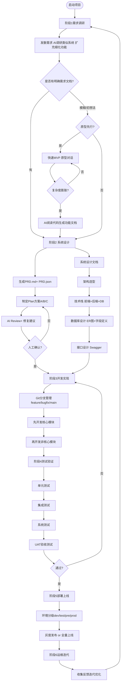
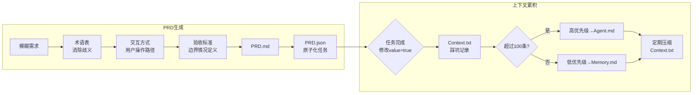

# Vibe-B App 开发 SOP — 团队标准化执行手册

> **目标**：将「To B 政务信息化小程序」这类项目从模糊想法落地为可交付系统，
> 为团队提供可复用的基准流程与 case 参考。
>
> **适用范围**：1～3 人小团队，政务 / 企业管理类 To B 小程序 / Web 系统
>
> **核心思想**：文档驱动 + 双层 AI 协作 + 原型先行 + 分层执行

---

## 一、方法论总览

### 1.1 两套模式的适用场景

| 场景 | 推荐模式 | 说明 |
|------|---------|------|
| 需求已基本明确（甲方有流程文档 / 对标系统） | **文档主导模式** | 直接走 SOP 六阶段，AI 辅助生成 PRD |
| 需求模糊，只有一个 idea | **原型先行模式** | 快速 MVP 验证可行性，再切换文档模式 |
| 需求模糊但复杂度快速膨胀 | **强制切换** | 原型对话膨胀 → 停止 → AI 阅读代码生成文档 → 切文档模式 |

### 1.2 双层 AI 协作模型

```
Layer 1（需求对接层）  ←→  人
  ↓ 产出：PRD.md + PRD.json
        │
Layer 2（全栈开发层）  ←→  人
  ↓ 产出：代码 + commit
        │
Layer 3（测试维护层）
  ↓ 产出：测试用例 + Review 清单
```

- **Layer 1**：AI + 人 发散需求 → 收敛为 PRD
- **Layer 2**：两个 AI 互相「制定计划 ↔ Review 修复」→ 人最终确认
- **Layer 3**：AI 设计测试 → 人 Review 清单确认

---

## 二、完整流程图（Mermaid）

### 2.1 总流程（文档主导模式）



### 2.2 Vibe Coding Layer 协作图

```mermaid
sequenceDiagram
    participant H as 人/产品经理
    participant L1 as Layer1 AI
    participant L2A as Layer2 AI-Plan
    participant L2B as Layer2 AI-Review
    participant L3 as Layer3 AI

    H->>L1: 模糊需求 + 产品背景
    L1-->>H: 调研类似系统 + 功能扩充
    H->>L1: 确认/修正方向
    L1-->>H: PRD.md + PRD.json（原子化任务清单）

    H->>L2A: 请给我3个方案（不含技术）
    L2A-->>H: 方案A/B/C 存为 md
    H->>L2B: 对方案提Review意见
    L2B-->>H: 修改建议
    H->>L2A: 审核并修改方案
    L2A-->>H: 最终方案 
    H->>L2A+L2B: 循环两轮以上 人工最终确认

    H->>L2A: 开始实现，Git分支管理
    L2A-->>H: commit代码（核心模块→非核心模块）
    Note over L2A: 边做边测单功能自测

    H->>L3: 设计测试，覆盖关键逻辑
    L3-->>H: 测试用例
    H->>L2A: 功能偏差则回头迭代

    H->>H: 人工Review清单确认
    H->>H: 最终合入main分支
```

### 2.3 PRD + 上下文累积机制



---

## 三、阶段执行标准（团队 SOP）

### 阶段1：需求调研与规划

**目标**：明确「做什么、为谁做、解决什么问题」

**标准动作**：
1. **发散需求**（Layer 1 AI 辅助）
   ```
   prompt：我现在在设计一个[系统类型]，需求如下：[功能草案]，
   请帮我①调研类似系统②扩充和细化功能。不要涉及技术内容。
   ```
2. 输出需求清单，分级：
   - **P0 核心需求**（必须上线）：直接影响业务流程的功能
   - **P1 非核心需求**（二期迭代）：报表、可视化、提醒等
3. 量化系统目标（如"订单处理效率提升50%"）
4. 明确范围边界（明确"做什么"和"不做什么"）

**产出**：`需求清单.md`

---

### 阶段2：系统设计（文档主导）

**目标**：输出可落地的《系统设计文档》

#### 业务设计
| 输出物    | 说明                   |
| ------ | -------------------- |
| 业务流程图  | 核心流程 + 节点职责 + 数据流转方向 |
| 功能模块拆分 | 按业务域拆分独立模块           |
| 核心实体定义 | 关键数据对象 + 属性          |

#### 技术设计

**架构选型决策树**：
```
小型系统（企业内部/简单工具）
  → 单体架构（Vue/React + SpringBoot/Flask + MySQL）

中大型系统（电商/平台型）
  → 微服务架构（Vue3/React+TS + Go/Java + MySQL主从+Redis + MQ/ES）

数据密集型（统计/分析平台）
  → 数仓/分布式架构
```

**技术栈推荐组合**（政务/To B 场景）：
```
前端：uni-app（TAM保证多端）+ Vue3/React
后端：Java/SpringBoot（稳定生态）或 Go（高性能）
数据库：MySQL + Redis（缓存）
部署：Docker + 轻量级编排（单节点用 DockerCompose，多节点用 K3s）
```

**数据库设计标准**：
- 按三范式设计
- 必须有 ER 图（实体关系图）
- 关键字段加索引（特别是外键 + 状态字段）
- 附字段定义表：字段名 | 类型 | 说明 | 约束

**接口设计标准**：
- 用 Swagger/OpenAPI 标准化，符合REST ful风格
- 接口文档必须包含：地址、请求方式、参数、返回值、错误码

**产出**：`系统设计文档.md`（含业务设计 + 技术设计两部分）

---

### 阶段3：PRD 生成（文档主导模式的核心）

#### `PRD.md` — 产品需求文档
```markdown
# [系统名称] PRD

## 1. 术语表
| 术语 | 定义 |
|------|------|
| [术语] | [消除歧义的详细定义] |

## 2. 交互方式
[用户如何与系统交互，操作路径]

## 3. 验收标准
### 3.1 核心功能
| 功能 | 验收条件 | 边界处理 |
|------|---------|---------|
| [功能名] | [可验证的通过条件] | [异常情况如何处理] |

### 3.2 非功能要求
[性能要求、兼容性要求、安全要求]
```

#### `PRD.json` — 原子化任务清单
```json
{
  "tasks": [
    {
      "id": "T-001",
      "module": "用户模块",
      "name": "用户注册",
      "description": "手机号+验证码注册",
      "value": false,
      "priority": "P0",
      "status": "todo"
    }
  ]
}
```

**上下文累积规则**：
- 每个任务完成时 `value: true`，并写 `context.txt` 记录踩坑
- `context.txt` 超过 100 条 → 重要项写 `agent.md`，其余压缩到 `memory.md`
- `context.txt` 定期清理，避免无限膨胀

---

### 阶段4：Plan + Review（Layer 2 AI 协作）

**强制双人 AI 机制，禁止单人 AI 独断**：

1. **AI-Plan 提出方案**（不含技术细节）
   ```
   prompt：给我3个[模块名]的实现方案，不涉及技术选型，
   只讨论业务逻辑和用户体验。存到 md，有不懂的问我。
   ```
2. **AI-Review 审查方案**
   ```
   prompt：对以上方案提出修改建议和潜在风险评估。
   ```
3. **AI-Plan 审核修改**
4. 循环 2 轮以上，**人工最终确认**后才进入实现

---

### 阶段5：开发实现

**Git 分支策略**：
```
main          （稳定可发布分支）
├── feature/  （新功能开发）
├── bugfix/   （Bug修复）
└── refactor/ （重构，不改功能）
```

**Commit 规范**：每个最小功能点单独 commit，commit message 清晰描述改动

**开发顺序**：核心模块 → 核心模块自测 → 非核心模块 → 集成

**高内聚低耦合原则**：
- 单模块功能聚焦
- 模块间依赖尽可能少
- 接口先行（先定义接口，再实现）

---

### 阶段6：测试验证

**AI 辅助测试设计**：
```
prompt：针对刚才的所有修改，设计测试用例，确保：
1. 简洁、可维护
2. 只覆盖关键逻辑
3. 关注系统的交界点，而不是系统内部实现细节
```

**测试分级**：

| 测试类型 | 执行者 | 通过标准 |
|---------|--------|---------|
| 单元测试 | 开发人员 | 单函数/单接口无 BUG |
| 集成测试 | 开发人员 | 模块间交互正常 |
| 系统测试 | 测试人员 | 还原真实业务场景 |
| UAT | 业务方/甲方 | 符合需求，操作便捷 |

**上线门槛**：UAT 通过 + 出具《验收报告》

---

### 阶段7：部署上线

**环境分级**：
```
dev（开发环境）→ test（测试环境）→ pre（预生产）→ prod（生产）
```

**部署方式**：
- 小型系统：直接 Docker 部署到云服务器（阿里云 ECS）
- 中大型系统：DockerCompose（单节点）或 K3s（多节点）

**上线策略**：灰度发布（先 10% 用户，无问题全量）

---

### 阶段8：运维与迭代

**日常运维检查清单**：
- [ ] 监控：服务器 CPU/内存/磁盘
- [ ] 数据库性能、接口响应时间
- [ ] 数据备份（全量 + 增量）
- [ ] 故障响应 SOP

**迭代循环**：
```
收集反馈 → 需求调研 → 设计 → 开发 → 测试 → 上线
```

---

## 四、强制切换规则

| 触发条件 | 切换动作 |
|---------|---------|
| 原型对话复杂度膨胀 | 停止对话 → AI 阅读代码生成功能文档 → 切换文档主导模式 |
| 需求文档与实现严重偏离 | 回退到阶段2，重新设计 |
| 测试失败率 > 30% | 回退到阶段4，AI 重新 Review |

---

## 五、文件命名规范

```
project/
├── PRD.md              # 产品需求文档
├── PRD.json            # 原子化任务清单
├── 系统设计文档.md      # 技术方案
├── context.txt         # 踩坑记录（实时更新）
├── agent.md            # 重要经验沉淀
├── memory.md           # 长期记忆
└── 项目日志.md          # 每日开发记录
```

---

## 六、避坑清单

| 序号 | 避坑项 | 后果 | 预防 |
|------|--------|------|------|
| 1 | 跳过需求调研直接开发 | 返工成本极高 | 必须输出需求清单 |
| 2 | 设计阶段模糊 | 理解偏差，功能不符合需求 | 必须有系统设计文档 |
| 3 | AI 方案无 Review | 方案缺陷未发现，后期难改 | 强制双 AI 循环 |
| 4 | 测试不充分直接上线 | 上线后 BUG 爆发 | UAT 验收报告是上线硬门槛 |
| 5 | 无运维规划 | 上线后故障无法处理 | 提前规划监控和备份 |
| 6 | context.txt 无限膨胀 | 重要经验被淹没 | 超过100条强制整理 |

---

## 七、项目启动 Checklist

- [ ] 明确需求类型（文档主导 OR 原型先行）
- [ ] 确定技术栈组合
- [ ] 创建 Git 仓库 + 分支策略
- [ ] 创建 PRD.md 骨架
- [ ] 创建 PRD.json 任务清单
- [ ] 确认监控系统已接入
- [ ] 确认部署环境已就绪
