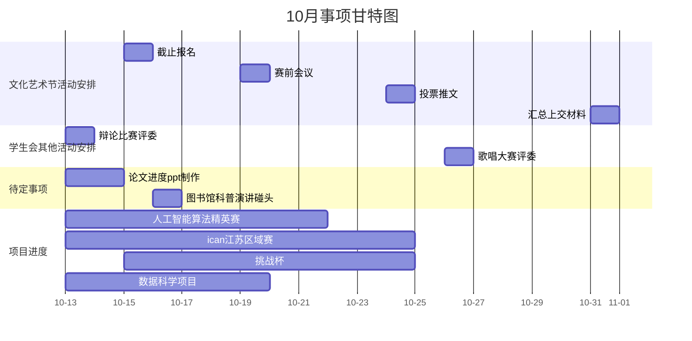

10.15截止报名发报名表到群确认（大学生文化艺术节）
10.19赛前会议开好假条（大学生文化艺术节）
10.24出投票推文（大学生文化艺术节）
10.24人工智能算法精英赛比赛交作品和材料（ppt未完成、原型没搭建好，先搞定数据集）
10.26晚 歌唱大赛评委
10.31汇总上交材料（大学生文化艺术节）
ican江苏区域赛不确定（可能25日线下区域赛）
挑战杯可能10月中旬

项目模块除了实时甘特图和看板，还有知识库（左边是侧边栏，按钮可以默认隐藏，点击后弹出所有项目文件夹，和项目清单相通，每个project是一个文件夹，里面的文件就是该项目的参考文献，点击参考文献就会显示pdf/md文件预览，也可以收起侧边栏全屏预览）