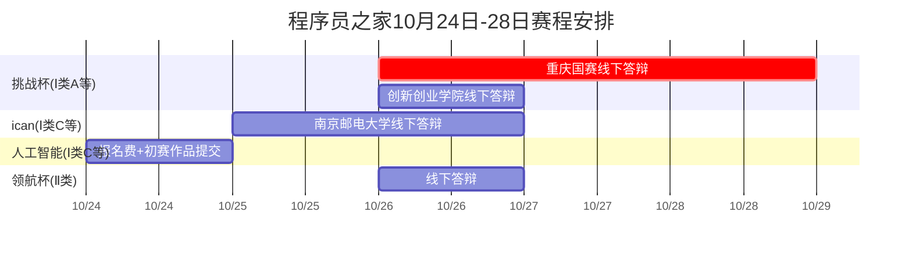

## 挑战杯(Ⅰ类A等)
![[Pasted image 20251015175907.png]]
### 参赛时间:
10月26日-28日（重庆国赛线下答辩）
10月26日创新创业学院线下答辩
10月28日重庆国赛线下答辩
### 参赛队伍:
==王凌宇乐==、曹磊、==许子祺==、==范晓雨==、费扬//（不干活）杨熙承、王雨欣、陈俊豪、夏思彤、刘岩
## ican(Ⅰ类C等)
![[Pasted image 20251015175805.png]]
### 参赛时间:
10月25日-26日（南京邮电大学）
10月25日到现场，==26日==现场答辩
### 参赛队伍:
王凌宇乐、许子祺、==黄加辰、彭云杰==、范晓雨（程序员之家）
==孙景阳、曹磊==（机器人）
## 人工智能算法精英赛(Ⅰ类C等)

![[Pasted image 20251015175839.png]]
### 参赛时间:
10月24日报名费+初赛作品提交//不着急
### 参赛队伍:
曹磊、许子祺、黄加辰
王凌宇乐、彭云杰、范晓雨
## 领航杯(Ⅱ类)
![[Pasted image 20251015174810.png]]
### 参赛时间:
10月==26日==参加线下答辩
### 参赛队伍:
曹磊、许子祺、黄加辰、==何彦葵==//（不干活）王雨欣、陈俊豪
王凌宇乐、彭云杰、范晓雨、杨熙承

