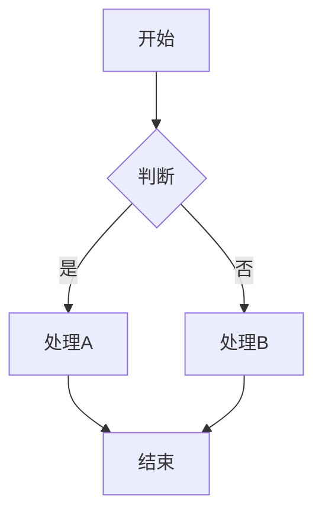
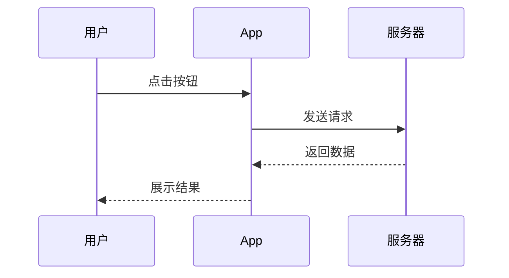
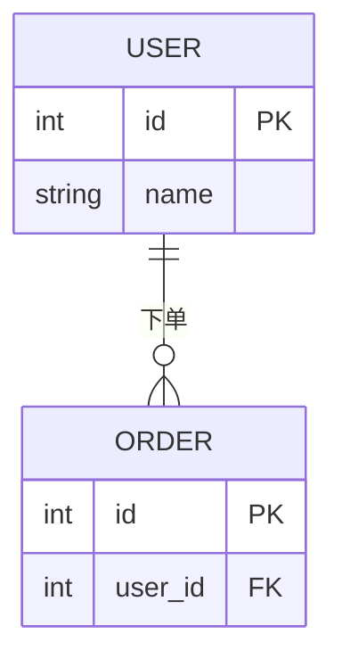

# 文档编写规范

## 1. 通用规范

### 1.1 文档元信息

每个文档必须在开头包含以下元信息：

```markdown
# {文档标题}

> **文档版本**: v{主版本}.{次版本}
> **更新日期**: YYYY-MM-DD
> **所属项目**: 考验英语App
> **文档状态**: 草稿/审核中/已发布
```

### 1.2 变更记录

所有正式文档必须包含变更记录表：

```markdown
## 变更记录

| 版本 | 日期 | 变更内容 | 作者 |
|------|------|----------|------|
| v1.0 | 2026-03-05 | 初始版本 | {作者} |
| v1.1 | 2026-03-10 | 修订{具体内容} | {作者} |
```

### 1.3 文件命名

```
# 正式文档
XXX-文档类型.md                    # 如: 001-BRD.md, 005-PRD.md

# 草稿文档
[DRAFT]-描述.md                    # 如: [DRAFT]-新功能想法.md

# 归档文档
[日期]-原文件名.md                 # 如: [2026-02-20]-005-PRD-v1.md

# 分析文档
[类型]-主题.md                     # 如: [分析]-用户留存率.md
```

---

## 2. 格式规范

### 2.1 标题层级

```markdown
# 一级标题 - 文档标题
## 二级标题 - 主要章节
### 三级标题 - 子章节
#### 四级标题 - 小节
```

**规则**:
- 一级标题只能有一个（文档标题）
- 层级不能跳跃（如不能从二级直接到四级）
- 同级标题之间要有逻辑关系

### 2.2 表格规范

```markdown
| 列名1 | 列名2 | 列名3 |
|-------|-------|-------|
| 数据1 | 数据2 | 数据3 |
| 数据4 | 数据5 | 数据6 |
```

**规则**:
- 表头使用中文，清晰易懂
- 数据左对齐，数字右对齐
- 复杂表格需加说明

### 2.3 列表规范

```markdown
## 无序列表
- 项目1
- 项目2
  - 子项目2.1
  - 子项目2.2

## 有序列表
1. 步骤1
2. 步骤2
3. 步骤3

## 任务列表
- [x] 已完成任务
- [ ] 未完成任务
```

---

## 3. 图表规范

### 3.1 Mermaid图表

统一使用Mermaid语法绘制图表：

**流程图**:


**时序图**:


**ER图**:


### 3.2 ASCII图表

当Mermaid不适用时，使用ASCII图表：

```
┌─────────────────────────────────────┐
│  页面标题                            │
├─────────────────────────────────────┤
│                                     │
│  ┌─────┐  ┌─────┐  ┌─────┐         │
│  │  A  │  │  B  │  │  C  │         │
│  └─────┘  └─────┘  └─────┘         │
│                                     │
└─────────────────────────────────────┘
```

---

## 4. 链接规范

### 4.1 内部链接

使用Wiki链接格式引用项目内文档：

```markdown
- [[000-项目one-page]]
- [[005-功能需求分析文档（PRD）]]
- [[Agent.md#术语表]]
```

### 4.2 外部链接

外部链接使用标准Markdown格式：

```markdown
[Mermaid语法参考](https://mermaid.js.org/)
```

---

## 5. 术语规范

### 5.1 术语表

每个主要文档应包含术语表：

```markdown
## 术语表

| 术语 | 英文 | 定义 |
|------|------|------|
| 间隔重复 | Spaced Repetition | 依据记忆曲线，在即将遗忘时复习 |
| 掌握率 | Mastery Rate | 用户对该单词形成长期记忆的比例 |
```

### 5.2 术语使用

- 首次出现术语时，应给出全称和简称
- 全文统一使用相同的术语表达
- 避免混用同义词（如"用户"和"客户"要统一）

---

## 6. 代码规范

### 6.1 代码块

代码块需指定语言：

```markdown
```typescript
interface User {
  id: number;
  name: string;
}
```

```sql
SELECT * FROM users WHERE id = 1;
```

```dart
class User {
  final int id;
  final String name;
}
```
```

### 6.2 伪代码

伪代码使用text或无语言标识：

```markdown
```
开始
  初始化变量
  循环处理每个元素
    执行操作
  结束循环
  返回结果
结束
```
```

---

## 7. 文档结构模板

### 7.1 PRD文档结构

```markdown
1. 概述
   1.1 背景
   1.2 目标
   1.3 范围
2. 需求分析
   2.1 用户故事
   2.2 用户场景
3. 功能设计
   3.1 功能结构
   3.2 业务流程
   3.3 页面流转
4. 交互设计
   4.1 界面原型
   4.2 交互规则
   4.3 状态定义
5. 数据设计
   5.1 数据实体
   5.2 数据关系
6. 非功能需求
7. 验收标准
8. 附录
```

### 7.2 分析报告结构

```markdown
1. 分析背景
2. 数据说明
3. 核心发现
4. 详细分析
5. 结论与建议
6. 附录
```

---

## 8. 质量检查清单

发布前检查：

- [ ] 元信息完整（版本、日期、状态）
- [ ] 变更记录已更新
- [ ] 标题层级正确
- [ ] 表格格式正确
- [ ] 图表可渲染
- [ ] 链接有效
- [ ] 术语统一
- [ ] 代码块指定语言
- [ ] 无错别字
