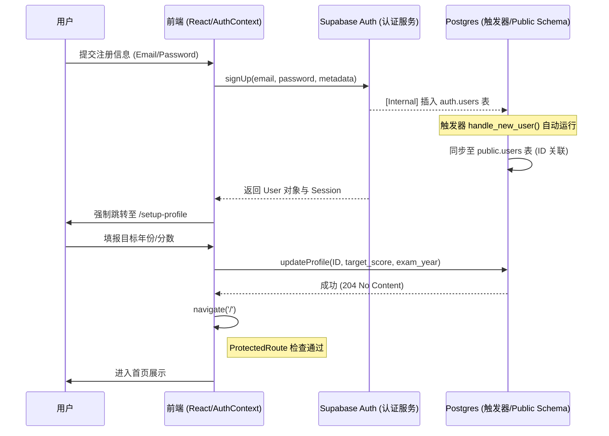

## 1. 产品核心愿景与业务架构 (Vision & Architecture)

### 1.1 产品使命
本项目致力于为考研学子提供"最具确定感"的英语备考解决方案。在信息泛滥的时代，我们通过"真题指引学习"的核心哲学，将 5500 个大纲词汇、历年真题精读与碎片化语法体系进行有机的逻辑耦合。产品不仅是一个记忆工具，更是一个基于行为数据驱动的"上岸概率预测器"。我们的愿景是：让每一次点击都产生考分上的真实反馈。

### 1.2 系统分层模型 (Layered Model)
- **引导层 (Onboarding Layer):** 用户注册后的目标冷启动。通过设定 target_score 与 exam_year，系统自动在 `users` 表中锚定用户的成长基准线。
- **调度层 (Scheduling Layer):** SM-2 间隔重复算法，负责全系统 5500 词库的复习频率分发，动态调整每个 `vocab_progress` 记录的 `next_review_at`。
- **内容层 (Content Layer):** 包含 `words`、`reading_articles`、`grammar_points` 三大静态资源池，支持 Markdown 高级渲染与跨表关联。
- **业务逻辑层 (Business Logic Layer):** 封装在 `src/services/` 下的 async 方法集，通过 Supabase Client 直接与 PostgreSQL 交互。
- **表现层 (Interaction Layer):** 采用 React + TailwindCSS + Framer Motion 打造的具有"苹果风"美感的交互界面。

---

## 2. 核心功能模块详尽说明 (Detailed Feature List)

### 2.1 用户认证与个人中心 (Authentication & Profile)

#### 2.1.1 核心业务逻辑架构图

#### 2.1.2 关键原理与技术实现
- **账号同步原理 (Sync Principle)**: 为了保证数据一致性但不牺牲性能，采用 **Security Definier** 触发器。当 `auth.users` 产生新行时，Postgres 内部自动在 `public.users` 创建对应 ID 的 Profile，解决了 RLS 权限初始化的死锁。
- **状态持久化 (State Persistence)**: 采用 `onAuthStateChange` 监听会话。所有的业务逻辑（背词、阅读）均依赖于 Context 中 `user.id` 的存在。
- **异常边界逻辑 (Error Boundaries)**:
    - **Email Rate Limit**: Supabase 免费版限制每小时发送约 3-5 封验证邮件。若短时间内重复注册，会触发 `email rate limit exceeded`。
    - **Session Race Condition**: 在 `SetupProfile` 完成前，系统会处于 "未初始化" 挂起状态，由 `isInitialized` 旗标控制加载动画，防止未同步完成前跳转。

#### 2.1.3 功能清单
| 子功能 | 详细描述 | 业务规则 | 优先级 |
|-------|---------|---------|-------|
| 登录/注册 | 支持邮件 + 密码的注册方式。 | 注册后必须强制引导进入 SetupProfile 完善学习目标。 | P0 |
| 目标设定 | 选择报考年份、英语一/二、目标分数。 | 分数直接影响 Dashboard 中的目标达成率环形图。 | P0 |
| 系统设置 | 主题切换（亮色/护眼）、退出登录、账号注销。 | 护眼模式通过 ThemeContext 实现全局 `sepia` 滤镜叠加。 | P1 |

### 2.2 智能背词引擎 (Vocab Learning Engine)
| 子功能 | 详细描述 | 交互逻辑 | 优先级 |
|-------|---------|---------|-------|
| 每日学习库生成| 每天 4:00 AM 系统自动结算并生成包含"旧词复习"与"今日新词"的任务池。 | 优先拉取 `next_review_at < now()` 的词。 | P0 |
| 单词全景卡片 | 展示词性、释义、UK/US 音标播放、真题例句溯源。 | 上滑不认识，右滑认识，下滑模糊。 | P0 |
| 聚焦听词模式 | 无干扰音频洗脑流，循环次数 5-20 次可选。 | 自动切词，支持后台播放以适配通勤场景。 | P0 |
| 拼写强化库 | 针对标记为 `difficult` 的词，强制进行全拼写校验。 | 错误即清空输入框，连续三次正确方可通关。 | P1 |

### 2.3 真题精读精练 (Advanced Reading System)
| 子功能 | 详细描述 | 交互逻辑 | 优先级 |
|-------|---------|---------|-------|
| 真题一站式列表| 按年份（1997-2025）和题号（Text 1-4）分类检索。 | 支持按"文章主旨/主题词"进行全局模糊搜索。 | P1 |
| 深度精读视图 | 支持 Markdown 原文阅读，核心词汇高亮标识。 | 点击文中单词，即刻弹出半屏 VocabCard 浮层。 | P1 |
| 长难句语法哨兵| 标注文中超长句，支持一键查看句法结构图解。 | 通过彩色块标注：主句（红）、从句（绿）、非谓语（蓝）。 | P1 |
| 在线答题解析 | 模拟正式机考场景，完成课后测试获得文章评分。 | 提交后展示全卷翻译、选项陷阱深度剖析。 | P2 |

---

## 3. 用户故事场景分析 (User Stories: Given-When-Then)

### 3.1 词汇记忆场景：对抗遗忘

**[User Story 1 - 科学复习]**
- **Given:** 晓雯在 4 天前学习了 "infrastructure" 并选择了"认识"。
- **When:** 根据 SM-2 算法逻辑，本词今天应出现在复习列表顶部。
- **Then:** 她若再次选择"认识"，系统应自动更新 `interval_days` 为 7 天；若选择"模糊"，则重置为 1 天。

**[User Story 2 - 场景联动]**
- **Given:** 小赵在读阅读文章，遇到一个标记为"已掌握"但记不起来的词。
- **When:** 他长按该词。
- **Then:** 底层逻辑应将其从 "mastered" 状态撤回至 "learning" 状态，并强制加入到明天的复习流。

---

### 3.2 学习看板场景：量化进步

**[User Story 3 - 连续打卡激励]**
- **Given:** 用户小陈已经连续学习了 30 天。
- **When:** 他点击打开 `Dashboard.tsx` 页面。
- **Then:** 系统应渲染一份带有其"打卡热力图"的月度成就报告，并允许其点击生成一张带有考研金句的分享卡片。

**[User Story 4 - 能力预警]**
- **Given:** 用户发现看板中的"掌握率"红点显示。
- **When:** 鼠标悬浮查看详情。
- **Then:** 系统分析其 `vocab_progress` 数据，给出建议："近期新词学习过快，建议本周开启 2 天纯复习模式"。

---

## 4. 详细验收标准与质量指标 (Acceptance Criteria)

### 4.1 核心业务验收标准 (AC List)
- **AC-1:** 背词卡片的前后翻转、状态提交响应时间必须稳定在 **< 60ms**，确保无任何跟手迟滞感。
- **AC-2:** `vocabService` 必须能正确处理网络中断。若请求由于 408/500 失败，必须有 UI 级提示并自动尝试重新提交。
- **AC-3:** 真题阅读页面的点击查词命中区域应有适度的 Padding，避免在大屏手机上难以点击。
- **AC-4:** 每日结算生成的打卡日期必须取自 Supabase 服务端时间 `now()`，防止用户手动修改手机本地时间。

### 4.2 性能与安全性指标 (NFR)
- **Lighthouse Score:** 性能打分应保持在 90+（使用 Vite 的按需加载和 Gzip 压缩）。
- **SQL 安全:** 所有针对 Supabase 的调用必须符合 RLS 策略 `(auth.uid() = user_id)`，严禁越权。
- **防抖防刷:** 结算提交接口（PATCH `users`）必须加设频率限制，单分钟内不得超过 5 次。

---

## 5. 详细页面逻辑与界面流转 (UI Logic)

### 5.1 背词学习流
1.  **Entrance:** 首页点击 "今日任务"。
2.  **Fetch:** `VocabHome.tsx` 调用 `vocabService.getProgress()` 确认任务量。
3.  **Loading:** 展示 Skeleton 骨架屏（避免白屏焦虑）。
4.  **Learning:** `VocabCard.tsx` 页面采用 `Framer Motion` 的 `AnimatePresence` 处理卡片划走动画。
5.  **Completion:** 全部刷完后，组件触发 `confetti` 纸屑渲染并跳转至 `DailySettlement.tsx`。

### 5.2 个人资料更新流
1.  **Detail:** 进入 `ProfileSettings.tsx` 修改目标分数。
2.  **Verify:** 实时校验输入是否为 0 - 100 之间的整数。
3.  **Submit:** 调佣 `AuthContext.updateUser`。
4.  **Sync:** 更新全局 Context 状态，Home 页面的环形进度条自动重算百分比。

---

## 6. 全局数据字典与字段规则 (Data Dictionary)

| 物理字段 | 业务名称 | 存储类型 | 校验规则 | 说明 |
|---------|---------|---------|---------|------|
| `target_score` | 目标分数 | Integer | 0 <= score <= 100 | 决定仪表盘目标百分比分母。 |
| `continuous_days`| 连续天数 | Integer | >= 0 | 系统基于 date 时间戳判断连续性。 |
| `is_read` | 通知未读 | Boolean | Default false | 改为 true 后标记消红点。 |
| `definitions` | 单词释义 | JsonB | Key : 'pos', 'zh' | 方便前端一键 map 渲染列表。 |
| `ease_factor` | SM-2 因子 | Numeric | 1.3 <= ef <= 2.5 | 决定复习周期的衰减速度。 |

---

## 7. 异常场景处理与系统鲁棒性 (Error Handling)

- **场景 1: 服务器连接超时 -** 展示全局通知栏，标记为"离线背词模式"，将操作缓存于 `sessionStorage`。
- **场景 2: 登录 Token 过期 -** 组件层捕获 `401` 错误后，展示登录过期对话框，点击跳转回 `/login` 并带上当前路由作为 `redirect_url`。
- **场景 3: 数据库限流 -** 当并发请求过高时，展示"系统繁忙"占位符，UI 层增加随机退避算法重试。

## 8. 扩展性及未来 Roadmap 规划

- **Phase 3 (2026 Q3):** 整合 OpenAI GPT-4o-mini API，上线"作文实时润色"功能。
- **Phase 4 (2026 Q4):** 推出 PWA 离线版，支持在没有任何公网信号的自习室地下室仍可背词。
- **Phase 5 (2027 Q1):** 建立研友社区，允许将自己的 `favorites` 收藏列表一键导出并分享给他人。

---

## 9. 验收签字确认 (AC Confirmation)
*本 PRD 需经过 UI 设计师、前端负责人及后端架构师三方联合评审确认，并签字。*
- [ ] UI 符合 Rich Aesthetics 设计审美。
- [ ] 算法符合 SM-2 科学记忆逻辑。
- [ ] 数据库权限策略 100% 覆盖。