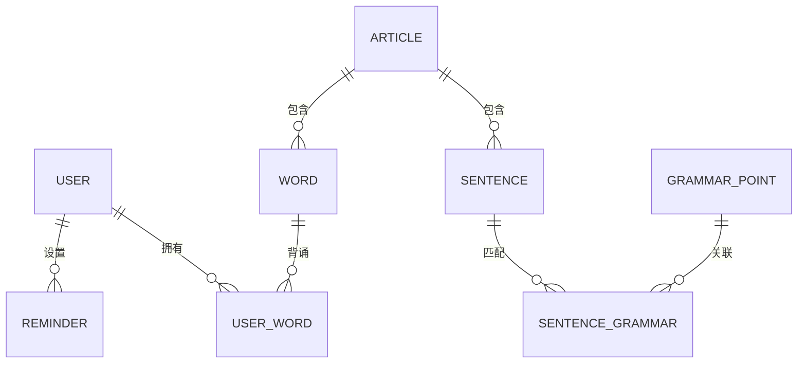

# 006 - 数据库设计

> 文档版本：v1.0 | 更新日期：2026-02-18 | 所属项目：考验英语App

---

## 一、数据库概览

本项目使用 **PostgreSQL** (通过 Supabase 托管) 作为数据库，8个核心实体表，关系型设计。

### ER 图



### 表清单

| 序号 | 表名 | 说明 |
|------|------|------|
| 1 | profiles | 用户表（Supabase Auth 集成） |
| 2 | articles | 真题阅读文章（95篇） |
| 3 | sentences | 句子表（文章逐句） |
| 4 | words | 单词表（来自真题） |
| 5 | user_words | 用户背词记录（核心表） |
| 6 | grammar_points | 语法3.0知识点 |
| 7 | sentence_grammar | 句子-语法关联表 |
| 8 | reminders | 学习提醒表 |

---

## 二、详细表结构

### 1. profiles 用户表 (与 Supabase Auth 集成)

```sql
CREATE TABLE profiles (
    id UUID REFERENCES auth.users ON DELETE CASCADE PRIMARY KEY,
    nickname VARCHAR(50) DEFAULT '考研er',
    exam_type VARCHAR(10) DEFAULT '英语一',  -- 英语一/英语二
    target_year INTEGER DEFAULT 2026,        -- 目标考研年份
    avatar_url TEXT,
    created_at TIMESTAMP WITH TIME ZONE DEFAULT NOW(),
    updated_at TIMESTAMP WITH TIME ZONE DEFAULT NOW(),
    settings JSONB DEFAULT '{}'::jsonb       -- {"reminder_morning": "07:30", ...}
);
```

| 字段 | 类型 | 说明 |
|------|------|------|
| id | INTEGER | 主键，自增 |
| nickname | VARCHAR(50) | 用户昵称，默认"考研er" |
| exam_type | VARCHAR(10) | 备考类型：英语一/英语二 |
| target_year | INTEGER | 目标考研年份 |
| created_at | DATETIME | 注册时间 |
| last_active | DATETIME | 最后活跃时间 |
| settings | TEXT | 用户设置JSON |

---

### 2. articles 真题阅读文章表

```sql
CREATE TABLE articles (
    id SERIAL PRIMARY KEY,
    title VARCHAR(200) NOT NULL,              -- "2024年英语一阅读Text 1"
    exam_year INTEGER NOT NULL,               -- 2024
    exam_type VARCHAR(10) NOT NULL,           -- 英语一/英语二
    category VARCHAR(20),                     -- 题型：text1/text2/text3/text4/完形/新题型/翻译
    full_text TEXT NOT NULL,                  -- 原文全文
    translation TEXT,                         -- 中文译文（可选）
    difficulty VARCHAR(10) DEFAULT '中等',    -- 简单/中等/较难
    word_count INTEGER DEFAULT 0,
    created_at TIMESTAMP WITH TIME ZONE DEFAULT NOW()
);
```

| 字段 | 类型 | 说明 |
|------|------|------|
| id | INTEGER | 主键 |
| title | VARCHAR(200) | 文章标题 |
| exam_year | INTEGER | 真题年份 |
| exam_type | VARCHAR(10) | 英语一/英语二 |
| category | VARCHAR(20) | 题型分类 |
| full_text | TEXT | 原文 |
| translation | TEXT | 译文 |
| difficulty | VARCHAR(10) | 难度 |
| created_at | DATETIME | 创建时间 |

**索引**：
```sql
CREATE INDEX idx_article_year ON article(exam_year);
CREATE INDEX idx_article_type ON article(exam_type);
```

---

### 3. sentences 句子表

```sql
CREATE TABLE sentences (
    id SERIAL PRIMARY KEY,
    article_id INTEGER NOT NULL REFERENCES articles(id) ON DELETE CASCADE,
    sentence_order INTEGER NOT NULL,          -- 句子在文章中的顺序
    content TEXT NOT NULL,                    -- 英文原句
    translation TEXT,                         -- 中文翻译
    keywords JSONB DEFAULT '[]'::jsonb,       -- 关键词：["word1", "word2"]
    created_at TIMESTAMP WITH TIME ZONE DEFAULT NOW()
);
```

| 字段 | 类型 | 说明 |
|------|------|------|
| id | INTEGER | 主键 |
| article_id | INTEGER | 外键，关联article |
| sentence_order | INTEGER | 句子序号 |
| content | TEXT | 英文原句 |
| translation | TEXT | 中文翻译 |
| keywords | TEXT | 关键词JSON数组 |

**索引**：
```sql
CREATE INDEX idx_sentence_article ON sentence(article_id);
```

---

### 4. words 单词表

```sql
CREATE TABLE words (
    id SERIAL PRIMARY KEY,
    word VARCHAR(100) NOT NULL UNIQUE,        -- 单词原形
    phonetic_uk VARCHAR(100),                 -- 英式音标
    phonetic_us VARCHAR(100),                 -- 美式音标
    meaning_zh TEXT NOT NULL,                 -- 中文释义（真题常考义）
    difficulty VARCHAR(10) DEFAULT '中等',    -- 简单/中等/较难
    frequency INTEGER DEFAULT 0,              -- 真题中出现频率
    created_at TIMESTAMP WITH TIME ZONE DEFAULT NOW()
);

-- 单词-文章关联表（一个单词可能出现在多篇文章）
CREATE TABLE word_articles (
    word_id INTEGER NOT NULL REFERENCES words(id) ON DELETE CASCADE,
    article_id INTEGER NOT NULL REFERENCES articles(id) ON DELETE CASCADE,
    PRIMARY KEY (word_id, article_id)
);
```

**索引**：
```sql
CREATE INDEX idx_words_word ON words(word);
```

---

### 5. user_words 用户背词记录表（核心表）

```sql
CREATE TABLE user_words (
    id SERIAL PRIMARY KEY,
    user_id UUID NOT NULL REFERENCES auth.users ON DELETE CASCADE,
    word_id INTEGER NOT NULL REFERENCES words(id) ON DELETE CASCADE,
    source_article_id INTEGER REFERENCES articles(id) ON DELETE SET NULL,
    source_sentence_id INTEGER REFERENCES sentences(id) ON DELETE SET NULL,

    -- 学习状态
    status VARCHAR(20) DEFAULT 'new',         -- new/learning/reviewing/mastered
    show_count INTEGER DEFAULT 0,             -- 展示次数（3-10次）

    -- 记忆曲线
    mastery_level INTEGER DEFAULT 0,          -- 掌握等级 0-5
    mastered BOOLEAN DEFAULT FALSE,           -- 是否已掌握

    -- 时间线
    learned_at TIMESTAMP WITH TIME ZONE,
    last_reviewed_at TIMESTAMP WITH TIME ZONE,
    next_review_at TIMESTAMP WITH TIME ZONE,

    -- 拼写统计
    spelling_correct_count INTEGER DEFAULT 0,
    spelling_error_count INTEGER DEFAULT 0,
    is_spelling_error BOOLEAN DEFAULT FALSE,  -- 当前是否拼写错误（触发高频复习）

    created_at TIMESTAMP WITH TIME ZONE DEFAULT NOW(),
    UNIQUE(user_id, word_id)
);
```

| 字段 | 类型 | 说明 |
|------|------|------|
| id | INTEGER | 主键 |
| user_id | INTEGER | 用户ID |
| word_id | INTEGER | 单词ID |
| source_article_id | INTEGER | 来源文章 |
| source_sentence_id | INTEGER | 来源句子 |
| status | VARCHAR(20) | 学习状态 |
| show_count | INTEGER | 展示次数 |
| mastery_level | INTEGER | 掌握等级(0-5) |
| mastered | BOOLEAN | 是否掌握 |
| learned_at | DATETIME | 首次学习时间 |
| last_reviewed_at | DATETIME | 最后复习时间 |
| next_review_at | DATETIME | 下次复习时间 |
| spelling_correct_count | INTEGER | 拼写正确次数 |
| spelling_error_count | INTEGER | 拼写错误次数 |
| is_spelling_error | BOOLEAN | 当前是否拼写错误 |

**索引**：
```sql
CREATE INDEX idx_user_words_user ON user_words(user_id);
CREATE INDEX idx_user_words_next_review ON user_words(next_review_at);
CREATE INDEX idx_user_words_status ON user_words(status);
```

---

### 6. grammar_points 语法3.0知识点表

```sql
CREATE TABLE grammar_points (
    id SERIAL PRIMARY KEY,
    point_name VARCHAR(100) NOT NULL,         -- "定语从句"
    category VARCHAR(50) NOT NULL,            -- 大类：从句/非谓语/虚拟语气/倒装/...
    sub_category VARCHAR(50),                 -- 子类
    content_md TEXT NOT NULL,                 -- Markdown格式语法内容
    examples JSONB DEFAULT '[]'::jsonb,       -- 例句：[{en, zh}, ...]
    keywords JSONB DEFAULT '[]'::jsonb,       -- 匹配关键词：["which", "that", "whom"]
    difficulty VARCHAR(10) DEFAULT '中等',
    created_at TIMESTAMP WITH TIME ZONE DEFAULT NOW()
);
```

| 字段 | 类型 | 说明 |
|------|------|------|
| id | INTEGER | 主键 |
| point_name | VARCHAR(100) | 知识点名称 |
| category | VARCHAR(50) | 大类 |
| sub_category | VARCHAR(50) | 子类 |
| content_md | TEXT | Markdown内容 |
| examples | TEXT | 例句JSON |
| keywords | TEXT | 关键词JSON |
| difficulty | VARCHAR(10) | 难度 |

---

### 7. sentence_grammar 句子-语法关联表

```sql
CREATE TABLE sentence_grammar (
    id SERIAL PRIMARY KEY,
    sentence_id INTEGER NOT NULL REFERENCES sentences(id) ON DELETE CASCADE,
    grammar_point_id INTEGER NOT NULL REFERENCES grammar_points(id) ON DELETE CASCADE,
    match_type VARCHAR(20) DEFAULT 'keyword', -- keyword/ai/manual
    match_score REAL DEFAULT 0.8,             -- 匹配置信度 0.0-1.0
    created_at TIMESTAMP WITH TIME ZONE DEFAULT NOW(),
    UNIQUE(sentence_id, grammar_point_id)
);
```

| 字段 | 类型 | 说明 |
|------|------|------|
| id | INTEGER | 主键 |
| sentence_id | INTEGER | 句子ID |
| grammar_point_id | INTEGER | 语法点ID |
| match_type | VARCHAR(20) | 匹配方式 |
| match_score | REAL | 置信度 |

---

### 8. reminders 用户提醒表

```sql
CREATE TABLE reminders (
    id SERIAL PRIMARY KEY,
    user_id UUID NOT NULL REFERENCES auth.users ON DELETE CASCADE,
    slot VARCHAR(20) NOT NULL CHECK (slot IN ('morning', 'noon', 'night')),
    time VARCHAR(10) NOT NULL DEFAULT '07:30',
    enabled BOOLEAN DEFAULT TRUE,
    snooze_count INTEGER DEFAULT 0,
    last_snoozed_at TIMESTAMP WITH TIME ZONE,
    created_at TIMESTAMP WITH TIME ZONE DEFAULT NOW(),
    UNIQUE(user_id, slot)
);
```

| 字段 | 类型 | 说明 |
|------|------|------|
| id | INTEGER | 主键 |
| user_id | INTEGER | 用户ID |
| slot | VARCHAR(20) | 时段：morning/noon/night |
| time | VARCHAR(10) | 具体时间 |
| enabled | BOOLEAN | 是否启用 |
| snooze_count | INTEGER | 延后次数 |
| last_snoozed_at | DATETIME | 最后延后时间 |

---

## 三、复习算法数据模型

### 复习间隔序列（分钟）

| 等级 | 间隔 | 说明 |
|------|------|------|
| 0 | 10 | 首次学习后10分钟 |
| 1 | 30 | 30分钟后 |
| 2 | 60 | 1小时后 |
| 3 | 480 | 当天晚些（8小时） |
| 4 | 1440 | 次日（1天） |
| 5 | 4320 | 3天后 |
| 6 | 10080 | 7天后 |
| 7 | 21600 | 15天后 |

### 拼写错误高频复习序列（分钟）

| 错误次数 | 间隔 |
|----------|------|
| 第1次错 | 5分钟后 |
| 第2次错 | 30分钟后 |

---

## 四、数据库初始化 SQL

```sql
-- 1. 创建所有表
-- (见上方各表CREATE语句)

-- 2. 初始化默认提醒（每个用户3个）
INSERT INTO reminder (user_id, slot, time, enabled) VALUES
(1, 'morning', '07:30', 1),
(1, 'noon', '12:00', 1),
(1, 'night', '21:30', 1);

-- 3. 导入95篇真题（数据文件导入）

-- 4. 导入语法3.0（数据文件导入）

-- 5. 句子-语法匹配（批量处理）

-- 6. 单词抽取（从文章中提取）
```

---

## 五、数据迁移脚本规范

每次数据库结构变更必须创建迁移脚本：

```sql
-- migrations/001_add_word_frequency.sql
-- 添加单词出现频率字段

ALTER TABLE word ADD COLUMN frequency INTEGER DEFAULT 0;
```

---

## 六、性能优化

| 优化点 | 方案 |
|--------|------|
| 看板查询 | Supabase RPC + 物化视图，避免实时统计全表 |
| 单词检索 | 使用 PostgreSQL 全文搜索 (tsvector) |
| 复习队列 | 按 next_review_at 建索引 + 定时 Edge Function |
| 语法匹配 | 预处理关键词索引，避免运行时匹配 |

---

## 七、备份策略

- Supabase 自动每日备份
- 用户可手动导出学习数据为 JSON
- 支持数据导入（跨设备同步）
