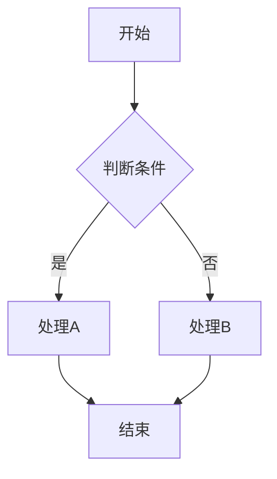
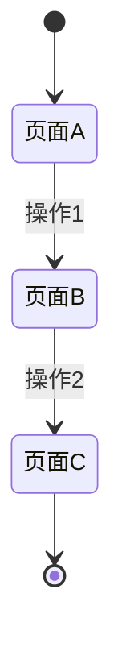
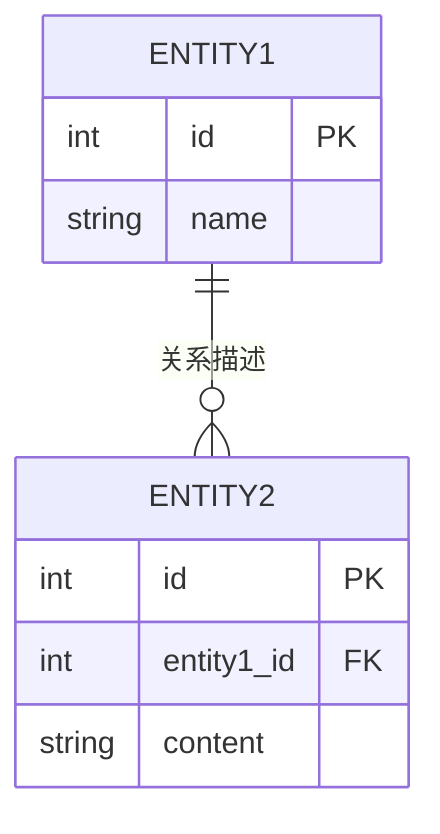

# {功能模块名} - 产品需求文档 (PRD)

> **文档版本**: v{版本号}
> **更新日期**: {日期}
> **所属项目**: 考验英语App
> **文档状态**: 草稿/审核中/已发布

---

## 变更记录

| 版本 | 日期 | 变更内容 | 作者 |
|------|------|----------|------|
| v0.1 | YYYY-MM-DD | 初始版本 | {作者} |
| v0.2 | YYYY-MM-DD | 修订{具体内容} | {作者} |

---

## 一、概述

### 1.1 背景
{描述该功能的业务背景，为什么要做这个功能}

### 1.2 目标
{该功能要达成的业务目标，可量化}

### 1.3 范围
**包含**:
- {功能点1}
- {功能点2}

**不包含**:
- {明确说明不在本期范围内的功能}

---

## 二、需求分析

### 2.1 用户故事

```
作为 [用户角色]
我想要 [功能需求]
以便 [实现价值]
```

**验收标准**:
- [ ] {可测试的标准1}
- [ ] {可测试的标准2}

### 2.2 用户场景

| 场景 | 用户行为 | 系统响应 |
|------|---------|---------|
| {场景1} | {用户做什么} | {系统做什么} |
| {场景2} | {用户做什么} | {系统做什么} |

---

## 三、功能设计

### 3.1 功能结构

```
{功能模块}
├─ {子模块1}
│   ├─ {功能点1.1}
│   └─ {功能点1.2}
└─ {子模块2}
    ├─ {功能点2.1}
    └─ {功能点2.2}
```

### 3.2 业务流程



### 3.3 页面流转



---

## 四、交互设计

### 4.1 界面原型

#### {页面名称}

```
┌─────────────────────────────────────┐
│  导航栏                              │
├─────────────────────────────────────┤
│                                     │
│  {界面内容描述}                       │
│                                     │
│  ┌─────┐  ┌─────┐  ┌─────┐         │
│  │按钮1│  │按钮2│  │按钮3│         │
│  └─────┘  └─────┘  └─────┘         │
│                                     │
├─────────────────────────────────────┤
│  底部导航                            │
└─────────────────────────────────────┘
```

**元素说明**:

| 元素 | 类型 | 说明 | 交互 |
|------|------|------|------|
| {元素1} | 按钮 | {说明} | 点击后{行为} |
| {元素2} | 文本 | {说明} | {行为} |

### 4.2 交互规则

| 操作 | 触发条件 | 系统响应 | 异常处理 |
|------|---------|---------|---------|
| {操作1} | {条件} | {响应} | {异常时的处理} |
| {操作2} | {条件} | {响应} | {异常时的处理} |

### 4.3 状态定义

| 状态 | 说明 | 视觉表现 |
|------|------|---------|
| {状态1} | {说明} | {颜色/样式} |
| {状态2} | {说明} | {颜色/样式} |

---

## 五、数据设计

### 5.1 数据实体

```typescript
interface {实体名} {
  id: number;              // 主键ID
  field1: string;          // 字段1说明
  field2: number;          // 字段2说明
  createdAt: Date;         // 创建时间
  updatedAt: Date;         // 更新时间
}
```

### 5.2 数据关系



---

## 六、非功能需求

### 6.1 性能要求

| 指标 | 目标值 | 测试方法 |
|------|-------|---------|
| {指标1} | {目标} | {方法} |
| {指标2} | {目标} | {方法} |

### 6.2 兼容性要求

| 平台 | 最低版本 |
|------|---------|
| iOS | {版本} |
| Android | {版本} |

### 6.3 安全要求

- {安全要求1}
- {安全要求2}

---

## 七、验收标准

### 7.1 功能验收

| 功能点 | 验收标准 | 优先级 |
|--------|---------|--------|
| {功能1} | {标准} | P0/P1/P2 |
| {功能2} | {标准} | P0/P1/P2 |

### 7.2 测试用例

| 用例ID | 场景 | 前置条件 | 操作步骤 | 预期结果 |
|--------|------|---------|---------|---------|
| TC001 | {场景} | {条件} | 1. {...} | {结果} |
| TC002 | {场景} | {条件} | 1. {...} | {结果} |

---

## 八、附录

### 8.1 术语表

| 术语 | 定义 |
|------|------|
| {术语1} | {定义} |
| {术语2} | {定义} |

### 8.2 参考文档

- [[相关文档1]]
- [[相关文档2]]

### 8.3 待确认事项

- [ ] {待确认事项1}
- [ ] {待确认事项2}

---

> 📌 **审核状态**: ⬜ 待审核 / ✅ 已通过 / ❌ 需修改
