# 2025年第30周计划
# 2025年第30周计划 (7月28日-8月3日)

## 1. Routine频率
- [ ] 跑步：3次/周 (周一、周三、周五, 45分钟) [[跑步_2025_Week_30]] #routine
- [ ] 力量训练：4次/周 (周二、周四、周六、周日, 1小时) [[力量训练_2025_Week_30]] #routine
- [ ] 日语网课：3次/周 (周二、周四、周六, 1.5小时) [[日语_2025_Week_30]] #routine
- [ ] 算法练习：2次/周 (周三、周日, 2小时) [[算法_2025_Week_30]] #routine
- [ ] CSAPP学习：2次/周 (周一、周五, 1小时) [[CSAPP_2025_Week_30]] #routine
- [ ] 阅读：20页/天，140页/周 [[阅读_2025_Week_30]] #routine
- [ ] 逻辑思维题：7次/周 (每日06:00, 15分钟) [[逻辑思维_2025_Week_30]] #routine
- [ ] 每日复盘：7次/周 (每日21:00, 15分钟) [[复盘_2025_Week_30]] #routine

## 2. 项目拆解
- [ ] 项目X (8-10小时/月，2小时/周) [[项目_2025_Week_30]] #project
  - 周六 (13:00-15:00)：__ (例：规划功能A)
  - 周日 (13:00-15:00)：__ (例：编码模块B)
  - 里程碑：__ (例：完成项目X第一阶段)

## 3. 日盘汇总及Checklist
- [ ] 周一：[[2025-07-28]] (查看每日计划，确认完成)
- [ ] 周二：[[2025-07-29]]
- [ ] 周三：[[2025-07-30]]
- [ ] 周四：[[2025-07-31]]
- [ ] 周五：[[2025-08-01]]
- [ ] 周六：[[2025-08-02]]
- [ ] 周日：[[Areas/001_个人规划/001_日记/2025-08-03]]

## 4. 下周陌生路线探索规划
- **路线**：__ (例：XX公园步道，2小时)
- **时间**：周日16:00-18:00 [[探索_2025-08-10]]
- **准备**：__ (例：地图、运动鞋、水)
- **目标**：__ (例：探索新步道，记录风景)

## 甘特图

```mermaid
gantt
    title 2025年第30周计划 (7月28日-8月3日)
    dateFormat  HH:mm
    axisFormat  %H:%M
    section 周一
    逻辑思维题 :done, m1, 06:00, 15m
    跑步 :m2, 07:00, 45m
    CSAPP学习 :m3, 11:00, 1h
    阅读 :m4, 20:00, 40m
    每日复盘 :m5, 21:00, 15m
    section 周二
    逻辑思维题 :t1, 06:00, 15m
    力量训练 :t2, 15:00, 1h
    日语网课 :t3, 19:00, 90m
    阅读 :t4, 20:00, 40m
    每日复盘 :t5, 21:00, 15m
    section 周三
    逻辑思维题 :w1, 06:00, 15m
    跑步 :w2, 07:00, 45m
    算法练习 :w3, 19:00, 2h
    阅读 :w4, 20:00, 40m
    每日复盘 :w5, 21:00, 15m
    section 周四
    逻辑思维题 :r1, 06:00, 15m
    力量训练 :r2, 15:00, 1h
    日语网课 :r3, 19:00, 90m
    阅读 :r4, 20:00, 40m
    每日复盘 :r5, 21:00, 15m
    section 周五
    逻辑思维题 :f1, 06:00, 15m
    跑步 :f2, 07:00, 45m
    CSAPP学习 :f3, 11:00, 1h
    阅读 :f4, 20:00, 40m
    每日复盘 :f5, 21:00, 15m
    section 周六
    逻辑思维题 :s1, 06:00, 15m
    日语网课 :s2, 09:00, 90m
    项目训练 :s3, 13:00, 2h
    力量训练 :s4, 15:00, 1h
    阅读 :s5, 20:00, 40m
    每日复盘 :s6, 21:00, 15m
    section 周日
    逻辑思维题 :u1, 06:00, 15m
    项目训练 :u2, 13:00, 2h
    力量训练 :u3, 15:00, 1h
    新路线探索 :u4, 16:00, 2h
    阅读 :u5, 20:00, 40m
    每日复盘 :u6, 21:00, 15m
    下周计划 :u7, 21:30, 30m
```

