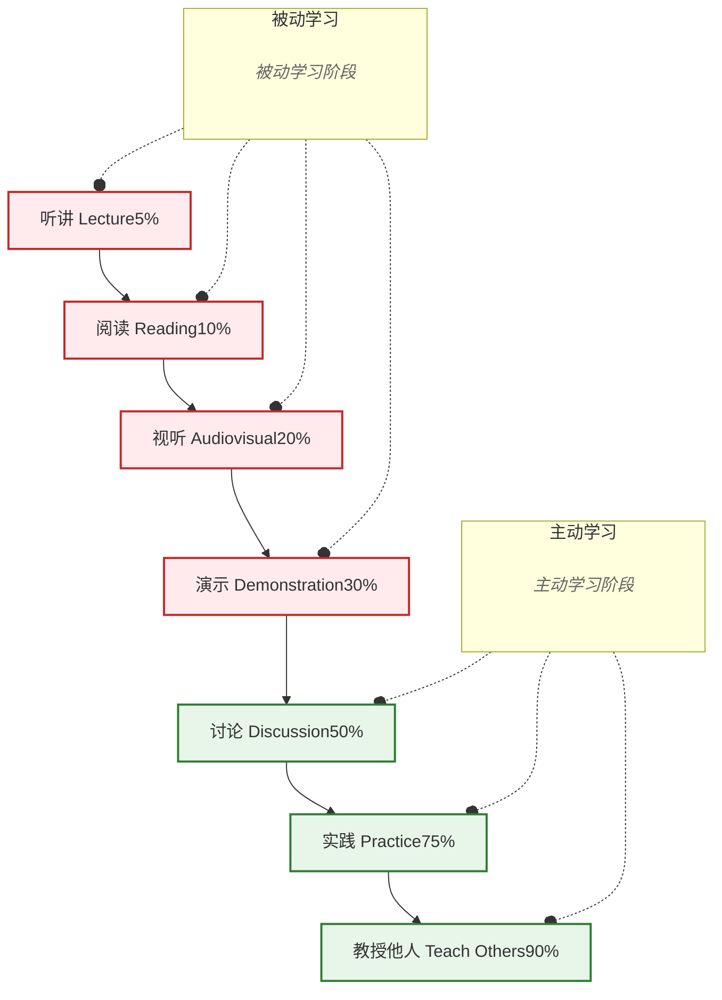

---
tags:
  - 思维工具
  - 费曼学习法
date: 2025-02-23
---
# 学习金字塔 (知识留存率)

## 学习金字塔说明

### 被动学习阶段
包含四种以**输入**为主的学习方式：
- **听讲 (5%)**：单纯听课，留存率最低
- **阅读 (10%)**：自己阅读材料
- **视听 (20%)**：观看视频、听音频
- **演示 (30%)**：观看老师演示

### 主动学习阶段
包含三种以**输出和互动**为主的学习方式：
- **讨论 (50%)**：小组讨论、辩论
- **实践 (75%)**：动手操作、实际应用
- **教授他人 (90%)**：将知识教给别人（费曼学习法）

### 核心启示
1. **输出优于输入**：主动输出的学习方式（讨论、实践、教授）留存率远高于被动输入
2. **教学相长**：教授他人是最高效的学习方法
3. **设计学习路径**：应尽快从被动学习转入主动学习阶段