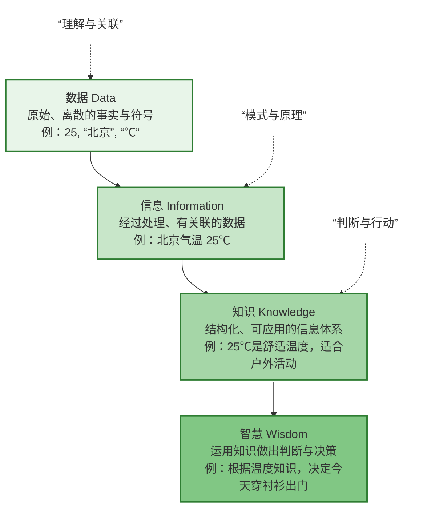

## 模型核心要点

| 层级                   | 核心问题        | 特征            | 示例                                           |
| :------------------- | :---------- | :------------ | :------------------------------------------- |
| **数据 (Data)**        | 是什么？        | 原始、未处理、无上下文   | `42`, `“错误”`, `2023-10-27`                   |
| **信息 (Information)** | 谁？什么？何时？何地？ | 经过处理、有关联、有意义  | `用户ID 42 于 2023-10-27 登录失败`                  |
| **知识 (Knowledge)**   | 如何做？        | 结构化、体系化、可应用   | `登录失败通常由密码错误或账户锁定引起，可检查密码或联系管理员`             |
| **智慧 (Wisdom)**      | 为什么做？       | 洞察、判断、决策、价值导向 | `鉴于该用户多次失败登录且非工作时间，可能为攻击尝试，建议暂时封锁其IP并通知安全团队` |

**演进关系**：数据 →（**上下文与关联**）→ 信息 →（**模式归纳与理解**）→ 知识 →（**经验与伦理应用**）→ 智慧