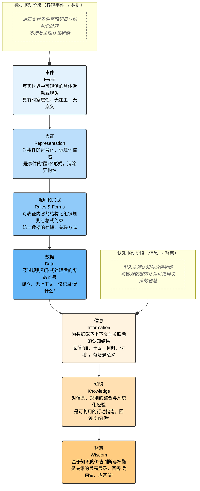

一、 整体架构定位
 
这张图是DIKW模型的扩展七层线性演化框架，它在经典DIKW（数据-信息-知识-智慧）的基础上，新增了事件、表征、规则和形式三层，并明确划分了数据驱动阶段与认知驱动阶段，完整呈现了从客观事件到主观智慧的演化路径。
 
# DIKW 完整版七层架构图

## 架构核心说明

### 阶段划分
1.  **数据驱动阶段 (底层 1-4 层)**
    *   **核心**：对客观世界进行**记录、标准化和结构化**。
    *   **特征**：处理对象是“客观事件”，目标是将其转化为可处理的“数据”，**不涉及主观认知**。
    *   **演进**：`事件` → `表征` → `规则和形式` → `数据`

2.  **认知驱动阶段 (上层 5-7 层)**
    *   **核心**：引入人的**主观认知和价值判断**。
    *   **特征**：处理对象是“数据”，目标是将其升华为可指导行动的“智慧”。
    *   **演进**：`数据` → `信息` → `知识` → `智慧`

### 关键跃迁
*   **从 `数据` 到 `信息`**：通过为数据**赋予上下文和关联**，使其产生意义。
*   **从 `信息` 到 `知识`**：通过**整合、系统化**信息与规则，形成可复用的经验。
*   **从 `知识` 到 `智慧`**：在知识基础上融入**价值观和具体情境**，做出判断与决策。

二、 数据驱动阶段（底层4层：客观事件→数据）
 
这个阶段的核心是对真实世界的客观记录与结构化处理，不涉及主观认知判断。
 
1. 事件
​
- 定义：真实世界中可观测的具体活动或现象，是整个架构的起点。
​
- 特征：具有时空属性，无加工、无意义，是一切信息的源头。
​
2. 表征
​
- 定义：对事件的符号化、标准化描述，是事件的“翻译”形式。
​
- 特征：将不可直接处理的事件转化为可记录的形态，消除异构性。
​
3. 规则和形式
​
- 定义：对表征内容的结构化组织规则与格式约束。
​
- 特征：统一数据的存储、关联方式，为后续处理建立基础规范。
​
4. 数据
​
- 定义：经过规则和形式处理后的离散符号，是事件的量化结果。
​
- 特征：孤立、无上下文，仅记录“是什么”，不解释“为什么”。
 
 
 
三、 认知驱动阶段（上层3层：信息→智慧）
 
这个阶段的核心是引入主观认知与价值判断，将客观数据转化为可指导决策的智慧。
 
1. 信息
​
- 定义：为数据赋予上下文与关联后的认知结果。
​
- 特征：回答“谁、什么、何时、何地”，具备场景意义，但无行动指导。
​
- 图中标注“（经由表征而产生的认知）”，强调信息是主观加工后的产物。
​
2. 知识
​
- 定义：对信息、规则的整合与系统化经验，是可复用的行动指南。
​
- 特征：回答“如何做”，是经过智力加工、以物理形态记录的经验。
​
3. 智慧
​
- 定义：基于知识的价值判断与权衡，是决策的最高层级。
​
- 特征：回答“为何做、应否做”，融合了价值观，在具体判断中体现。
