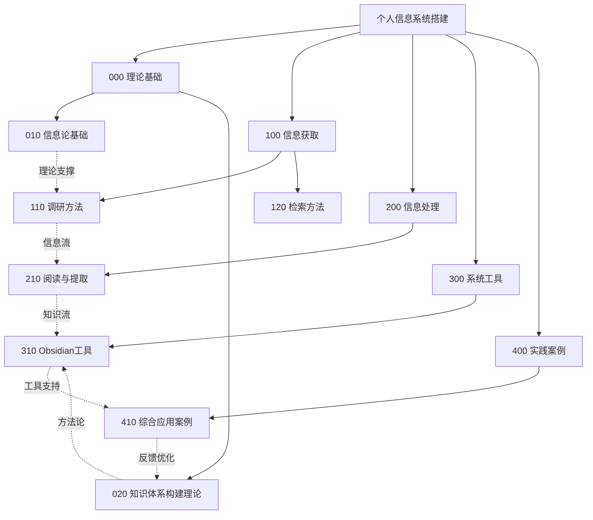

# 个人信息系统搭建知识体系

## 📚 杜威分类体系结构

基于杜威十进制分类法（Dewey Decimal Classification）构建的个人信息系统知识体系。

```
个人信息系统搭建/
│
├── 000_理论基础/              # 信息论与知识论基础
│   ├── 010_信息论基础/
│   │   ├── 011_DIKW模型-简明版.md
│   │   ├── 012_DIKW七层架构-完整版.md
│   │   └── 013_知识与信息的本质区分.md
│   │
│   └── 020_知识体系构建理论/
│       ├── 021_基于底层逻辑的知识体系构建法.md
│       ├── 022_知识深度理解方法.md
│       └── 023_学习闭环理论.md
│
├── 100_信息获取/              # 检索与调研方法
│   ├── 110_调研方法/
│   │   ├── 111_AI快速调研法.md
│   │   └── 112_快速调研法2.0.md
│   │
│   └── 120_检索方法/
│       ├── 121_学术论文资料查找方法.md
│       └── 122_文献阅读与笔记方法.md
│
├── 200_信息处理/              # 筛选、处理、验证
│   └── 210_阅读与提取/
│       └── 211_读书知识提取方法.md
│
├── 300_系统工具/              # 工具与技术实现
│   └── 310_Obsidian工具/
│       ├── 311_Dataview插件使用教程.md
│       ├── 312_inline字段.md
│       └── 313_内置属性.md
│
└── 400_实践案例/              # 应用实践
    └── 410_综合应用案例/
        └── 411_旅游规划信息系统实践.md
```

## 🎯 知识体系说明

### 000 理论基础
构建个人信息系统的理论支撑，包括信息论基础和知识体系构建方法论。

**核心概念：**
- DIKW模型：数据→信息→知识→智慧的演化路径
- 底层逻辑：知识的拆解、连接、抽象与重构
- 学习闭环：学习-思考-执行-反馈的循环

### 100 信息获取
系统化的信息检索、调研方法，帮助高效获取高质量信息源。

**核心方法：**
- AI辅助调研：利用AI工具提升调研效率
- 学术检索：专业文献的查找与筛选策略
- 快速调研：短平快的信息收集方法

### 200 信息处理
对获取的信息进行筛选、验证、提取和整理的方法。

**核心技能：**
- 文献阅读：高效阅读学术论文的方法
- 知识提取：从书籍中提炼核心知识
- 信息验证：对抗AI幻觉，验证信息真实性

### 300 系统工具
支撑个人信息系统的具体工具和技术实现。

**核心工具：**
- Obsidian：知识管理平台
- Dataview：自动化筛选整理笔记
- 元数据系统：inline字段和内置属性

### 400 实践案例
理论方法在实际场景中的应用示范。

**案例类型：**
- 综合应用：完整展示信息检索→筛选→验证→应用的全流程

## 📖 使用指南

### 快速索引
- **新手入门**：000 → 100 → 300 → 400
- **提升效率**：100 → 200 → 300
- **深度理解**：000 → 020 → 400

### 学习路径

#### 路径1：理论驱动型
```
011 DIKW模型 → 021 底层逻辑构建法 → 023 学习闭环 → 实践应用
```

#### 路径2：实践驱动型
```
111 AI调研法 → 311 Dataview工具 → 411 实践案例 → 回顾理论
```

#### 路径3：工具驱动型
```
310 Obsidian工具系列 → 100 信息获取方法 → 200 信息处理 → 综合应用
```

## 🔗 关键连接

### 理论与实践的桥梁
- **DIKW模型** ↔ **实践案例**：理解信息如何转化为知识
- **底层逻辑** ↔ **工具使用**：理论指导工具配置
- **学习闭环** ↔ **调研方法**：形成知识复利

### 工具与方法的结合
- **Dataview** + **调研方法** = 自动化信息管理
- **inline字段** + **阅读方法** = 结构化笔记
- **内置属性** + **检索方法** = 高效知识检索

## 📊 知识图谱



## 🎓 核心价值

1. **系统化**：建立完整的信息获取→处理→存储→应用闭环
2. **可检索**：通过杜威编号快速定位所需知识
3. **可扩展**：预留编号空间，便于添加新内容
4. **可复用**：方法论和工具可迁移到其他领域

---

*最后更新：2026-02-08*
*知识体系版本：v1.0*
