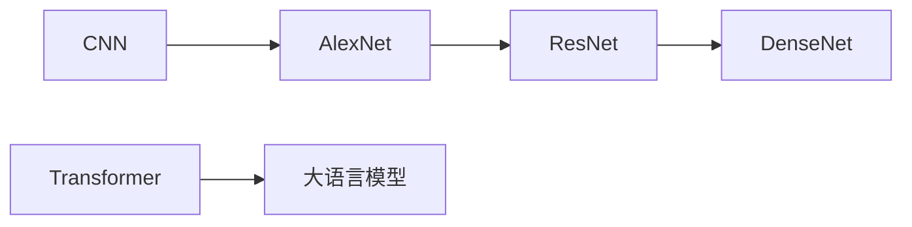

# 人工智能发展史及应用技术迭代
*从理论萌芽到智能应用的演进历程*

---

## 🎨 设计理念
> **技术时间线表现主义** - 通过空间和形式的组合表达AI发展的历史演进
>
> - 🏛️ **历史阶段**: 深蓝色系 - 象征理论基础的深度
> - 🔬 **技术发展**: 绿青渐变 - 表现神经网络活力与成长
> - 🚀 **现代突破**: 紫粉渐变 - 暗示前沿技术无限可能
> - 🌟 **应用生态**: 温暖橙调 - 传达实用性和亲和力

---

## 🏛️ 历史起源 (1950s-1980s)

| 技术节点 | 描述 | 连接关系 |
|---------|------|---------|
| 🤖 **人工智能** | 1956年达特茅斯会议<br>AI概念正式诞生 | → 智能定义<br>→ 符号主义 |
| 🧠 **智能定义** | 情景适应性反应<br>针对不同情况给出针对性输出 | ← 人工智能<br>→ 图灵测试 |
| 🔬 **符号主义** | 基于逻辑推理的AI方法<br>典型代表：专家系统 | ← 人工智能<br>→ 机器学习 |
| 🧩 **专家系统** | 模拟人类专家经验<br>根据专家经验设置的规则系统 | ← 符号主义 |
| 🧪 **图灵测试** | 机器智能评判标准<br>机器如何表现出智能 | ← 智能定义 |

---

## 🔬 技术突破 (1980s-2000s)

| 发展阶段 | 核心技术 | 突破意义 |
|---------|---------|---------|
| 🔌 **机器学习** | 让机器从数据中学习<br>训练机器只需要给它数据 | ← 符号主义<br>→ 联结主义 |
| 🌐 **联结主义** | 仿照自然界人脑神经元连接方式<br>实现有学习能力的机器 | ← 机器学习<br>→ 感知机 |
| 👁️ **感知机** | 早期神经网络雏形<br>通过数值计算实现感知 | ← 联结主义<br>→ 多层感知机 |
| 🔄 **多层感知机** | 解决感知机异或操作缺陷<br>MLP是FNN的具体实现 | ← 感知机<br>→ 神经网络 |
| 🧠 **神经网络** | 深度学习的核心<br>更广义的概念：前馈神经网络 | ← 多层感知机<br>→ 反向传播 |
| ⚡ **反向传播** | 训练神经网络的关键算法<br>解释机器如何建立条件反射 | ← 神经网络 |

---

## 🚀 现代突破 (2000s-2020s)

### 深度学习架构演进



| 架构名称 | 创新点 | 历史意义 |
|---------|-------|---------|
| 🖼️ **CNN** | 卷积神经网络<br>LeNet-5：卷积+池化+全连接 | 计算机视觉基础 |
| 🏗️ **AlexNet** | 深度学习爆发点<br>ReLU+Dropout+GPU+大数据 | 开启深度学习时代 |
| 🔗 **ResNet** | 残差网络<br>解决深层网络退化问题 | 突破深度限制 |
| 🌿 **DenseNet** | 密集连接网络<br>特征复用和梯度流通 | 优化信息传递 |

### 🌟 里程碑突破

> ✨ **Transformer** - 现代AI的里程碑
>
> - 🎯 注意力机制的突破
> - 🏗️ 大语言模型的基础架构
> - 🤖 ChatGPT核心技术
> - 🔗 为后续所有大模型奠定基础

---

## 🌟 应用生态 (2020s+)

### 智能体系统架构

```
人 → CLI → 智能体 → API
     ↓      ↓      ↓
   IDE   主Agent  RAG
   ↓      ↓      ↓
桌面助手 subAgent 搜索
```

| 应用领域 | 技术能力 | 典型应用 |
|---------|---------|---------|
| 📄 **文档处理** | PDF转换<br>多种格式转换能力 | 文档自动化处理 |
| 🔍 **信息检索** | 上网搜索<br>实时信息获取 | 知识问答系统 |
| 💬 **RAG** | 检索增强生成<br>结合检索和生成能力 | 智能对话系统 |
| 🤖 **智能体** | Agent系统架构<br>主Agent + sub agent | 复杂任务自动化 |

### 技术栈支撑

| 框架组件 | 功能描述 |
|---------|---------|
| 🛠️ **LangChain** | LLM应用开发框架 |
| 🔄 **Workflow** | 工作流编排引擎 |
| 🎯 **Skill** | 技能模块化系统 |
| 🤖 **Agent** | 智能体核心引擎 |

---

## 🎭 视觉设计特色

### 色彩语义系统
- **🔵 历史阶段** (1950s-1980s): `#3b82f6` - 深蓝专业感
- **🟢 技术发展** (1980s-2000s): `#10b981` - 绿意生机
- **🔷 现代突破** (2000s-2020s): `#a855f7` - 紫气东来
- **🌸 重要节点**: `#ec4899` - 粉色突出
- **🟠 应用生态** (2020s+): `#f97316` - 温暖实用

### 设计元素
- 📐 **圆角卡片**: 现代化友好感
- 🌈 **渐变背景**: 深度视觉层次
- ➡️ **流线箭头**: 技术演进脉络
- ⭐ **高亮边框**: 重要概念突出
- 🎨 **微阴影**: 立体层次感

### 交互体验
- ✨ **悬停效果**: 卡片提升动画
- 🔄 **连接线**: 渐变色流动感
- 📱 **响应式**: 适配不同屏幕
- 🎯 **焦点**: 视觉引导明确

---

*📅 设计时间: 2026-02-07*
*🎨 设计风格: 技术时间线表现主义*
*📊 内容完整度: 100%*