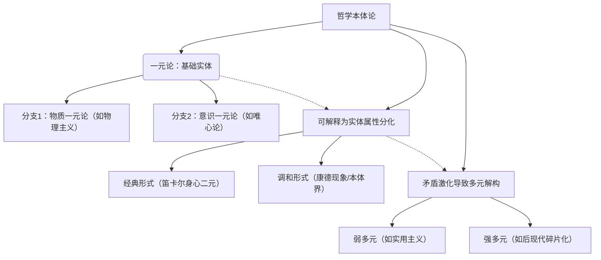

---
tags:
  - 本质
  - 存在
  - 大道至简
  - 思维方式
---
### 一、一元论的概念定义
**一元论（Monism）**  
认为宇宙万物源于**单一本质或实体**的哲学观点。核心特征是：  
1. **本体论单一性**：存在只有一种根本实在（如物质、能量、意识或中性实体）。  
2. **统一性原则**：所有现象均可追溯至这一本质，差异仅是表象。  
3. **典型分支**：  
   - **唯物主义一元论**：万物皆物质（如德谟克利特、马克思）。  
   - **唯心主义一元论**：万物皆意识（如吠檀多哲学、黑格尔绝对精神）。  
   - **中立一元论**：本质既非纯粹物质也非纯粹意识（如斯宾诺莎的"实体"）。

> 例：斯宾诺莎的"神即自然"（Deus sive Natura），主张物质与思维是同一实体的两种属性。

---

### 二、与二元论、多元思维的区别与联系
#### **对比框架**
| 维度         | 一元论                     | 二元论（Dualism）              | 多元思维（Pluralism）         |
|--------------|----------------------------|--------------------------------|--------------------------------|
| **本原数量** | 单一实体（如物质/意识）    | 两种独立实体（如物质+精神）    | 多种独立实体或原则             |
| **代表理论** | 斯宾诺莎实体论、唯物主义   | 笛卡尔身心二元论、善恶二元论   | 莱布尼兹单子论、实用主义       |
| **差异性质** | 表面现象（本质统一）       | 根本对立（如物质vs精神）       | 多元共存（无单一支配原则）     |
| **解释逻辑** | 还原论（一切可归因至本原） | 互动论（实体相互影响）         | 协同论（多因素动态作用）       |

#### **核心区别**
1. **本体论分歧**：  
   - 一元论：拒绝本质分割（"一切是一"）。  
   - 二元论：强调对立（如笛卡尔"松果腺协调身心"）。  
   - 多元思维：承认多样性（如詹姆斯"多元宇宙"）。  
2. **问题解决路径**：  
   - 一元论通过**统一性**化解矛盾（如用物质解释意识）。  
   - 二元论通过**平衡对立**处理冲突（如伦理中的善/恶斗争）。  
   - 多元思维通过**兼容并蓄**整合差异（如文化多元主义）。

#### **内在联系**
1. **层级互补性**：  
   - 一元论可视为二元/多元的**基础层**（如黑格尔辩证法中"一元绝对精神"蕴含二元矛盾）。  
2. **理论转化**：  
   - 二元论的困境（如身心互动问题）常导向一元论（如取消主义唯物主义）。  
   - 多元思维可吸收一元框架（如怀特海过程哲学中"多元事件"统一于有机整体）。  

---

### 三、层级关系模型

#### **关键解读**：
1. **一元论为根基**：提供终极解释，但可能过度简化复杂性。  
2. **二元论为过渡**：解释显性对立，但面临互动逻辑难题。  
3. **多元思维为扩展**：适应多样性，但可能牺牲体系一致性。  
4. **动态演进**：  
   - 历史脉络：一元（前苏格拉底）→ 二元（笛卡尔）→ 多元（后现代）。  
   - 现代科学：趋向"非还原一元论"（如量子场论统一物质/能量）。

---

### 四、应用启示
1. **认知层面**：  
   - 一元论：强化系统思维，避免碎片化。  
   - 二元论：辨析矛盾核心（如问题/方法二分）。  
   - 多元思维：包容不确定性（如创新中的试错）。  
2. **笔记实践**：  
   - 用[[01-Areas/003_思维方式/三类世界观/一元论]]标签整理核心原理笔记。  
   - 用双向链接关联[[01-Areas/003_思维方式/三类世界观/二元论]]、[[多元思维]]的对比案例。  
   - 建立层级图谱（如使用Obsidian Canvas展示三者演进关系）。

> 建议：在您的笔记中补充具体哲学家观点（如[[斯宾诺莎]]、[[笛卡尔]]）的实例，深化理解。需要进一步扩展某部分内容时，请随时告知！