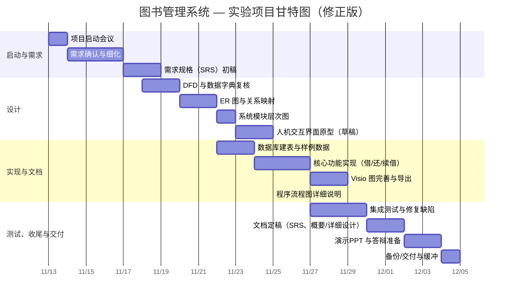
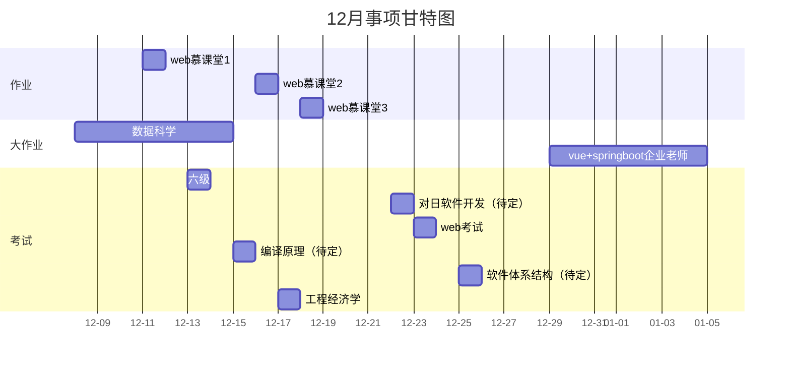

```mermaid
gantt
  title 图书管理系统 — 实验项目甘特图（修正版）
  dateFormat  YYYY-MM-DD
  axisFormat  %m/%d

  section 启动与需求
  项目启动会议             :a1, 2025-11-13, 1d
  需求确认与细化           :a2, after a1, 3d
  需求规格（SRS）初稿      :a3, after a2, 2d

  section 设计
  DFD 与数据字典复核       :b1, 2025-11-18, 2d
  ER 图与关系映射          :b2, after b1, 2d
  系统模块层次图           :b3, after b2, 1d
  人机交互界面原型（草稿） :b4, after b3, 2d

  section 实现与文档
  数据库建表与样例数据     :c1, 2025-11-22, 2d
  核心功能实现（借/还/续借）:c2, after c1, 3d
  Visio 图完善与导出       :c3, after c2, 2d
  程序流程图详细说明       :c4, 2025-11-25, 2d   %% 并行任务：不依赖 c2

  section 测试、收尾与交付
  集成测试与修复缺陷       :d1, 2025-11-27, 3d
  文档定稿（SRS、概要/详细设计）:d2, after d1, 2d
  演示PPT 与答辩准备       :d3, after d2, 2d
  备份/交付与缓冲           :d4, after d3, 1d

```
  
---

```mermaid
gantt
    title 12月事项甘特图
    dateFormat YYYY-MM-DD
    axisFormat  %m-%d 
    
    section 作业
    web慕课堂1 :2025-12-11, 1d
    web慕课堂2 :2025-12-16, 1d
    web慕课堂3 :2025-12-18, 1d
    
    section 实验
    section 大作业
    数据科学 :2025-12-8, 7d
    vue+springboot企业老师 :2025-12-29, 7d
    
    section 考试
    六级 :2025-12-13, 1d
    对日软件开发（待定） :2025-12-22, 1d
    web考试 :2025-12-23, 1d
    编译原理（待定） :2025-12-15, 1d
    软件体系结构（待定） :2025-12-25, 1d
    工程经济学 :2025-12-17, 1d
```
---
