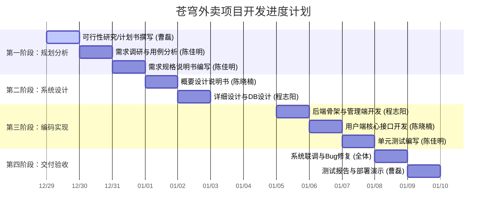

### 项目进度甘特图

---

### 苍穹外卖项目开发计划书 

#### 1．引言

**1.1 编写目的** 本文档旨在明确“苍穹外卖”项目的开发路径、任务分配及进度安排，确保团队成员（曹磊、陈佳明、陈晓楠、程志阳）在统一的指导下按时高质量完成交付物。

**1.2 项目背景** 随着餐饮行业数字化转型，本项目旨在开发一套高效的管理端及微信小程序端外卖系统，涵盖员工管理、菜品分类、订单流转及数据统计功能。

**1.3 定义**
- **Admin端**：供餐厅内部员工使用的后台管理系统。
- **User端**：供消费者下单使用的微信小程序。
- **DTO/VO**：数据传输对象与视图对象。
**1.4 参考资料** 
- 《苍穹外卖项目需求规格说明书》
- 《Java 开发手册》
#### 2．项目概述

**2.1 工作内容** 
本项目开发涵盖从需求分析、架构设计、数据库建模到后端业务代码实现及系统测试的全流程。
**2.2 条件与限制** 
- **时间限制**：总工期 12 天。
- **技术栈限制**：必须使用 Spring Boot, MyBatis Plus, Redis, MySQL。
2.3 产品 
1. 管理端系统：支持分类、菜品、套餐、订单管理。
2. 用户端小程序：支持在线选餐、购物车、微信支付、订单跟踪。
**2.4 运行环境** 
- **后端**：JDK 11, Maven 3.6, MySQL 8.0, Redis 6.0。
- **前端**：微信开发者工具。
**2.5 服务** 
提供系统部署脚本、数据库初始化脚本以及核心功能的演示讲解。
**2.6 验收标准** 
- 完成所有 6 项核心交付物。
- 业务闭环测试通过（从下单到接单完成）。
- 接口响应速度在合理范围内。
#### 3．实施计划

**3.1 任务分解 (WBS)** 
- **P1 规划**：可行性研究、进度计划、需求文档。
- **P2 设计**：系统架构、ER模型、接口定义。
- **P3 实现**：Spring Boot环境搭建、核心CRUD、Redis缓存。
- **P4 测试**：Postman接口联调、黑盒测试。
**3.2 进度** 
- **2025.12.29 - 12.31**：完成规划与需求基线。
- **2026.01.01 - 01.02**：完成概要与详细设计。
- **2026.01.05 - 01.07**：完成核心代码编写与单元测试。
- **2026.01.08 - 01.09**：系统联调与最终交付。
**3.3 预算** 
项目为内部开发，主要预算支出为时间资源与算力成本。
**3.4 关键问题** 
- 微信登录授权的调通。
- 菜品与套餐在高并发下的缓存一致性问题。
#### 4．人员组织及分工

|**姓名**|**角色**|**主要职责**|
|---|---|---|
|**曹磊**|**组长**|项目总控、可行性分析、交付验收、演示材料准备|
|**陈佳明**|**需求/测试**|需求规格说明书编写、单元测试用例、集成测试报告|
|**陈晓楠**|**设计/开发**|概要设计说明书编写、用户端核心业务逻辑实现|
|**程志阳**|**设计/开发**|详细设计说明书编写、数据库建模、管理端核心业务实现|

#### 5．交付期限

所有交付物必须于 **2026年1月9日 17:00** 前提交至项目仓库，具体清单如下：

1. 可行性研究报告 (12.29)
    
2. 项目开发计划书 (12.29)
    
3. 需求分析说明书 (12.31)
    
4. 概要设计说明书 (01.01)
    
5. 详细设计说明书 (01.02)
    
6. 源代码清单及测试报告 (01.09)
    
#### 6．专题计划要点
- **质量保证**：采用 Code Review 机制，核心代码由组长曹磊进行二次复核。
- **版本控制**：使用 Git 分支管理，每个人在独立分支开发，联调阶段统一合并至 master。
- **沟通机制**：每日 18:00 进行短会，同步当日进度与阻塞问题。

