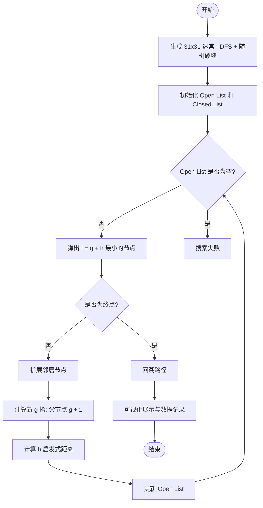

**一、实验目的**

熟悉和掌握A*算法实现迷宫寻路功能，要求掌握启发式函数的编写以及各类启发式函数效果的比较。

**二、实验环境**

本实验可以采用Python语言或其它语言为软件平台。

**三、实验内容与要求**

**实验内容**：迷宫问题，作为实验心理学中的一项经典课题，其核心在于求解从入口至出口的最优化路径，即在众多可能路径中筛选出最短的一条。在本实验中运用技术手段，特别是利用matplotlib库的数据可视化功能，来模拟并展示这一求解过程。

采用matplotlib库中的Circle函数来绘制迷宫的节点，Rectangle函数则用于描绘节点间的连接边。随后，借助matplotlib.pyplot模块中的ion()函数，以动态图形的形式，逐一呈现算法在搜索过程中的每一个关键阶段。

采用随机生成的深度优先搜索法作为基本框架。在迷宫构建的初始阶段，仅设定一个由固定大小节点组成的阵列，而节点间并无直接连接。随后，从预设的起点出发，算法将随机选择四个可能的方向进行探索。若某方向的相邻节点尚未被访问，则在该两点间生成一条边，并将搜索焦点转移至该新节点，重复上述过程直至所有节点均被遍历，此时算法宣告结束。

为进一步增加迷宫问题的挑战性，将随机在迷宫内部增添k条边，以此构造出包含多条可行路径的复杂迷宫结构，从而更全面地检验并优化我们的求解算法。

**实验要求**：画出用A*算法求解迷宫最短路径的流程图，设置不同的地图，以及不同的初始状态和目标状态，记录A*算法的求解结果，包括最短路径、生成节点数和算法时间。

**四、实验预习和准备**

参考相关资料，能够熟练地安装和使用Python或其它语言。

**五、实验过程与结果**

请完成实验过程和结果的记录。

现在我要进行简历ppt撰写，简历求职ppt的撰写逻辑是：“1.对简历的补充说明，尤其对线上面试来说是一种更“多元化”、“直观”、”真实“的一种映射，那么应该充分发挥其“图”和“视频”的最大优势，增强真实性；2.可以提供“钩子”，刻意的留白陷阱，引导面试官去问已经事先准备好的问题3.我不仅侧重“项目和竞赛实践”，而且更兼顾‘人生丰富度’，给面试官直观的感受”。你的任务是这样的：首先，先梳理一份简历ppt的准则以及我的对标职业jd，即先将ppt内容逻辑梳理好，接着到各个互联网大厂找到最标准的“行业要求”，将我的简历ppt原材料与JD进行对齐和修改，在‘/Users/caolei/Library/Mobile Documents/com~apple~CloudDocs/Desktop/Obsidian_root/001_个人规划/007_工作资讯’输出两个产物‘目标求职岗位JD行业天花板标准’和‘求职ppt大纲及内容编排逻辑，放在‘/Users/caolei/Desktop/学院材料/简历材料’下的src里；然后整理我的‘/Users/caolei/Desktop/学院材料/简历材料’材料；里面包括两个部分：23-25年综测和25-26年综测；23-25年综测包括了我的两年的所有经历和成就，但是还不够概括，我的真正集大成是学生会轮值主席求职ppt‘'/Users/caolei/Desktop/学院材料/简历材料/23-25年综测/执行主席 23030301 曹磊.pptx'’的内容，里面包含了截至25年4月份我的大学前半段经历；而25年4月份往后的经历就是我求职ppt的精华：我将其分成项目经历+硬技能实力两个模块；为了突出我的核心优势：高并发长期处理不同项目任务，保证高质量的同时不互相冲突，参考‘/Users/caolei/Library/Mobile Documents/com~apple~CloudDocs/Desktop/Obsidian_root/011_项目经验/001-项目看板（时间事务管理）‘和’/Users/caolei/Library/Mobile Documents/com~apple~CloudDocs/Desktop/Obsidian_root/000_个人看板/GTD看板.canvas‘。所以应该将不同项目的时间线梳理清楚起止时间，并标注好取得结果和成就。如果是重点的项目经历，那就重点展示1.遇到的问题 2.解决的方案 3.复盘记录（发现问题->提出问题->定位根问题->探索解决方案->解决问题->复盘记录/归档）；如果是通过性的考试、证书，就重点突出 信息调研->确定学习策略->输入->费曼输出->测试复盘的学习环路构建和执行力的强大。

‘/Users/caolei/Desktop/学院材料/简历材料/25-26年综测/项目经历.txt’这是我的项目经历，但是其实这里面的信息是有残缺的，现在补齐信息：

---
1.大学生文化艺术节获“先进个人”荣誉
作为活动负责、策划人，从0到1主导完成整个项目
从前期的策划构思，到对接上级政策解读，再到调研采购物料，活动详细设计、项目组织执行，最终活动宣传推文推广
将学院特色与政策结合，最终将活动推向高潮，参与活动人数达到历史新高，达到线下一百余人，线上突破一千人，同比去年增长30%。详细的活动结构化流程思路和活动复盘
‘/Users/caolei/Library/Mobile Documents/com~apple~CloudDocs/Desktop/Obsidian_root/002_知识体系构建/005-人工智能/040_项目实践/042_活动组织/001_活动通知_AI文明交响曲.md’、
‘/Users/caolei/Library/Mobile Documents/com~apple~CloudDocs/Desktop/Obsidian_root/010_时间管理/GTD管理模板工具/002_项目清单/大学生文化艺术节.md’、
‘/Users/caolei/Library/Mobile Documents/com~apple~CloudDocs/Desktop/Obsidian_root/014_学生会/大学生文化艺术节/sop复盘/复盘01-流程记录和事件节点汇总（负责人篇）’

2.2025年中国青年科技创新“揭榜挂帅”擂台赛全国二等奖
‘/Users/caolei/Library/Mobile Documents/com~apple~CloudDocs/Desktop/Obsidian_root/010_时间管理/GTD管理模板工具/002_项目清单/大模型TTS学习和音图分析.md‘
参考项目核心文档

3.2025年第十九届ican大学生创新创业大赛全国三等奖
江苏区域赛——10.25
全国总决赛——11.28
4.2025年亚太地区大学生数学建模竞赛全国二等奖
‘/Users/caolei/Library/Mobile Documents/com~apple~CloudDocs/Desktop/Obsidian_root/011_项目经验/亚太杯/apmcm竞赛重要信息.md’

5.第七届全球校园人工智能算法精英大赛省级三等奖
‘/Users/caolei/Library/Mobile Documents/com~apple~CloudDocs/Desktop/Obsidian_root/002_知识体系构建/005-人工智能/040_项目实践/041_竞赛经验/001_人工智能算法赛.md’

6.JLPT日语等级考试N2合格
‘/Users/caolei/Library/Mobile Documents/com~apple~CloudDocs/Desktop/Obsidian_root/009_日语学习/000_日综学习计划/日综拆解.excalidraw.md’

7.C1驾照
‘/Users/caolei/Library/Mobile Documents/com~apple~CloudDocs/Desktop/Obsidian_root/008_考证经验/驾考.canvas’
驾校报考两年，中间经历了两次挂科，因为各种原因搁置一年，但科目三在项目结束后通过失败总结和sop复盘，仅四天时间快速适应并拿到驾照
抗压能力和迁移学习能力以及总结复盘能力强

8.2025年第十九届ican大学生创新创业大赛省级一等奖
同3，没什么好说的，背演讲稿、参赛材料对齐赛方要求，ppt演讲、线下答辩，拿到结果

9.实习经历
在上海季思传媒公司实习，学习并且实现对关键词的捕捉和追踪，并能实现更新。具体的实践内容为：1.尝试在微博或推特利用python进行用户发布动态关键信息的爬取；2.使用nlp（natural language processing）自然语言处理对爬取的信息进行解读，底层逻辑是通过让计算机模拟人类的语意理解和判断的方式，能够对博客或推文进行关键词追踪和更新。

二、实践日程及内容（400-600字）
7月18日（第1天）实践内容：制定项目学习计划，学习python基础语法知识（变量、命名规则、数据类型、运算法则、输入输出格式），了解爬虫算法。
7月19日（第2天）实践内容：继续学习python知识（包括if-else、for、while循环、列表、字典、元组、函数、模块、输出格式化）的基本知识。
7月20日（第3天）实践内容：学习requests库的使用方法、HTML网页结构
7月21日（第4天）实践内容：学习Beautiful Soup库的使用方法，以及如何解析HTML网页内容、实践爬取豆瓣top250的网页电影榜
7月22日（第5天）实践内容：寻找到网上开源项目，实践上手如何爬取微博指定用户的一个月内的博文内容，包括博文内容、主题、评论数、关注数等基本信息。
7月23日（第6天）实践内容：学习NLP基础语法：向量表示、情感分析、主题建模、词义理解、词义归类、文本处理、词性标注、实体识别。
7月24日（第7天）实践内容：学习pytorch的使用方法教程。
7月25日（第8天）实践内容：使用NLP实践对爬取的推文信息进行情感分析、词义标记、关键词提取、文本处理、实体标记等实践操作

在上海的这段实习时间，虽然不是企业内部的业务（非金融专业的业务），但是作为一次锻炼的机会，我也因此认识了很多行业的领先人物和社会各个领域的精英，虽然时间很短暂且有限，但我还是跑通了这个公司的新开业务项目的60^%，对整体业务的实现有了宏观的认识。
在这次的上海之旅中，软件市场的萎缩使我意识到，未来人工智能的发展势必会取代低效的可重复性可替代性的工作，而能打破僵局，在新时代的工业革命中站稳脚跟对于我来说有两条道路：1.提高算法能力，培养逻辑思维，提高核心竞争力，尽量成为金字塔上层的技术性人员。2.转变方向，学习人工智能的底层逻辑，抓住时代的风口，成为替流水线上的自动化机械的修理人员。第二种方向也正是这次实习的业务方向与目的，通过对Twitter和微博的用户推文信息进行爬取，随后使用NLP 对其进行情感分析、词义理解、关键词提取等操作，从而实现对指定用户指定推文的关键信息追踪和更新。

10.“治慧租”APP从需求调研到研发（正在进行）
对接龙虎塘派出所的政务信息化项目，包括微信小程序端1万+社区租户信息录入、网格员、二房东以及警务员的信息处理、权利下发、web端信息可视化管理。目前小程序完成初代原型设计，正在开发和测试周期。

11.独立创业开发项目“常工生鲜”小程序（进行中）
为了更理解真实生产环境需求，自主创业并实现了需求验证到微信社群管理和客服售后的业务全链路跑通；参考‘/Users/caolei/Library/Mobile Documents/com~apple~CloudDocs/Desktop/Obsidian_root/001_个人规划/006_创业/00_项目总览’到‘/Users/caolei/Library/Mobile Documents/com~apple~CloudDocs/Desktop/Obsidian_root/001_个人规划/006_创业/05_产品设计’
项目经历三个阶段；
阶段一：需求验证和链路跑通阶段（v0.1）
阶段二：需求调研分析到产品设计阶段（v0.3）
阶段三（当前阶段）：小程序架构选型和程序开发阶段（v0.5）
