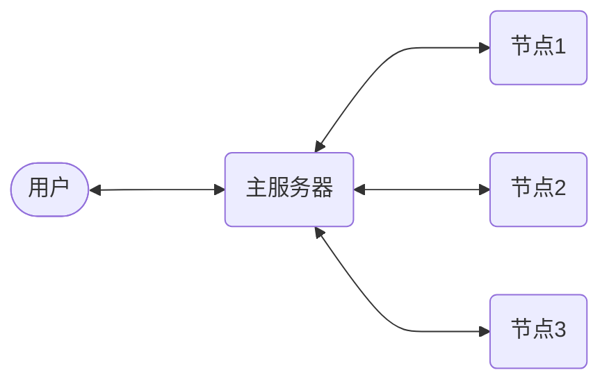

## 概述

The Apache™ Hadoop® project develops open-source software for reliable, scalable, distributed computing.

The Apache Hadoop software library is a framework that allows for the distributed processing of large data sets across clusters of computers using simple programming models. It is designed to scale up from single servers to thousands of machines, each offering local computation and storage. Rather than rely on hardware to deliver high-availability, the library itself is designed to detect and handle failures at the application layer, so delivering a highly-available service on top of a cluster of computers, each of which may be prone to failures.

### 模块

Modules
The project includes these modules:

* Hadoop Common: The common utilities that support the other Hadoop modules.
* Hadoop Distributed File System (HDFS™): A distributed file system that provides high-throughput access to application data.
* Hadoop YARN: A framework for job scheduling and cluster resource management.
* Hadoop MapReduce: A YARN-based system for parallel processing of large data sets

### 传统模式


### MapReduce



### HDFS


## 下载

https://hadoop.apache.org/

### Java 版本兼容性

https://cwiki.apache.org/confluence/display/HADOOP/Hadoop+Java+Versions

Supported Java Versions
* Apache Hadoop 3.3 and upper supports Java 8 and Java 11 (runtime only)
	* Please compile Hadoop with Java 8. Compiling Hadoop with Java 11 is not supported:  HADOOP-16795 - Java 11 compile support OPEN
* Apache Hadoop from 3.0.x to 3.2.x now supports only Java 8
* Apache Hadoop from 2.7.x to 2.10.x support both Java 7 and 8

## 创建模板容器

linux 

```sh
docker run -itd \
--name myubuntu \
--privileged \
-p 8088:8088 \
-p 9870:9870 \
-p 19888:19888 \
myubuntu run.sh
```

windows

```sh
docker run -itd `
--name myubuntu `
--privileged `
-p 8088:8088 `
-p 9870:9870 `
-p 19888:19888 `
myubuntu run.sh
```
9870: HDFS NameNode Web 查询端口

8088: Yarn Web 查询端口

19888: 历史任务 Web 查询端口

内部通常端口：8020/9000 

Hyper-V 保留端口

```sh
netsh interface ipv4 show excludedportrange protocol=tcp
```

### 拷贝 hadoop 包到容器
```sh
docker cp hadoop-3.4.3.tar.gz myubuntu:/root
```
### 进入容器
```sh
docker exec -it myubuntu bash
```
### 解压缩
```sh
cd
tar -xzvf hadoop-3.4.3.tar.gz
mv hadoop-3.4.3 hadoop
rm -f hadoop-3.4.3.tar.gz
```
### 修改环境变量
编辑 .bash_aliases
```sh
vi .bash_aliases
```
添加 
```sh
# Hadoop
export HADOOP_HOME=/root/hadoop
export PATH=$HADOOP_HOME/bin:$HADOOP_HOME/sbin:${PATH}
```
生效 .bashrc
```sh
source .bash_aliases
```
## 本地模式
### 运行 word count
```sh
cd ~/hadoop
mkdir input
cp etc/hadoop/*.xml input
hadoop jar share/hadoop/mapreduce/hadoop-mapreduce-examples-3.4.3.jar grep input output 'conf[a-z.]+'
cat output/*
```
## 伪分布式模式
### 编辑 hadoop 配置文件

配置文件位于 etc/hadoop 目录下

core-site.xml
```xml
<?xml version="1.0" encoding="UTF-8"?>
<configuration>
    <property>
        <name>fs.defaultFS</name>
        <value>hdfs://localhost:9000</value>
    </property>
</configuration>
```
hdfs-site.xml
```xml
<?xml version="1.0" encoding="UTF-8"?>
<configuration>
    <property>
        <name>dfs.replication</name>
        <value>1</value>
    </property>
</configuration>
```
### 复制配置文件到容器内
```
docker cp core-site.xml myubuntu:/root/hadoop/etc/hadoop/
docker cp hdfs-site.xml myubuntu:/root/hadoop/etc/hadoop/
```
### 格式化 namenode
```
hdfs namenode -format
```
### 编辑 start-dfs.sh 和 stop-dfs.sh
```
vi ~/hadoop/sbin/start-dfs.sh
vi ~/hadoop/sbin/stop-dfs.sh
```
文件开始处添加
```
#!/usr/bin/env bash
HDFS_DATANODE_USER=root
HDFS_NAMENODE_USER=root
HDFS_SECONDARYNAMENODE_USER=root
HADOOP_SECURE_DN_USER=hdfs
```

### 启动 dfs
```
start-dfs.sh
```
### 查看 jps
```
865 DataNode
1090 SecondaryNameNode
726 NameNode
1225 Jps
```
### sudo: command not found 错误

/root/hadoop/libexec/hadoop-functions.sh: line 234: sudo: command not found

```
apt install -y sudo
```

### JAVA_HOME 错误

hadoop/etc/hadoop/hadoop-env.sh 中添加 

```
export JAVA_HOME=/root/java
```

### hdfs 文件操作
```
hdfs dfs -mkdir /user    
hdfs dfs -mkdir /user/root
echo "hello hdfs" >  hello.txt
hdfs dfs -put hello.txt .
hdfs dfs -ls .
rm -f hello.txt
hdfs dfs -cat hello.txt
hdfs dfs -get hello.txt
```
### 浏览器确认 hdfs 信息
```
http://localhost:9870/
```
### word count
```
cd ~/hadoop
hdfs dfs -mkdir input
hdfs dfs -put etc/hadoop/*.xml input
hadoop jar share/hadoop/mapreduce/hadoop-mapreduce-examples-3.4.3.jar grep input output 'conf[a-z.]+'
hdfs dfs -get output output
cat output/*
```
### 停止 hdfs
```
stop-dfs.sh
```
## Yarn 本地模式
测试伪分布式模式-YARN配置:启动集群，在浏览器中查看yarn集群
### core-site.xml 和 hdfs-site.xml 和伪分布模式相同
### 编辑 mapred-site.xml
```xml
<?xml version="1.0" encoding="UTF-8"?>
<configuration>
    <property>
        <name>mapreduce.framework.name</name>
        <value>yarn</value>
    </property>
    <property>
        <name>mapreduce.application.classpath</name>
        <value>$HADOOP_MAPRED_HOME/share/hadoop/mapreduce/*:$HADOOP_MAPRED_HOME/share/hadoop/mapreduce/lib/*</value>
    </property>
</configuration>
```
### 编辑 yarn-site.xml
```xml
<?xml version="1.0" encoding="UTF-8"?>
<configuration>
    <property>
        <name>yarn.nodemanager.aux-services</name>
        <value>mapreduce_shuffle</value>
    </property>
    <property>
        <name>yarn.nodemanager.env-whitelist</name>
        <value>JAVA_HOME,HADOOP_COMMON_HOME,HADOOP_HDFS_HOME,HADOOP_CONF_DIR,CLASSPATH_PREPEND_DISTCACHE,HADOOP_YARN_HOME,HADOOP_MAPRED_HOME</value>
    </property>
</configuration>
```
### 复制配置文件到容器内
```
docker cp core-site.xml myubuntu:/root/hadoop/etc/hadoop/
docker cp hdfs-site.xml myubuntu:/root/hadoop/etc/hadoop/
docker cp mapred-site.xml myubuntu:/root/hadoop/etc/hadoop/
docker cp yarn-site.xml myubuntu:/root/hadoop/etc/hadoop/
```
### 编辑 start-yarn.sh 和 stop-yarn.sh
```
vi ~/hadoop/sbin/start-yarn.sh
vi ~/hadoop/sbin/stop-yarn.sh
```
文件开始处添加
```
#!/usr/bin/env bash
YARN_RESOURCEMANAGER_USER=root
HADOOP_SECURE_DN_USER=yarn
YARN_NODEMANAGER_USER=root
```

### 启动 dfs
```
start-dfs.sh
```

### 启动 yarn
```
start-yarn.sh
```
### 确认 jps
```
2336 ResourceManager
865 DataNode
1090 SecondaryNameNode
726 NameNode
2472 NodeManager
3324 Jps
```
其中 ResourceManager、NodeManager 是 yarn 的服务

### word count
```
cd ~/hadoop
hdfs dfs -mkdir input
hdfs dfs -put etc/hadoop/*.xml input
hadoop jar share/hadoop/mapreduce/hadoop-mapreduce-examples-3.4.3.jar grep input output 'conf[a-z.]+'
hdfs dfs -get output output
cat output/*
```
如果 output 文件夹已经存在，先删除
```
hdfs dfs -rm -r output
```
### 浏览器确认 yarn 信息
```
http://localhost:8088/
```
## Yarn 集群模式
### 导出配置好 hadoop 的容器
```
docker export myubuntu > myhadoop.tar
```
### 导入自定义 hadoop 镜像
```
docker import myhadoop.tar myhadoop
```

### 创建 Linux 集群
host|ip|mode
----|----|---- 
mymaster|172.18.11.4|master
myworker1|172.18.11.1|worker
myworker2|172.18.11.2|worker
myworker3|172.18.11.3|worker

```batch
@echo off
setlocal enabledelayedexpansion
set IP_PREFIX=172.18.11
set /a HOST_COUNT=4
set /a SUB_HOST_COUNT=%HOST_COUNT% - 1

set ADD_HOST=
for /l %%i in (1,1, %SUB_HOST_COUNT%) do (
    set ADD_HOST=!ADD_HOST! --add-host=myworker%%i:%IP_PREFIX%.%%i
)

:: mymaster

docker run -itd ^
--name mymaster ^
--hostname mymaster ^
--network=mynet ^
--ip=172.18.11.%HOST_COUNT%^
%ADD_HOST% ^
--privileged ^
-p 8088:8088 ^
-p 9870:9870 ^
-p 16010:16010 ^
myubuntu run.sh

:: myworker

set /a HOST_COUNT=%HOST_COUNT% - 1
set /a SUB_HOST_COUNT=%HOST_COUNT% - 1

for /l %%i in (1,1, %HOST_COUNT%) do (
    set /a K=%HOST_COUNT% + 1
    set ADD_HOST=--add-host=mymaster:%IP_PREFIX%.!K!
    for /l %%j in (1,1, %SUB_HOST_COUNT%) do (
        set /a K=%%i+%%j-1
        set /a K=!k!%%%HOST_COUNT%+1
        set ADD_HOST=!ADD_HOST! --add-host=myworker!k!:%IP_PREFIX%.!k!
    )
    docker run -itd ^
    --network=mynet ^
    --name=myworker%%i ^
    --hostname=myworker%%i ^
    --ip=%IP_PREFIX%.%%i ^
    !ADD_HOST! ^
    --privileged ^
    myubuntu run.sh
)

@echo on
```
### 编辑配置文件
workers
```
myworker1
myworker2
myworker3
```

workers 文件不能使用 Windows 环境编辑，Windows 环境中换行 0A 0D，需要 Linux 环境，换行 0A 。

core-site.xml
```xml
<?xml version="1.0" encoding="UTF-8"?>
<configuration>
    <property>
        <name>fs.defaultFS</name>
        <value>hdfs://mymaster:9000</value>
    </property>
</configuration>
```
hdfs-site.xml
```xml
<?xml version="1.0" encoding="UTF-8"?>
<configuration>
    <property>
        <name>dfs.replication</name>
        <value>2</value>
    </property>
</configuration>
```
mapred-site.xml
```xml
<?xml version="1.0"?>
<configuration>
	<property>
        <name>mapreduce.framework.name</name>
        <value>yarn</value>
    </property>
	<property>
        <name>mapreduce.map.memory.mb</name>
        <value>1536</value>
    </property>
	<property>
        <name>mapreduce.map.java.opts</name>
        <value>-Xmx1024M</value>
    </property>
    <property>
        <name>mapreduce.reduce.memory.mb</name>
        <value>2048</value>
    </property>
    <property>
        <name>mapreduce.reduce.java.opts</name>
        <value>-Xmx1536M</value>
    </property>
    <property>
        <name>mapreduce.application.classpath</name>
        <value>$HADOOP_HOME/share/hadoop/mapreduce/*:$HADOOP_HOME/share/hadoop/mapreduce/lib/*</value>
    </property>
</configuration>
```

yarn-site.xml
```xml
<?xml version="1.0"?>
<configuration>
	<property>
		<name>yarn.resourcemanager.hostname</name>
		<value>mymaster</value>
	</property>
    <property>
        <name>yarn.nodemanager.aux-services</name>
        <value>mapreduce_shuffle</value>
    </property>
    <property>
        <name>yarn.scheduler.maximum-allocation-mb</name>
        <value>2048</value>
    </property>
    <property>
        <name>yarn.nodemanager.resource.memory-mb</name>
        <value>2048</value>
    </property>
    <property>
        <name>yarn.nodemanager.env-whitelist</name>
        <value>
        	JAVA_HOME,
        	HADOOP_COMMON_HOME,
        	HADOOP_HDFS_HOME,
        	HADOOP_YARN_HOME,
            HADOOP_MAPRED_HOME,
            HADOOP_CONF_DIR,
        	CLASSPATH_PREPEND_DISTCACHE
        </value>
    </property>
    <property>
        <name>yarn.application.classpath</name>
        <value>
            /root/hadoop/etc/hadoop,
            /root/hadoop/share/hadoop/common/*,
            /root/hadoop/share/hadoop/common/lib/*,
            /root/hadoop/share/hadoop/hdfs/*,
            /root/hadoop/share/hadoop/hdfs/lib/*,
            /root/hadoop/share/hadoop/mapreduce/*,
            /root/hadoop/share/hadoop/mapreduce/lib/*,
            /root/hadoop/share/hadoop/yarn/*,
            /root/hadoop/share/hadoop/yarn/lib/*
        </value>
    </property>
</configuration>
```
### 拷贝配置文件到集群

bat

```sh
for host in mymaster myworker{1..3}
do
	docker workers ${host}:/root/hadoop/etc/hadoop/
	docker core-site.xml ${host}:/root/hadoop/etc/hadoop/
	docker hdfs-site.xml ${host}:/root/hadoop/etc/hadoop/
	docker mapred-site.xml ${host}:/root/hadoop/etc/hadoop/
	docker yarn-site.xml ${host}:/root/hadoop/etc/hadoop/
done
```
shell

```batch
@echo off
SET HOSTS=mymaster myworker1 myworker2 myworker3
(for %%i in (%HOSTS%) do (
	docker cp config/hadoop/cluster/workers %%i:/root/hadoop/etc/hadoop/
	docker cp config/hadoop/cluster/core-site.xml %%i:/root/hadoop/etc/hadoop/
	docker cp config/hadoop/cluster/hdfs-site.xml %%i:/root/hadoop/etc/hadoop/
	docker cp config/hadoop/cluster/mapred-site.xml %%i:/root/hadoop/etc/hadoop/
	docker cp config/hadoop/cluster/yarn-site.xml %%i:/root/hadoop/etc/hadoop/
))
@echo on
```
### 按伪分布模式测试
进入 mymaster 容器
格式化 namenode
```sh
hdfs namenode -format
```
启动 dfs

```sh
start-dfs.sh
```
mymaster jps 确认
```sh
2018 NameNode
2418 Jps
2283 SecondaryNameNode
```
myworker1-3 jps 确认
```sh
394 DataNode
461 Jps
```
启动 yarn
```sh
start-yarn.sh
```
mymaster jps 确认
```sh
2816 ResourceManager
2018 NameNode
2283 SecondaryNameNode
3149 Jps
```
增加 ResourceManager

myworker1-3 jps 确认
```
394 DataNode
1147 Jps
1023 NodeManager
```
增加 NodeManager

### word count 测试

出现类似以下错误信息 
```
/bin/bash: /bin/java: No such file or directory
```

添加 java 软连接
```
ln -s /root/java/bin/java /bin/java
```

