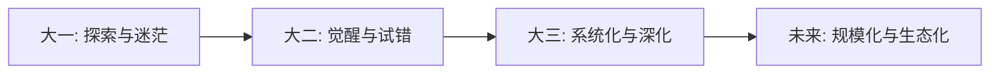

---
tags:
  - 个人成长
  - 大学
  - 回顾
  - 时间轴
  - 职业规划
  - 创业
created: 2026-07-03
---

# 个人成长经历（大学三年）🎓

> 大学三年，从迷茫到清晰，从消费者到创造者——一份创业者的成长时间轴

## 🕐 时间轴：大一至大三的蜕变之路

本笔记试图记录和反思大学前三年的关键成长节点。这不是一份成功的炫耀，而是一份**真实的成长档案**——包含迷茫、试错、突破和沉淀。每一次选择都是分叉路口，回看时才能看清那条**隐藏的成长曲线**。

### 大一：探索期 🌱

大一的核心主题是**拥抱不确定性**。从高中到大学，面临着身份转换的巨大冲击。高中时人生是单线程的——考好成绩 → 上好大学。而大学突然变成了**多线程操作系统**：学业、社团、交友、职业规划、自我探索同时运行。

这个阶段的典型特征是：什么都想尝试，但什么都不确定是不是自己真正想要的。参加社团是因为"别人都参加"，选课是因为"听说这门课好拿分"，对未来职业的想象主要来自**二手信息**——学长学姐的描述、网上的帖子、父母的建议。这种"迷茫"不是缺陷，而是**认知升级的必经阶段**——你开始意识到世界比你以为的大得多。

**关键突破点**：在大学一年级结束前后，逐渐意识到**被动跟随无法带来真正的成长**。别人觉得好的东西未必适合自己，别人走的路未必是自己想走的路。这个认知本身，就是大学教育最重要的第一课——不是知识本身，而是**学会了独立思考**。

### 大二：觉醒期 🔥

大二是一个分水岭。很多同学在这个阶段开始分化：一部分继续沿着保研/GPA 路线走，一部分开始准备出国，一部分开始实习积累职场经验。而你选择了**创业实战**这条路。

大二的典型变化是：从"学什么"转向"做什么"。课堂知识开始与实际需求挂钩——学的市场营销可以直接用在推广上，学的数据分析可以直接用来做用户洞察，学的财务管理可以直接用来做现金流预测。这种**学以致用**的正向反馈，是比任何 GPA 都更强的学习驱动力。

同时，大二也开始面临**时间分配的核心矛盾**：学业和创业如何平衡？社交和独处如何取舍？这个问题没有标准答案，但大二教会你的是：**不要试图平衡一切，要学会做减法**。砍掉那些"看起来不错但没有实际产出"的活动，把有限的精力集中在少数几件真正重要的事情上。

**关键突破点**：大二第一次体验了"从 0 到 1 "的完整闭环——看到一个需求、设计一个解决方案、获得第一批用户、收到第一笔收入。这个闭环中的每一个环节都是书本教不会的。课堂上告诉你"用户需求很重要"，但只有亲自被用户骂过、催过、夸过，你才真正理解什么叫**用户需求**。

### 大三：深化期 🚀

大三的关键词是**系统化和可复制化**。大二的探索让你找到了方向，大三的任务是把这个方向**夯实为可持续的系统**——不再靠"运气好"或"冲劲足"来驱动，而是靠流程、方法论和团队来保证稳定的产出。

在商业层面：从"能做出来"到"能规模化复制"；在个人成长层面：从"靠意志力"到"建立习惯系统"；在认知层面：从"知道很多"到"能深刻理解少数几件事的本质"。大三的能力增长不再表现为**知识广度**的增加，而在于**认知深度**——对商业底层逻辑、对人性规律、对自我局限的深刻理解。

**关键突破点**：大三意识到，创业不是一场百米冲刺，而是一场**马拉松中的马拉松**。那些能跑十年的人，不是因为他们天赋异禀，而是因为他们有一套可持续的节奏和恢复机制。身体、心智、关系——任何一维的崩塌都会导致全盘归零。

## 🎯 案例分析：创业者的大学时间线

将三年的经历浓缩来看，它遵循了一个清晰的发展模式：

这个模式的关键在于**每一阶段都在为下一阶段奠定基础**。大一的迷茫不是浪费时间——它让你试遍了各种可能性，排除了大量"看起来好但实际不适合"的选项。大二的试错不是失败——每一次被市场拒绝、被用户批评，都是在为决策模型收集**高质量训练数据**。大三的系统化不是变慢了——而是在为你安装**增长的引擎**。

## 🤔 问题与反思

### Q1: 大学期间最正确的决定是什么？
**尽早开始实践**。理论与实践之间有巨大的鸿沟，只有亲自跨越才能搭建桥梁。课堂教的是"在理想条件下怎么做"，而现实中你要面对的是——供应商不靠谱、用户不理解、资金不够用、团队要磨合。这些**混乱中的决策能力**，只有实战才能培养。

### Q2: 最大的遗憾是什么？
如果重来一次，会**更早建立知识管理系统**。大一大二大量有价值的思考和经验教训，因为没有系统化的记录和整理，已经模糊或遗忘了。这些"消失的认知资产"如果被保存下来，今天的决策质量会高很多。这也是为什么现在如此重视 Obsidian 和常青笔记。

### Q3: 对学弟学妹最重要的建议？
三句话：**(1) 早实践，别等到"准备好了"再出发**——你永远不会准备好。**(2) 建立自己的知识管理系统**——脑子记不住的事情，系统可以记住。**(3) 保护好身体**——大学是最容易透支健康的时期，也是健康习惯最容易建立的时期，选择后者。

---

## 🔗 相关笔记

[[复利系统的构建]]
[[成功的十大要素排行榜]]
[[知识管理系统搭建指南]]
[[创业者的自我修养]]
[[时间管理的本质]]
[[职业生涯规划方法论]]
[[精力管理与可持续竞争力]]
[[习惯的力量与系统思维]]
[[从零到一的实践方法论]]
[[大学生涯规划与选择]]

🏷️: [[个人成长]] [[大学]] [[回顾]] [[时间轴]] [[创业]] [[职业规划]] [[自我反思]]
