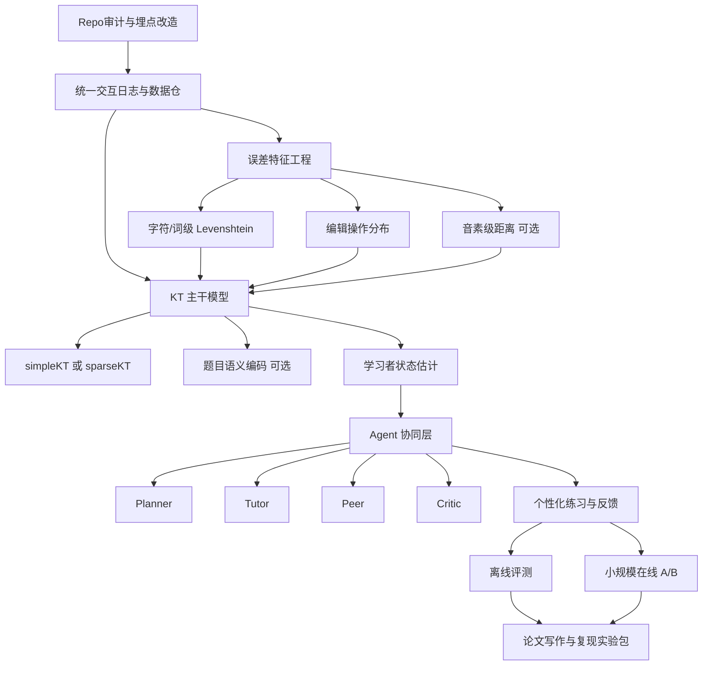
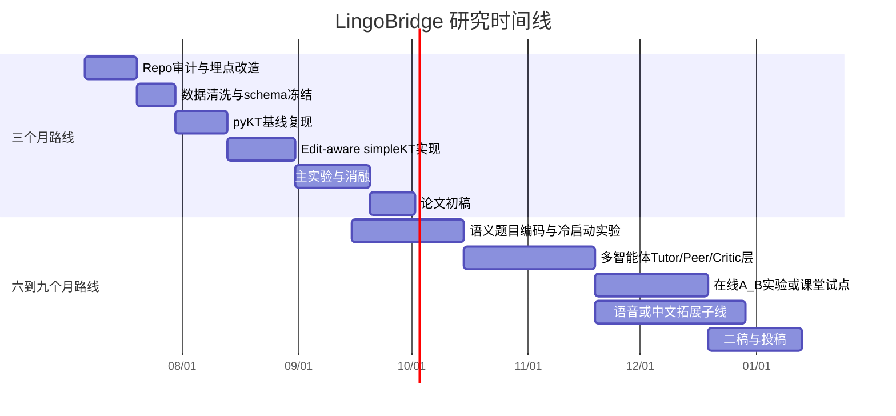

# LingoBridge 论文研究规划报告

> 🔴 **修订注记（2026-08-16）**：本报告原主线为「字符级 Edit-aware KT」，依赖**自由文本答题数据**（learner_answer / answer_text）。经逐一核实，主流 KT 数据集均无自由文本——EdNet 的 `user_answer` 是选择题选项字符 a~d，ASSISTments2017 仅含 skill_id + correct 无任何文本字段。**字符级编辑特征主实验数据缺失，原路线无法落地。**
>
> **主线转向**：改为「**音素级 Edit-aware KT**」。发音评测数据天然携带逐音素的正确/错误标注，等价于更本质的编辑距离信号，无需自由文本。首选数据集 **speechocean762**（250 名非母语说话人、5000 句、句/词/音素三级标注，`phones-accuracy` + `mispronunciations`，免费商用）。arXiv 交叉检索 `"pronunciation assessment" AND "knowledge tracing"` = **0 结果**，属完全空白方向。
>
> 详见：`LingoBridge论文_音素级知识追踪落地方案_20260816.md`。下文保留原「字符级 Edit-aware」论述，二者统一在「误差轨迹（error trajectory）」框架下：**文本分支（拼写/填空）待有自由文本数据时再启用，音素分支（发音）作为当前可落地主线**。

## Executive summary

如果你的目标是在 **LingoBridge** 这个半成品项目上，尽快做出一篇“能复现、能解释、能投稿”的论文，而不是做一个概念很大但难以落地的系统，那么最优策略不是一上来做“纯 LLM 教学智能体”，而是走一条**混合式主线**：以 **DKT/KT 作为可验证的学习状态建模骨架**，以 **Levenshtein 及其派生编辑特征**作为自由文本或发音错误的低成本、强解释性诊断信号，再把你称为“智能涌现（atoa）”的方向**操作化为多智能体协作式干预层**，用于生成反馈、选择练习路径、解释错误，而不是替代底层预测模型。这样做的原因很直接：KT 领域最近几年的共识是，评价协议如果不严谨很容易“虚高”，而像 `simpleKT`、`sparseKT` 这类简单但强的基线在公开数据上已经很难被随便超过；与此同时，最新的 FoundationalASSIST 结果说明，前沿大模型在“直接做 KT”这件事上并不可靠，至少目前还不应该把它当作唯一主干。citeturn18academia0turn17academia2turn18academia2turn38academia0turn30academia2

因此，本报告给出的核心论文方向是：**Edit-aware Knowledge Tracing for Language Learning with Agentic Intervention**。更具体地说，就是把“正确/错误”这个粗糙标签升级为“**答题结果 + 编辑距离 + 编辑操作分布 + 时间/提示行为 + 语义文本特征**”的联合建模，再把 KT 输出的知识状态、难度估计与不确定性作为多智能体系统的控制信号，让“导师 agent / 同伴 agent / 评审 agent”围绕同一个 learner state 协作。这样做既承接了 DKT 家族的可复现路线，也把 Levenshtein 的解释性优势和多智能体教育系统的新趋势整合进来。citeturn37academia1turn19academia1turn28academia0turn30academia2turn35academia2turn21academia0

从时间上看，我建议你分成两条路线并行思考。**短期三个月路线**只追求一篇“工程扎实、实验完整、可复现”的论文：优先做文本答题/拼写纠错场景，离线评估主导，少做用户实验。**中期六到九个月路线**则在前者基础上继续加两件事：一是把题目文本语义、冷启动题目建模和可能的语音发音评估接入；二是做一个小规模在线学习实验或 A/B test，把“多智能体是否真的提升学习增益”从工程想法变成实证贡献。citeturn30academia0turn30academia2turn33academia0turn40academia2turn32academia1

你此前上传的《计算机视觉论文发表规划》更适合沿用其“先复现、再改进、再投稿”的执行节奏，而不适合直接照搬选题内容；本报告只把它当作**流程模板**参考。fileciteturn0file0

## 选题重构与研究问题

先说边界：我**未能在当前浏览环境中直接拉取你给出的 GitHub 仓库页面文本**，所以下面的规划不会假装已经做过逐文件代码审计。报告会把 **LingoBridge** 暂时视为一个“语言学习交互系统/应用”的研究载体，并把第一阶段的首要交付物定义为：**repo 审计 + 数据埋点改造 + 可复现实验底座**。这不是保守，而是避免一开始就把论文计划建立在对现有代码结构的错误想象上。

从研究问题角度，LingoBridge 最值得切进去的不是“做一个比现有大模型更会讲课的聊天机器人”，而是下面四个更硬的问题。

第一，**语言学习场景里的 KT 是否应该继续只看二元正确率**。传统 DKT 的输入通常是“题目/知识点 + 对错”，但语言学习里大量题目不是纯选择题，而是拼写、填空、改写、跟读、短答。也就是说，学生回答里有大量**过程信息**，不能被一个 0/1 标签压扁。`Code-DKT` 在编程教育里已经证明：**响应内容本身**能带来比只看正确率更好的预测；FoundationalASSIST 进一步说明，包含**完整题面、真实学生回答、错误选项**的数据表示比传统仅 ID + 对错的数据更适合作为新一代教育模型输入。citeturn42academia1turn38academia0

第二，**Levenshtein 家族特征在语言学习里有天然解释性**。编辑距离的价值不只在于“分数”；更重要的是，它能展开成**插入、删除、替换、转置**等操作级错误剖面。对文本作答，这就是拼写/形态错误特征；对发音评估，类似思想可以迁移到**词级/音素级编辑距离**。SpeechOcean762 之所以有研究价值，不只是因为它公开，而且因为它提供了**句子级、词级、音素级**标注和开源基线，这意味着你可以把“字符编辑距离”和“音素编辑距离”统一到一个“误差轨迹”框架里。citeturn13search6turn20search6turn28academia0

第三，**“atoa”更适合被定义为 A2A 的教育化变体，而不是一个抽象口号**。下文我把它操作化成：**agent-to-agent orchestration for adaptive tutoring**。也就是多个具有不同职责的 agent 围绕同一 learner state 协作，例如：知识状态估计 agent、反馈生成 agent、难度校准 agent、同伴示例 agent、质量审查 agent。最近关于 IoAI、A2A 网络和多智能体教育系统的工作都把“受控涌现”“通信协议”“信任与治理”“身份感知”当作关键问题；教育场景里的 GenMentor 和学生—多智能体交互研究则说明，这条线不是空想，它至少在内容个性化与交互形态上已经开始有实证支持。citeturn0academia1turn21academia1turn30academia2turn35academia2turn21academia0

第四，**为什么不建议你直接走“纯 LLM-KT”**。原因不是这个方向没价值，而是当前证据并不稳定。一方面，SINKT、LLM-KT 这类工作显示，引入题目语义、概念结构和 LLM 编码可以显著改善冷启动与归纳泛化；另一方面，FoundationalASSIST 的结果又明确指出，当前前沿大模型在 KT 和 pedagogical grounding 上仍然存在明显短板。换句话说，**最安全的研究策略不是让 LLM 取代 KT，而是让它服务 KT**：做题目语义编码、难度解释、反馈生成或者 agent policy，而把预测主干仍然放在可控、可复现的序列模型上。citeturn30academia0turn31academia1turn38academia0

基于这四点，我建议你的论文问题陈述直接写成下面这种形式：

> 🔴 **修订（2026-08-16）**：RQ 表中「编辑距离/编辑操作特征」的载体由「自由文本」改为「音素级标注」（speechocean762 的 `phones-accuracy` / `mispronunciations`），其余不变。

| 研究问题 | 你真正要验证的东西 | 论文价值 |
|---|---|---|
| RQ-A | 将编辑距离与编辑操作特征注入 KT，是否比只用 correctness 的 DKT/AKT/simpleKT 更强 | 解决语言学习中“0/1 标签过粗”的问题 |
| RQ-B | 题目文本语义、答案文本、甚至音素级误差，是否能缓解新题冷启动与跨题泛化问题 | 把 KT 从 ID-based 推向内容感知 |
| RQ-C | 多智能体协作干预是否比单 tutor agent 带来更高学习增益与更低提示依赖 | 让“atoa”变成可测的教育实证贡献 |
| RQ-D | 新方法是否在平台、国家/地区、题型、低先验能力学生上更稳健、更公平 | 避免只做出一个分数更高但偏置更大的模型 |

这些问题分别对应最近 KT 社区对**评价协议、冷启动、解释性、公平性**的主线关注。citeturn18academia0turn30academia3turn29academia2turn27academia9

## 候选论文与方法比较

下面这张表只放**确实有公开论文原文，且能找到作者公开代码、作者明确开放资产或成熟基线**的候选项。它们不是都要复现，而是帮助你建立“底座—增量—扩展”的路线图。

| 方向 | 论文与时间 | 关键方法 | 数据集/任务 | 代码或可用资产 | 对 LingoBridge 的直接价值 |
|---|---|---|---|---|---|
| KT 基线 | **Deep Knowledge Tracing**，2015。citeturn37academia1 | 用 RNN 建模学生交互序列，预测下一题正确率 | 经典 KT 任务 | 建议通过 `pykt-team/pykt-toolkit` 统一复现基线与预处理。citeturn18academia0 | 所有后续模型的最低比较基线；必须复现 |
| 复现实验底座 | **pyKT: A Python Library to Benchmark Deep Learning based Knowledge Tracing Models**，2022。citeturn18academia0 | 统一数据预处理、协议与多模型基准；强调避免 label leakage | 7 个常用 KT 数据集 | `pykt-team/pykt-toolkit` / `pykt.org`。citeturn18academia0 | 这是你的实验基础设施，不是可选项 |
| 强基线 | **simpleKT**，2023。citeturn17academia2 | Rasch 风格题目差异建模 + 普通 dot-product attention | 7 个公开 KT 数据集 | 已合入 `pykt-team/pykt-toolkit`。citeturn17academia2 | 非常适合做你论文的主干 backbone |
| 稳健性增强 | **sparseKT**，2024。citeturn18academia2 | 通过 top-K / soft-threshold 稀疏注意力减少无关历史交互干扰 | 3 个公开 KT 数据集 | 已合入 `pykt-team/pykt-toolkit`。citeturn18academia2 | 适合小数据、噪声大、半成品项目的真实场景 |
| 语言学习发音子线 | **speechocean762**，2021。citeturn28academia0 | 开源非母语英语发音评测语料；句/词/音素三级标注 | Pronunciation assessment / CAPT | 数据在 OpenSLR；基线在 Kaldi。citeturn28academia0 | 如果 LingoBridge 有跟读/语音功能，这是最佳公开起点 |
| 多智能体教育主线 | **GenMentor**，2025。citeturn30academia2 | goal-to-skill 映射 + 演化式学习路径规划 + exploration-drafting-integration 内容生成 | goal-oriented ITS | `GeminiLight/gen-mentor`。citeturn30academia2 | 可直接借鉴 agent 分工与用户画像结构 |
| 多智能体评测/涌现 | **Agent-to-Agent Theory of Mind**，2025。citeturn21academia0 | 测试 LLM 在多智能体协作中对“对话对象身份/风格/偏好”的感知 | multi-agent collaboration evaluation | `younwoochoi/InterlocutorAwarenessLLM`。citeturn21academia0 | 可把“atoa”从口号落成可评估的 agent 指标 |
| 中文语言学习扩展 | **HSKBenchmark**，2025。citeturn40academia2 | 分阶段 SLA 建模 + curriculum tuning + 书面表达评测 | Chinese SLA / writing assessment | `CharlesYang030/HSKB`。citeturn40academia2 | 如果项目要做中文二语或写作评估，这是中期扩展点 |

如果你只选三条最值得先复现的线，我建议顺序是：**pyKT → simpleKT/sparseKT → GenMentor**。原因很简单：前两者能给你一篇论文最需要的“可靠底座 + 可复现分数”，而 GenMentor 则给你“atoa 多智能体”这条叙事线的工程骨架。SpeechOcean762 与 HSKBenchmark 属于你项目将来如果走“发音/中文学习/多模态语言学习”时再打开的分支。citeturn18academia0turn17academia2turn18academia2turn30academia2turn28academia0turn40academia2

如果从“最容易出第一篇”这个目标倒推，最建议你做的**首篇论文原型**其实只有一个：

| 方案 | 标题草案 | 技术复杂度 | 创新强度 | 三个月内完成概率 | 稿件形态 |
|---|---|---:|---:|---:|---|
| 首选 | **Edit-aware simpleKT for Language Learning** | 低到中 | 中 | 很高 | 工程型、实验型 |

> 🔴 **修订（2026-08-16）**：首选标题草案由「Edit-aware simpleKT for Language Learning」进一步收敛为「**Phoneme-level Knowledge Tracing**」方向，即 **《Phoneme-level Knowledge Tracing: Modeling Pronunciation Skill Acquisition with Edit-aware Sequence Features》**。骨架不变（simpleKT/sparseKT），仅将「字符编辑距离」替换为「音素编辑距离」。
| 平衡 | **Edit-aware sparseKT with Semantic Item Encoder** | 中 | 中到高 | 中高 | 方法型、泛化型 |
| 进取 | **Knowledge Tracing Guided Multi-Agent Tutoring** | 高 | 高 | 中 | 系统型、用户实验型 |

我不建议你把第一篇就压在“纯多智能体教育系统”上，因为这会让变量过多：底层预测、反馈生成、路径规划、用户体验、实验伦理全部一起爆炸。更理性的顺序是**先把 KT + edit 做成，再让 agent 层建立在这个底座上**。这一点也与最近关于多智能体教育系统和 Agent network 的研究脉络一致：系统层面的“受控涌现”必须建立在稳定、可解释的底层状态之上。citeturn30academia2turn21academia1turn32academia1

## 技术路线与创新假设

建议你的系统最终拆成四层，而不是一个大模型黑盒。

第一层是**事件采集层**。这里不是论文最显眼的部分，但决定论文能不能写。你需要把 LingoBridge 的每次交互记录成统一 schema：`user_id`、`item_id`、`concept_id`、`timestamp`、`prompt_text`、`reference_answer`、`learner_answer`、`correctness`、`latency`、`hint_used`、`attempt_index`，如果有语音，再加 `audio_uri`、`asr_text`、`phoneme_seq`。FoundationalASSIST 的价值就在于它提醒我们：只保留 ID 和对错，后续很多分析根本做不了。citeturn38academia0

第二层是**误差表征层**。你要把 Levenshtein 从一个单值距离，扩展成一组特征。最低配置应包括：字符级标准化编辑距离、Damerau-Levenshtein 距离、token 级编辑距离、编辑操作分布（插入/删除/替换/转置占比）、错误位置分布、长度归一化残差。如果项目支持发音，再加入音素级编辑距离、PER、词级误差模式。这样做的核心不是“把传统算法缝到深度模型里”，而是把**自然语言/发音错误的细粒度信号**显式送进 KT backbone。SpeechOcean762 的层级标注恰好支持这一思路。citeturn13search6turn28academia0

第三层是**知识状态建模层**。短期路线建议直接用 `simpleKT` 或 `sparseKT` 做 backbone。具体做法不是重写一套模型，而是在交互 embedding 里追加三类内容：**题目语义向量、编辑误差向量、行为向量**。如果你后续进入六到九个月路线，可以再做一个“语义 item encoder”，用小型 sentence encoder 或 instruction-tuned encoder 处理题面、参考答案、知识点文本，从而缓解新题冷启动。这个方向和 SINKT、LLM-KT 的思路一致，但你不需要一开始就把骨架换成大模型。citeturn17academia2turn18academia2turn30academia0turn31academia1

第四层是**agent 协同层**。这里就是你想表达的“atoa”。我建议把它明确成四个角色：`Planner` 负责选下一题与控制难度，`Tutor` 负责解释与反馈，`Peer` 负责给出对比例句/同伴视角提示，`Critic` 负责审查反馈是否与 learner state 一致、是否过度提示。KT 模型输出的 mastery、uncertainty、difficulty gap 是这个系统的唯一“硬控制信号”；agent 不直接改写学生状态，只围绕状态来做决策和解释。这样设计可以避免很多多智能体系统常见的“看上去很聪明，实际上不可控”的问题。citeturn30academia2turn21academia1turn21academia0turn32academia1

下面这张工作流图就是我建议你最终实现的系统结构。

围绕这套架构，我建议你论文里写四个明确的创新假设，而不是笼统地写“我们提出了一个新框架”。

| 创新假设 | 具体表述 | 支撑依据 |
|---|---|---|
| H-A | **Edit-aware KT** 会显著优于 correctness-only KT，尤其在自由文本作答题上 | 现有 KT 数据逐步从纯 ID/对错走向完整文本与真实回答；内容特征在编程教育中已被证明有效。citeturn38academia0turn42academia1 |
| H-B | **编辑操作级特征** 比单一 Levenshtein 标量更能提升解释性与错误诊断能力 | 编辑距离本身可分解成操作空间；语言学习恰好需要可解释错误类型。citeturn13search6turn20search6 |
| H-C | **KT-guided agent orchestration** 会比单 tutor agent 产生更好的学习增益，尤其对低先验能力学生更明显 | 多智能体学习环境中，低先验学生更依赖 co-construction，并有更高学习收益；GenMentor 也支持角色分工式个性化。citeturn35academia2turn30academia2 |
| H-D | 纯 LLM 直接做 KT 不是最佳路径，**混合架构** 更稳妥 | SINKT/LLM-KT 说明语义有价值；FoundationalASSIST 说明纯 LLM 仍存在显著缺口。citeturn30academia0turn31academia1turn38academia0 |

## 实验设计与可复现方案

实验部分一定要两层结构：**离线主实验** + **可选在线验证**。如果你把第一篇论文赌在在线实验上，极容易因为用户量不够、埋点不稳定、实验伦理或统计功效不足而翻车；但如果你只有离线实验，又很难把“atoa 多智能体”写得足够有说服力。所以短期论文以离线为主，中期再补在线，是最稳的。

离线数据建议按“内部真实数据 + 外部公共数据”双轨做。内部数据来自 LingoBridge；外部数据则按你项目功能裁剪。若当前项目主要是**文本答题/填空/拼写**，优先选 FoundationalASSIST、Duolingo SLA/SLAM 相关公开数据；若要做**发音评估**，优先接 SpeechOcean762；若未来要做**中文二语**，则补 HSKBenchmark。FoundationalASSIST 的优势是有完整题面和真实学生回答，适合验证“编辑距离特征 + KT”；SpeechOcean762 则适合把文本误差与音素误差统一到一个诊断框架里。citeturn38academia0turn29academia0turn40academia0turn28academia0turn40academia2

| 数据资源 | 适用功能 | 你该怎么用 |
|---|---|---|
| LingoBridge 内部日志 | 最重要，决定论文可发表性 | 生成真实实验主表；做 ablation、online study、误差案例分析 |
| FoundationalASSIST。citeturn38academia0 | 文本题、完整回答、KT | 做“有题面/有回答”的离线主实验 |
| Duolingo SLA/SLAM 公开任务数据。citeturn29academia0turn40academia1 | 二语学习预测 | 做跨平台/跨语言泛化补充实验 |
| SpeechOcean762。citeturn28academia0 | 跟读/发音评估 | 做音素级误差与发音评分子实验 |
| HSKBenchmark。citeturn40academia2 | 中文 SLA / 写作评测 | 做中期中文化扩展与 curriculum 实验 |

离线主任务至少要有两个。**任务一是 next-response prediction**，也就是标准 KT；**任务二是 error diagnosis**，即预测学生会错在哪里、错得有多重、或给出哪类反馈最合适。只做第一个任务，你的 Levenshtein 就会沦为“加了个特征”；做了第二个任务，编辑距离的存在才真正有论文意义。

评价指标我建议这样设：  
对于 KT 主任务，报告 **AUC、ACC、BCE/NLL、Brier score、ECE**；AUC 是对齐既有 KT 文献的横向对比指标，Brier 与 ECE 能体现你方法是否真正具备教育部署价值，因为教育系统不只要排序准，还要概率校准。对于错误诊断任务，文本可以用 **CER/WER、编辑操作分类 F1、MAE**；发音可再加 **PER、PCC** 与人工评分相关性。多智能体线上实验则看 **学习增益、7 天留存、完成率、平均提示次数、会话轮数、再次作答提升率**。最新的 SLA fairness 研究和 cold-start 重现实验都提醒过我们：只报一个 AUC，很容易掩盖模型偏置和题型差异。citeturn29academia2turn30academia3

基线设置必须“够硬”，否则论文会显得很虚。建议最少包含以下五类：  
**非深度基线**：BKT/IRT/逻辑回归；  
**经典深度基线**：DKT；  
**强注意力基线**：AKT 或相近 attention-KT；  
**近年强基线**：simpleKT、sparseKT；  
**系统层基线**：single tutor agent（没有 peer/critic/planner 分工）。  
如果做发音子线，再加 SpeechOcean762 的开源 Kaldi baseline；如果做语义 item encoder，再加一个“只加语义，不加 edit”版本。citeturn37academia1turn19academia1turn17academia2turn18academia2turn28academia0

消融实验不能偷懒，至少要切五刀。第一刀去掉全部 edit 特征；第二刀只保留 Levenshtein 标量、去掉操作分布；第三刀去掉题目语义；第四刀把 `simpleKT` 换回 DKT 看 backbone 敏感性；第五刀把多智能体系统退化成单 tutor agent。若有语音，再做“字符 edit vs 音素 edit”的对照。这样实验写出来，审稿人才会相信你的提升不是偶然叠加。KT 社区之所以近几年越来越强调 benchmark 与 evaluation protocol，本质上就是因为过去有太多方法提升来自协议差异，而不是模型本身。citeturn18academia0turn17academia2

可复现层面，建议你从一开始就把论文资产按以下方式管理：  
代码用 Git + tag；  
数据预处理用 DVC 或明确版本号；  
实验配置用 Hydra/YAML；  
日志用 W&B 或 TensorBoard；  
随机种子固定 3–5 个；  
最终随稿打包 `Dockerfile + requirements + config + run.sh + checkpoints list + experiment index`。  
这部分不是“锦上添花”，而是你之后投稿到任何认真 venue 时最省时间的做法。

## 时间线、资源、里程碑与投稿策略

先给结论。**三个月路线**只做“KT + edit + 严格评测”；**六到九个月路线**在此基础上加入“agent 协同 + 可能的语音/中文扩展 + 小规模在线实验”。这两条线不是互斥，而是一个递进关系：短线先保底出稿，中线再拉高上限。

三个月路线的交付目标要非常克制。你真正需要拿到手的，不是一个“功能很多的 app”，而是这些硬交付：  
**一份 repo 审计文档**，说明当前代码结构、可插入埋点位置、数据出口；  
**一份冻结后的实验数据 schema**；  
**一套 pyKT 基线脚本与复现实验记录**；  
**一个 Edit-aware simpleKT 或 sparseKT 模型实现**；  
**一份包含主结果、消融、案例分析的论文初稿**。  
只要这些东西齐，你的第一篇论文就已经有骨架了。

六到九个月路线的目标则是把论文从“工程型方法改进”升级到“系统型教育智能研究”。这里的关键不是堆功能，而是增加两种证据。第一种证据是**泛化证据**：新题冷启动、不同题型、不同学生群体、不同语言或不同模态能否成立。第二种证据是**教育证据**：多智能体真的促成更高学习增益吗，还是只是用户觉得“更会聊天”。最近关于学生—多智能体交互的研究已经表明，不同先验能力学生的交互模式与收益并不一样，这意味着你必须把用户分层纳入实验设计，而不是做全体平均。citeturn35academia2

资源方面，因为你允许“算力不限或按云资源计费”，那就不用为了省一点 GPU 把方案做残。KT 主干模型本身并不重，**单卡 A100 40GB** 就足够。真正吃资源的是两块：一是若你要对题目文本做 LLM 编码或 instruction tuning；二是若你要做语音子线。我的建议是：短线完全避免重训练大模型，只做特征抽取与轻量 adapter；中线若做多智能体，也优先采用 API 模型或 7B–14B 级本地模型，别把论文重心变成“怎么训模型”。从回报比上看，这比自己烧大模型更合理。citeturn30academia2turn33academia1

技能学习计划也应该服务于这两条线，而不是铺得太散。你最缺的不是“再看二十篇大模型综述”，而是下面这套最小闭环能力：

| 技能块 | 学到什么程度算够 | 建议时长 |
|---|---|---:|
| 教育数据挖掘与 KT | 能独立复现 DKT、simpleKT、sparseKT，并解释各自差异 | 2–3 周 |
| 文本误差建模 | 能自己实现 Levenshtein、Damerau-Levenshtein、操作回溯与特征统计 | 1 周 |
| 语义表示与冷启动 | 能把题面文本编码进 KT 模型，而不依赖端到端 LLM 微调 | 1–2 周 |
| 统计实验设计 | 能做 bootstrap CI、显著性检验、分组分析、误差案例归纳 | 1 周 |
| 多智能体工程 | 能搭出 Planner/Tutor/Peer/Critic 的最小系统并记录 agent log | 2 周 |
| 论文写作 | 能把“问题—方法—实验—案例—边界”讲清楚，而不是堆功能 | 全程并行 |

投稿策略上，我建议你不要只想一个 venue，而要做**投稿梯度**。对于“三区、短周期、回报率高”的要求，最实用的不是押注某一本绝对最优刊，而是让论文形态和期刊口味对应起来。

| 投稿目标 | 适合哪种稿件 | 为什么适合 |
|---|---|---|
| **Applied Artificial Intelligence**。citeturn34search1 | 偏 AI 应用、教育技术系统、实验扎实但理论不必极重的稿件 | 该刊明确覆盖 AI 在教育中的应用，而且年发文频率较高，适合“KT + 个性化反馈 + agent”这类应用型论文 |
| **Applied Sciences**。citeturn35search4 | 工程实现强、系统完整、对现实应用友好的稿件 | 期刊范围宽、刊期密，适合第一篇保守稿，但前提是实验必须完整，不能只是拼装系统 |
| **Educational Technology & Society**。citeturn34search2 | 更强调教育意义、课堂/学习成效解释的稿件 | 如果你做出了小规模在线试验或教学试点，这个方向会比纯 AI 刊更合理 |
| **System**。citeturn34search3 | 强调语言学习、二语习得、写作/反馈效果的稿件 | 如果你的结果最后更偏语言教学而非算法创新，这里比纯 CS 刊更对口，但竞争通常也更强 |
| **EDM / AIED / LAK 的 short/workshop 轨**。citeturn27academia1turn27academia9 | 先拿社区反馈、验证问题定义 | KT、自动反馈、学习分析本来就是这些社区的核心主题；适合作为中期外部验证，而不一定是最终归宿 |

如果只给一个最现实的组合建议，我会这样分：  
**三个月路线**：优先投 **Applied Artificial Intelligence** 或 **Applied Sciences** 类型的应用型期刊。  
**六到九个月路线**：如果有在线实验和语言学习成效，再往 **Educational Technology & Society** 或 **System** 这种更贴教育/语言场景的 venue 走。  
如果中途需要快速获得同行反馈，可以先投 **EDM/AIED/LAK 的 workshop 或 short paper**，再扩展成期刊稿。citeturn34search1turn35search4turn34search2turn34search3turn27academia1turn27academia9

最后说风险。真正会卡死项目的，不是“模型不够新”，而是下面这些现实问题。

| 风险 | 具体表现 | 缓解策略 |
|---|---|---|
| 内部数据不够干净 | 没有统一题目 ID、答案文本不规范、埋点缺失 | 第一阶段先做 schema 和日志治理；没有这个别谈论文 |
| 评价协议失真 | 数据泄漏、随机切分不合理、不同论文不可比 | 以 pyKT 协议为底座，固定拆分、固定预处理、固定种子。citeturn18academia0 |
| “多智能体”空心化 | agent 只是换皮 prompt，无法证明比单 agent 更强 | 把 multi-agent reduction 作为强制消融；所有 agent 行为写日志可审计。citeturn30academia2turn21academia0 |
| 纯 LLM 预期过高 | 生成质量高，但 KT 指标不稳或不可解释 | 坚持 hybrid：LLM 做语义与反馈，KT 做预测主干。citeturn38academia0turn31academia1 |
| 公平性与群体偏差 | 某些平台、国家、低资源群体持续吃亏 | 报告 subgroup AUC / calibration gap；参考二语公平性分析。citeturn29academia2 |
| 冷启动与新题泛化不佳 | 新题/新知识点表现骤降 | 加入题面文本编码与难度先验；重点做新题实验。citeturn30academia0turn30academia3 |
| 在线实验统计功效不足 | 用户量太小，看不出显著差异 | 三个月稿不依赖在线实验；中期再做小规模但严格设计的 A/B |
| 研究叙事过散 | DKT、编辑距离、agent、语音、中文全都想做 | 第一篇只讲一条主线：**Edit-aware KT**；agent 和多模态作为后续扩展 |

综合判断，**最优首发选题**应当是：

**“面向语言学习的 Edit-aware Knowledge Tracing：将 Levenshtein 误差结构注入 simpleKT / sparseKT，并以 KT 状态驱动个性化反馈”**。  
这是你当前项目最容易做出**可复现结果、可解释贡献、可投稿稿件**的方向。等这篇跑通，再把 `atoa` 升级为第二篇或扩展版中的“KT-guided multi-agent tutoring”。这样走，不炫，但稳，而且最有产出率。