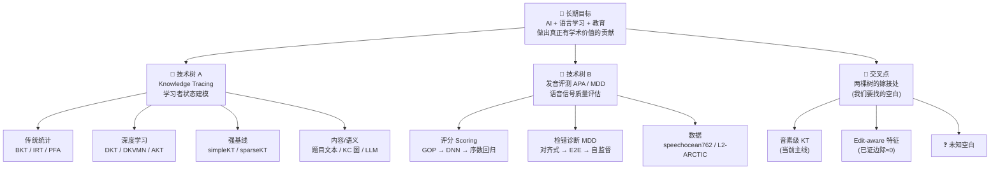

# 认知地图：AI 语言学习建模的两棵技术树

> 📅 创建：2026-08-19 ｜ 类型：认知地图 / 概念扫盲 ｜ 状态：持续生长
> 🎯 用途：为「发音评测 × 知识追踪」交叉方向建立认知坐标，扫盲专业名词，定位创新交叉点

---

## 一、为什么需要这张地图

在做实验的过程中，我连续撞到一个根本问题：**edit 特征（编辑操作）在 KT 的 next-step 预测范式里边际价值≈0**。这不是调参能解决的，而是「任务定义」和「信号来源」的错配。

要找到真正有学术价值的交叉点，不能只盯着一个点反复试，必须先把「知识追踪」和「发音评测」两条技术树各自的来龙去脉、核心概念、主流范式、评测协议都摸清楚。只有画出完整的树，才能看清两棵树之间哪根枝桠能嫁接。

这张地图的定位：**不是文献清单，是概念坐标**。每个节点回答三个问题——它是什么、为什么存在、怎么用。

---

## 二、认知地图总纲

---

## 三、技术树 A：Knowledge Tracing（知识追踪）

### 3.1 定义-解释-示例

**Knowledge Tracing（KT，知识追踪）** 是智能教育系统的核心任务：给定一个学生过去与题目/知识点的交互序列（做对/做错），动态建模他对各个知识点的掌握程度，并预测他未来做下一道题的正确概率。

它的本质是**序列预测**：输入是 `(题目, 知识点, 对错)` 的三元组序列，输出是「下一题做对的概率」。

> 示例：学生小明做了 5 道"分数加法"题（对、错、对、对、错），KT 模型要根据这 5 条记录，预测他做第 6 道"分数加法"题做对的概率。传统 IRT 只看"平均正确率"，而 KT 看的是**时间上的变化轨迹**——他在进步还是在退步、哪个知识点正在掌握。

### 3.2 概念级理解：核心术语

| 术语 | 是什么 | 为什么存在 | 怎么用 |
|---|---|---|---|
| **KC（Knowledge Component，知识点）** | 题目背后考察的最小知识单元 | 把"题"抽象成"知识点"，才能跨题泛化 | 每道题映射到 1~N 个 KC，是模型的输入维度 |
| **label leakage（标签泄漏）** | 用未来信息预测当前，导致指标虚高 | 评测协议不严谨会让所有模型"看起来都很强" | 严格时间切分（user-level split + next-step 预测） |
| **next-step prediction** | 用前 t 步预测第 t+1 步 | 这是 KT 的标准任务定义，保证因果性 | 训练时 y[t] 只对齐 r[t+1]，绝不能泄漏 |
| **forgetting curve（遗忘曲线）** | 艾宾浩斯：掌握后随时间遗忘 | 学生"学过后又忘"是真实现象 | 在模型中加时间间隔、重复次数等特征 |

### 3.3 技术树主干（演进脉络）

**第一层 · 传统统计模型**（可解释、参数少）：

- **BKT（Bayesian Knowledge Tracing）**：用隐马尔可夫模型，把知识掌握建模成"未掌握→已掌握"的二元隐状态 + 猜测/失误概率。可解释但假设过强。
- **IRT（Item Response Theory）/ Rasch**：给每个学生一个"能力 θ"，每道题一个"难度 b"，用逻辑函数 P(correct)=σ(θ−b)。是简单KT/sparseKT 的题目难度建模的理论源头。
- **PFA（Performance Factors Analysis）/ AFM**：逻辑回归 + 特征工程（历史答对次数、答错次数），把"经验特征"显式写进公式。

**第二层 · 深度学习模型**（强表达力）：

- **DKT（Deep Knowledge Tracing，2015 NeurIPS）**：LSTM 建模整个交互序列，开山之作，所有方法的 must-baseline。
- **DKVMN（2017 WWW）**：外部记忆矩阵（key-value），提升可解释性。
- **AKT（2020 KDD）**：单调注意力 + Rasch 难度，引入遗忘行为。

**第三层 · 强基线（简单但难超越）**：

- **simpleKT（2023 AAAI）**：Rasch 题目差异 + 普通 dot-product attention。核心洞见——**"把题目难度建模好"比"堆复杂网络"更重要**。
- **sparseKT（2024 AAAI）**：top-K / 软阈值稀疏注意力，减少无关历史干扰，小数据/噪声场景鲁棒。

**第四层 · 内容/语义增强（当前趋势）**：

- **SINKT / LLM-KT**：用 LLM 编码题目语义、概念结构注入 KT，改善冷启动。
- **LLMKT（EDM 2025）**：用大模型从多媒体题目自动提取 KC。
- **FoundationalASSIST（2024）**：核心结论——**大模型直接做 KT 不可靠，更适合做语义编码/反馈生成，不该替代预测主干**。

> 💡 **关键共识**：KT 社区近年的主线关注 = 评价协议严谨性、冷启动、可解释性、遗忘、公平性。我们的工作必须挂靠这五条之一。

---

## 四、技术树 B：发音评测 APA / MDD

### 4.1 定义-解释-示例

**发音评测（APA，Automatic Pronunciation Assessment）** 是计算机辅助发音训练（CAPT）的核心：给定二语学习者朗读的音频 + 参考文本，自动给出发音质量评分，并诊断具体错在哪。

它分两个子任务：

- **评分（Scoring）**：给整句/整词/单个音素打一个连续的"发音好坏"分数（如 0-10 或 0-2.0）。
- **检错诊断（MDD，Mispronunciation Detection & Diagnosis）**：逐音素判断"读对/读错"，读错还要诊断错成什么（替换/删除/插入/未知）。

> 示例：学生读 "THEME"（标准音素 `TH IY0 M`），实际发成了 `TH AH M`。APA 的任务是：① 给这个词打个分（如 7/10）；② 诊断出第 2 个音素 `IY0` 被错误替换成了 `AH`。speechocean762 数据集同时提供了这两个标签。

### 4.2 概念级理解：核心术语

| 术语 | 是什么 | 为什么存在 | 怎么用 |
|---|---|---|---|
| **GOP（Goodness of Pronunciation）** | 音素后验对数比：P(正确音素)/P(错误音素) | 经典评分方法，由 Witt 博士论文提出，是几乎所有评分方法的祖先 | 用 ASR 声学模型算后验，GOP 低 = 发音差 |
| **forced alignment（强制对齐）** | 已知参考文本，把音频帧对齐到音素 | 发音评测需要"知道每个音素在哪一帧" | 传统 MDD 的第一步 |
| **canonical phone vs 实际发音** | 标准音素 vs 学生真实发出的音素 | 两者的差异就是"发音错误" | 逐音素比较得到错误类型 |
| **ordinal regression（序数回归）** | 把连续评分建模成有序类别（0<0.2<...<2.0） | 发音分数是有序的，不是普通分类 | 11 级 phones-accuracy 就用序数回归建模 |
| **PCC / F1 / PER** | 评分用皮尔逊相关，MDD 用 F1，错误率用 PER/CER | 三个子任务各有专属指标 | 我们的评测必须对齐这些标准 |

### 4.3 技术树主干（演进脉络）

**评分 Scoring 线**：

- **GOP（经典）**：基于 HMM/GMM 声学模型的对数后验比。
- **DNN 回归**：用深度网络直接回归发音分数。
- **序数回归**：`PRESERVING PHONEMIC DISTINCTIONS FOR ORDINAL REGRESSION`（Interspeech 2023）——把 phoneme 分类 + 序数回归结合，在 speechocean762 上验证。
- **自监督 / 大模型**：wav2vec2、HiPPO（AACL-IJCNLP 2025，层次化发音评估）、Whisper probing（2025，挖掘 ASR 基础模型的潜藏评估能力）。

**检错诊断 MDD 线**：

- **对齐式（传统）**：force-align 后逐音素比较。
- **E2E（端到端）**：CTC 框架直接输出音素序列（如《基于迁移学习的端到端发音检错》）。
- **文本感知 E2E**：Text-Aware E2E MDD（2022）——用门控融合音频+文本表征。
- **自监督**：LingWav2Vec2（语言增强）、MPL-MDD（Interspeech 2022，动量伪标签）。

**数据线**：

- **speechocean762（Interspeech 2021）**：5000 句 / 250 非母语者 / 句-词-音素三级标注 / 5 专家独立标注 / 免费商用。**这是我们的主实验数据，也是 APA/MDD 领域事实上的标准 benchmark**。
- **L2-ARCTIC**：另一个常用发音评测语料（用于 related work 佐证）。

> 💡 **关键判断**：发音评测领域的 SOTA 全部依赖**声学特征（音频 → wav2vec2/Whisper）**。我们目前只有标注序列（音素 + 对错标签），没有音频——这是决定"能不能做 MDD"的硬约束（见方向判断）。

---

## 五、交叉点分析（初版）

### 5.1 已确认的事实

1. **"pronunciation assessment" × "knowledge tracing" = 0 文献**——交叉方向是空白，这个在 8 月已验证。
2. **音素级 KT 已跑通**：speechocean762 的逐音素标注天然构成 KT 三要素（学生=说话人、题目=音素、对错=phones-accuracy）。
3. **Edit-aware 特征边际价值≈0**：已通过三变体实验（no_edit / edit_same / edit_leak）诚实验证。

### 5.2 三个候选定位（待用户拍板后深化）

| 定位 | 核心卖点 | 风险 |
|---|---|---|
| **Edit-aware KT（原始）** | edit 特征注入 KT | 已证边际≈0，卖点弱 |
| **音素级细粒度 KT** | 数据新颖（逐音素标签） | 偏"换数据"，创新性存疑 |
| **MDD 发音错误诊断** | 任务有意义 | 缺声学特征、样本量紧张、是换题 |

### 5.3 真正的卡点

**edit 信号到底在哪个任务里才值钱？** 这是下一步方向判断要回答的核心问题。可能的线索：

- 发音评测的 MDD 任务里，编辑操作（替换/删除/插入）**本身就是标签**，不是特征——这可能是 edit 信号真正该去的地方。
- KT 的 next-step 范式对"过程信息"不敏感，但**错误诊断/反馈生成**类任务对"错成什么"极度敏感。

---

## 六、关键术语速查表（扫盲用）

| 缩写 | 全称 | 一句话 |
|---|---|---|
| KT | Knowledge Tracing | 预测学生下一步表现 |
| KC | Knowledge Component | 知识点，题目的抽象 |
| DKT | Deep Knowledge Tracing | LSTM 建模交互序列 |
| IRT | Item Response Theory | 能力-难度逻辑模型 |
| BKT | Bayesian Knowledge Tracing | 隐马尔可夫二元掌握 |
| APA | Automatic Pronunciation Assessment | 发音自动评分 |
| MDD | Mispronunciation Detection & Diagnosis | 发音检错+诊断 |
| CAPT | Computer-Assisted Pronunciation Training | 计算机辅助发音训练 |
| GOP | Goodness of Pronunciation | 音素后验对数比 |
| PCC | Pearson Correlation Coefficient | 评分相关性指标 |
| PER/CER | Phoneme/Character Error Rate | 音素/字符错误率 |

---

## 相关笔记

[[00_选题与研究规划_LingoBridge]] [[01_全流程任务规划_LingoBridge]] [[02_第一阶段实验指导_LingoBridge]] [[10_前沿科研成果综述]] [[11_前沿调研_具身智能世界模型Agent协作]] [[90_计算机视觉论文发表规划]]

🏷️: [[认知地图]] [[知识追踪]] [[发音评测]] [[MDD]] [[概念扫盲]] [[论文选题]] [[交叉方向]]
