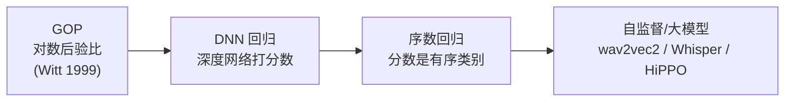
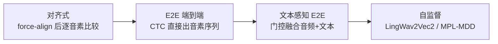

# 发音评测技术树：APA / MDD 概念扫盲

> 📅 创建：2026-08-19 ｜ 类型：概念扫盲 / 常青笔记 ｜ 状态：持续更新
> 🎯 用途：把「发音评测」这一相对陌生的技术树的概念、范式、瓶颈彻底讲清，为交叉方向判断提供坐标

---

## 一、定位

发音评测是「AI 语言学习」里最成熟、也最被忽视的一条技术线。它和知识追踪（KT）长期各走各的，几乎零交叉——这正是我们要找的空白。

**一句话理解**：KT 回答「学生懂没懂」，发音评测回答「学生读得准不准、错在哪」。

---

## 二、定义-解释-示例

### 2.1 APA（Automatic Pronunciation Assessment，发音自动评测）

**定义**：给定二语学习者朗读的音频 + 参考文本，自动量化其发音质量，并定位、诊断具体错误。

它内部天然分两个子任务，这俩不能混：

| 子任务 | 干什么 | 输出 | 指标 |
|---|---|---|---|
| **Scoring（评分）** | 打一个连续分数 | 句/词/音素分数（0-10 或 0-2.0） | **PCC**（皮尔逊相关）、MAE |
| **MDD（检错诊断）** | 逐音素判断对错 + 诊断错成什么 | 错误类型（替换/删除/插入/未知） | **F1**、**PER**（音素错误率） |

> 示例：学生读 "THEME"（标准音素 `TH IY0 M`），实际发成 `TH AH M`。Scoring 给这个词打 7/10；MDD 诊断出第 2 个音素 `IY0` 被错误替换成 `AH`。speechocean762 数据集同时提供这两个标签——这是它作为标准 benchmark 的核心价值。

### 2.2 关键概念：GOP（Goodness of Pronunciation）

**定义**：发音「优度」的经典度量，等于**正确音素的对数后验概率 − 最可能音素的对数后验概率**。

**为什么存在**：发音评测不能直接用 ASR（语音识别）——ASR 会"纠错"（把读错的也识别成对的）。GOP 用声学模型的后验概率差异，衡量"这个音素读得偏离标准有多远"。

**怎么用**：GOP 低 = 发音差。它是几乎所有评分方法的祖先，流利说等产品都以此为基。传统实现基于 HMM/GMM，现代实现基于 DNN。

---

## 三、技术树主干（演进脉络）

### 3.1 评分 Scoring 线的演进

- **GOP（经典，1999）**：HMM 声学模型算后验，是地基。
- **DNN 回归**：用深度网络直接把声学特征回归成分数。
- **序数回归**：`PRESERVING PHONEMIC DISTINCTIONS FOR ORDINAL REGRESSION`（Interspeech 2023）——洞见：发音分数是**有序**的（0.2 < 0.4 < ... < 2.0），不该当普通分类。在 speechocean762 上验证，是近年评分线的代表作。
- **自监督/大模型**：HiPPO（AACL-IJCNLP 2025，层次化发音评估）、Whisper probing（2025，挖掘 ASR 基础模型的潜藏评估能力）、`Enabling Auditory LLMs for Automatic Speech Quality Evaluation`（arXiv 2409.16644）。

### 3.2 检错诊断 MDD 线的演进

- **对齐式（传统）**：force-align（强制对齐）把音频帧对齐到音素，再逐音素比对。需要精确对齐，工程重。
- **E2E 端到端**：CTC 框架直接输出音素序列（如《基于迁移学习的端到端发音检错》，利用 L1 迁移中文母语音素特征）。
- **文本感知 E2E**：`Text-Aware End-to-end MDD`（2022）——用门控策略融合音频 + 文本表征，并用对比损失缩小音素识别与 MDD 目标之间的 gap。
- **自监督**：`LingWav2Vec2`（语言增强 wav2vec2）、`MPL-MDD`（Interspeech 2022，动量伪标签）。

### 3.3 关键数据集

| 数据集 | 规模 | 标注 | 定位 |
|---|---|---|---|
| **speechocean762** | 5000 句 / 250 非母语者（一半儿童） | 句-词-音素三级 + 5 专家 | **标准 benchmark，免费商用** |
| **L2-ARCTIC** | 非母语英语 | 句级 + 音素级标注 | 常用补充语料 |

---

## 四、关键瓶颈（这是最重要的发现）

### 4.1 检错精度远未解决

`Computer-assisted Pronunciation Training -- Speech synthesis is almost all you need`（arXiv 2207.00774）明确指出：

> 现有 CAPT 方法**检错精度仅 ~60% precision（40%-80% recall）**。核心瓶颈是**误发音语音数据稀缺**——训练可靠的错误检测模型需要大量真实的"读错"样本，而这类数据极难收集。

**含义**：发音检错（MDD）本身就是一个**尚未被解决**的问题，存在真实、明确的 gap。这比"KT 再刷一个点"有价值得多。

### 4.2 解决方案的分歧

- **数据增强派**：用语音合成（speech synthesis）生成任意数量的误发音数据（该论文标题即此意）。
- **自监督派**：用 wav2vec2/Whisper 等预训练模型弥补数据不足。
- **我们的潜在位置**：speechocean762 恰好提供了**逐音素的对错 + 错误类型标注**——如果把这个当成「学习者状态」而非「一次性检测」，就进入 KT 的领域。

---

## 五、和 KT 的交叉点（初判）

| KT 概念 | 发音评测对应 | 嫁接点 |
|---|---|---|
| 学生（student） | 说话人（speaker） | 同一人的发音错误有**纵向轨迹**（会不会进步） |
| 题目（item） | 音素（phoneme） | 每个音素是一个"知识点" |
| 对错（correct） | phones-accuracy / 错误类型 | 不是 0/1，是**11 级有序 + 4 类错误** |
| next-step 预测 | 预测下一次读这个音素对不对 | 发音技能习得的纵向建模 |

**核心洞察**：发音评测社区把每次发音当成**独立的检测任务**（检测→打分→结束），而 KT 社区把每次交互当成**序列中的一个点**（追踪→预测→干预）。把「发音错误」从"一次性检测"升级为"可追踪、可预测的技能状态"，这是两个社区都没做过的。

---

## 相关笔记

[[20_认知地图_AI语言学习建模]] [[10_前沿科研成果综述]] [[00_选题与研究规划_LingoBridge]]

🏷️: [[发音评测]] [[APA]] [[MDD]] [[GOP]] [[speechocean762]] [[概念扫盲]] [[CAPT]]
