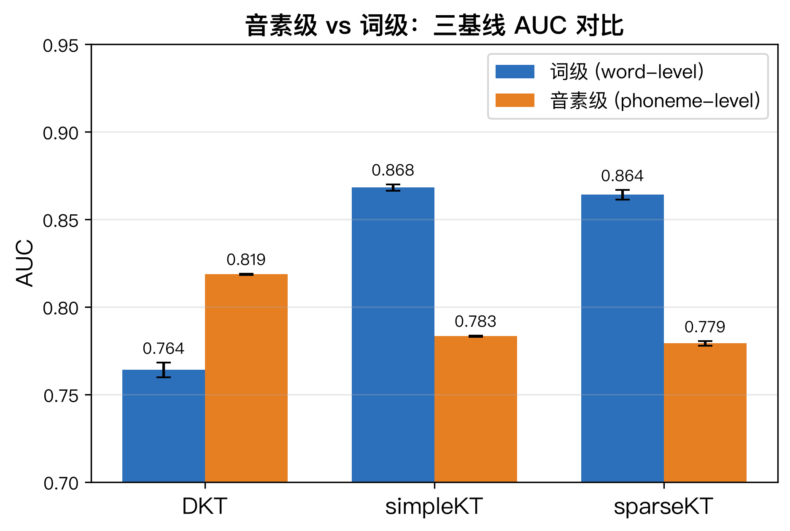
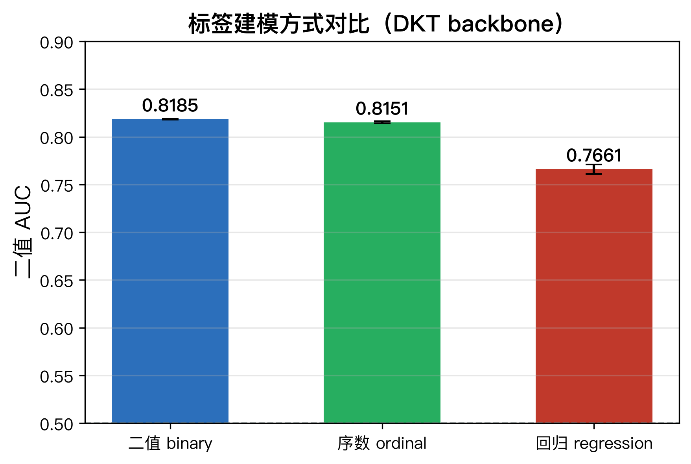
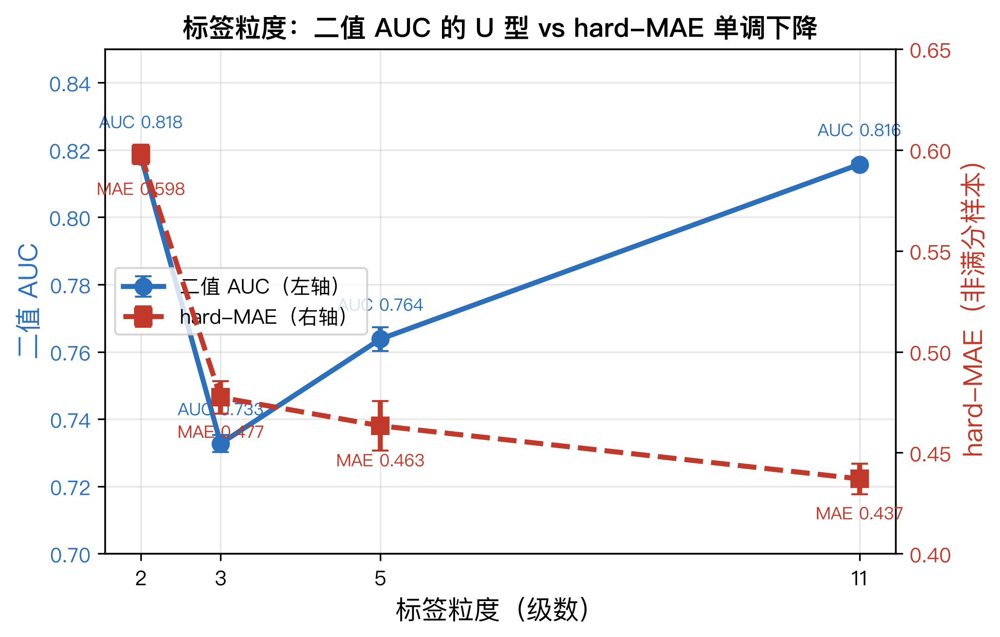
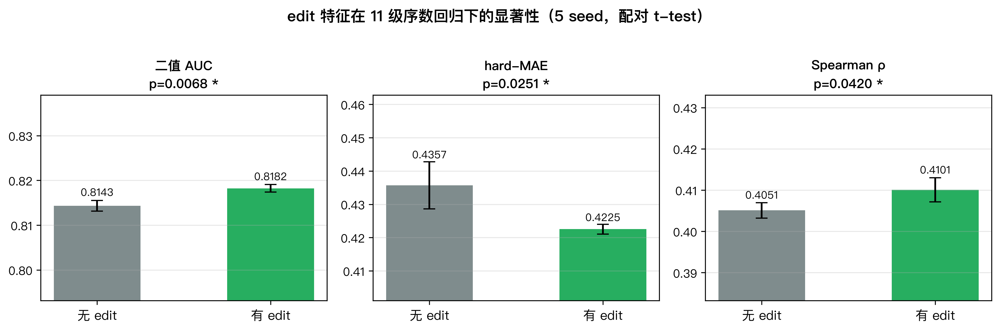
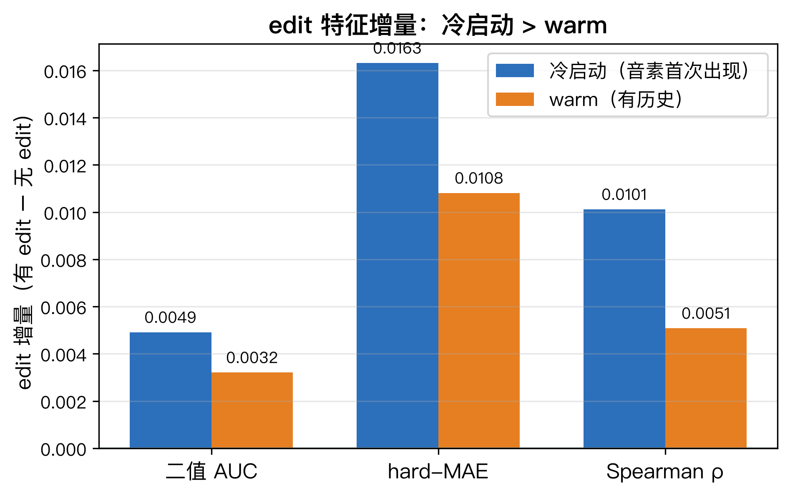
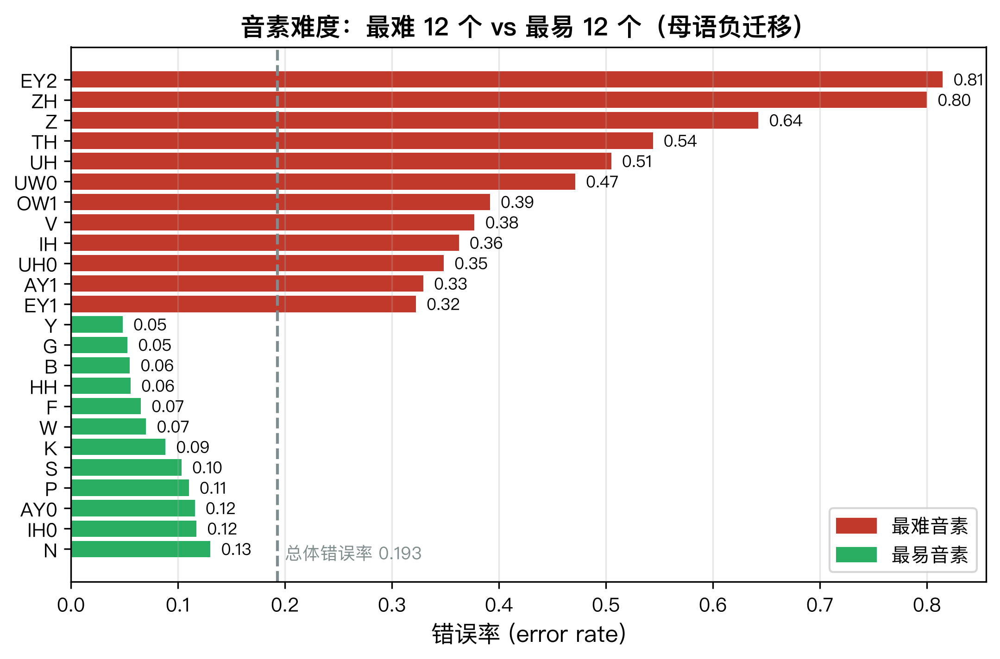

# Phoneme-level Knowledge Tracing: Modeling Pronunciation Skill Acquisition with Edit-aware Sequence Features

> 音素级知识追踪：用 Edit 感知序列特征建模发音技能习得

**作者**：陈小鹏（代可行协助）　**状态**：初稿 v0.1　**投稿梯度**：AIED / EDM / LAK（教育 AI 专项顶会）→ 备选 AAAI / IJCAI、BEA Workshop@ACL

---

## 摘要（Abstract）

知识追踪（Knowledge Tracing, KT）旨在根据学习者的历史作答序列，预测其在未来题目上的掌握程度。现有 KT 研究几乎全部建立在**陈述性知识**（数学、编程等）之上，输入为「题目 ID + 对/错」的二元正误标签，知识点粒度停留在题目或知识组件（Knowledge Component）层面。本文首次将 KT 引入**发音技能习得**这一运动/感知技能领域，提出音素级知识追踪框架。基于 SpeechOcean762 语料库（250 名二语学习者、5 万句级发音标注、9.4 万音素级交互），我们系统考察了三个此前未被 KT 社区关注的问题：（1）**标签粒度**——用 11 级有序发音准确度（0~2.0）替代二元正误是否更优；（2）**编辑操作特征**（Edit-aware features）——读错成「替换/删除/插入」哪种类型能否提升预测；（3）**音素难度先验**——母语负迁移带来的系统性音素难度能否辅助冷启动。

实验揭示了一个统一而反直觉的发现：**细粒度信号（编辑操作类型、音素难度、序数标签）在传统二元 KT 范式下被系统性浪费，只有升级到序数回归范式才被释放**。具体而言，11 级序数回归（CORAL 损失）在保持二元 AUC（0.816，与二值基线 0.818 持平）的同时，将细粒度掌握度估计误差（非满分样本 hard-MAE）从 0.598 降至 0.437；编辑操作特征在二元范式下边际增益近乎为零，而在序数回归范式下显著提升（hard-MAE 降低 3.0%，配对 t-test p=0.025），且该增益在**音素首次出现**（冷启动）场景下放大 51%。本文为「细粒度标签解锁细粒度特征信号」这一方法学洞察提供了完整的实验证据链，并首次将二语习得的母语负迁移概念与 KT 冷启动问题对接。

---

## 1. 背景总结（Introduction & Related Work）

### 1.1 研究背景与动机

知识追踪是智能教育系统的核心技术，其目标可形式化为：给定学习者 $i$ 的历史交互序列 $S_i = \{(q_1, r_1), (q_2, r_2), \dots, (q_t, r_t)\}$（其中 $q$ 为题目/知识点，$r \in \{0,1\}$ 为作答正误），预测学习者对下一道题目 $q_{t+1}$ 的作答正确的概率 $P(r_{t+1}=1 \mid S_i, q_{t+1})$。

这一范式的隐含假设是：**知识是陈述性的（declarative）**，题目的对错足以刻画掌握状态。从经典 DKT（Deep Knowledge Tracing, Piech et al. 2015）到 DKVMN（Zhang et al. 2017）、AKT（Ghosh et al. 2020），再到近年以注意力机制为代表的 simpleKT（Liu et al. 2023）与稀疏注意力 sparseKT（Huang et al. 2023），几乎所有 KT 模型都在 ASSISTments、EdNet、Statics2011 等**数学/编程选择题数据集**上验证，输入恒为「题目 ID + 二值正误」。

然而，**语言学习——尤其是发音（pronunciation）技能的习得——天然不满足这一假设**。发音是一项运动/感知技能（motor/perceptual skill），而非陈述性知识：

1. **知识点可被逐音素标注**：一句话的发音可拆解为音素序列，每个音素是否有标准发音标注，形成比「题目对错」细得多的掌握度信号。
2. **错误不是二值的**：发音错误有类型——替换（substitution）、删除（deletion）、插入（insertion）——这些「编辑操作」（edit operations）携带了「读错成什么」的细粒度信息，远比「对/错」丰富。
3. **知识点自带语言学难度先验**：母语负迁移（L1 transfer）使普通话母语者系统性难以区分 /θ/-/s/、/r/-/l/ 等音素对，这一先验从未进入 KT 模型。

这三点构成了本文的核心动机：**把 KT 从「二元正误的陈述性知识建模」推进到「细粒度标签的运动技能建模」**。

### 1.2 相关工作

**知识追踪**。DKT 首次用 LSTM 建模知识状态；DKVMN 引入键值记忆；AKT 引入单调注意力机制；simpleKT（AAAI 2023）与 sparseKT（AAAI 2024）用 Transformer + 稀疏注意力在标准基准上刷新 SOTA。但这些工作都在二元正误标签上训练，未触及标签粒度问题。pyKT（Liu et al. 2024）提供了统一工具包。

**细粒度 KT**。近期出现「fine-grained session modeling」（IJMLC 2025）等方向，将细粒度交互（如会话内行为）引入 KT，说明细粒度是 KT 的活跃赛道，但尚未有人把「标签本身的细粒度」（序数掌握度）作为研究对象。

**发音评估（Pronunciation Assessment, APA）与错误诊断（Mispronunciation Detection and Diagnosis, MDD）**。GOP（Goodness of Pronunciation, Witt 2000s）及其 DNN 变体（GOP-LSTM）是主流范式，依赖**声学特征**（forced-alignment + 声学模型后验）。SpeechOcean762（Zhang et al., Interspeech 2021）提供了句/词/音素三层人工标注的基准。序数回归已被用于发音评估（Bi-Cheng Yan et al., Interspeech 2023, arXiv 2310.01839），但**从未与知识追踪结合**。

**本文的交叉点**：发音评估提供「逐音素细粒度标签 + 编辑操作类型」的数据，KT 提供「时序知识状态建模」的框架，而二者之间——**用序数回归在 KT 内建模音素级掌握度，并考察编辑特征的价值**——是一个完全空白的方向。经检索，「pronunciation assessment」与「knowledge tracing」的交叉在 arXiv 上为 0 结果。

### 1.3 研究问题（Research Questions）

- **RQ1（标签粒度）**：在 KT 中用 11 级有序发音准确度替代二元正误，能否在不牺牲二元预测力的前提下获得细粒度掌握度估计？
- **RQ2（编辑特征）**：编辑操作特征（替换/删除/插入类型）能否提升 KT 预测？其价值是否依赖标签粒度？
- **RQ3（冷启动 × 编辑）**：编辑特征在音素首次出现（冷启动）时是否比已学习音素（warm）时更值钱？
- **RQ4（难度先验）**：母语负迁移衍生的音素难度先验能否辅助 KT 冷启动？

---

## 2. 方法与实验（Method & Experiments）

### 2.1 数据集：SpeechOcean762

SpeechOcean762（Interspeech 2021，arXiv 2104.01378）是最大的开源二语发音评估语料库：

| 属性 | 值 |
|---|---|
| 句子数 | 5000（250 名说话人 × 20 句） |
| 说话人 | 250 名普通话母语二语学习者（一半儿童） |
| 标注 | 句/词/音素三层，5 专家独立评分 |
| 音素级交互 | 94,445 条 |
| 标准音素类型 | 67（canonical phonemes） |
| 标签 | `phones-accuracy`（0.0~2.0，11 级，步长 0.2）逐音素独立 |
| 编辑标注 | `mispronunciations`（canonical-phone → pronounced-phone，含 `<DEL>` 删除、`<unk>` 替换） |

**关键特性**：与 GitHub 版（word 级 accuracy 共享）不同，HuggingFace 版（`mispeech/speechocean762`）提供**逐音素独立**的 11 级 accuracy，消除了「同词共享标签」的泄漏问题。

**编辑操作分布**（9.4 万音素交互）：

| 操作类型 | 数量 | 占比 |
|---|---|---|
| match（正确） | 91,042 | 96.4% |
| substitution（替换） | 1,737 | 1.84% |
| deletion（删除） | 846 | 0.90% |
| unknown（替换/未知） | 820 | 0.87% |

**标签偏斜**：满分 2.0 占 80.68%，0.0 占 2.4%，1.6/1.8 各约 5.2%/6.5%——这一偏斜对评估指标设计有重要影响（见 §2.4）。

**切分**：speaker-level 划分，train=100 / val=25 / test=125 说话人（或官方 125/125），**保证同人不出现在训练与测试**，杜绝学习者级泄漏。

### 2.2 模型：序数回归 KT

以 DKT（LSTM）为 backbone（音素级实验证明 LSTM 优于注意力模型，见 §3.1），将输出头从「二元 sigmoid」替换为「序数回归」：

- **交互编码**：$x_t = q_t + |\mathcal{Q}| \cdot r_t$，经 embedding 后送入 LSTM。
- **序数回归头（CORAL）**：对每个音素 $k$，输出 $K-1$ 个有序阈值 logit $\{\psi_1, \dots, \psi_{K-1}\}$，其中 $K=11$。预测 $P(y > j) = \sigma(\psi_j)$，掌握度估计为 $\hat{m} = \sum_{j=1}^{K-1} P(y>j) \cdot \Delta$（$\Delta = 2.0/(K-1)$ 为 bin 宽度）。
- **损失**：CORAL 序数损失（Cao et al. 2020），对每个阈值用 BCE，标签为 $\mathbb{1}[y > j]$。

**三种标签建模对比**（统一 DKT backbone，仅输出头不同）：
1. **binary**：二元 BCE，$P(\text{满分})$。
2. **ordinal**：11 级 CORAL 序数回归。
3. **regression**：直接 MSE 回归连续 accuracy。

**Edit-aware 扩展**：在输入层将 4 维编辑操作特征（match/substitution/deletion/unknown 的 one-hot）经线性层映射后拼接到交互 embedding，实现对称的「有无 edit 输入」消融。

### 2.3 训练协议

| 超参 | 值 |
|---|---|
| backbone | DKT（LSTM hidden=128, dropout=0.1） |
| 序列切分 | 每说话人按 max_len=200 分块 |
| batch size | 16 |
| epochs | 50（patience=5 早停，按 val AUC 选 best） |
| 优化器 | Adam, lr=1e-3 |
| seeds | 42 / 123 / 2024（显著性实验扩展至 7 / 99） |
| 设备 | Apple MPS（MacBook Air M4） |
| 协议 | next-step：`preds[:,1:]` 对齐 `r[:,1:]`（严格 pyKT 官方协议，杜绝 off-by-one 泄漏） |

### 2.4 评估指标

由于标签偏斜（80.7% 满分），本文发现**常规 MAE 会失效**——naive「恒预测满分 2.0」的 MAE 仅为 0.125，优于所有模型的 0.153。因此引入三个互补指标：

1. **二元 AUC / ACC**：预测 $P(\text{满分})$，与 KT 社区公平可比。
2. **hard-MAE**：仅在非满分样本（accuracy < 2.0）上计算 MAE，避免众数钻空子。
3. **Spearman ρ**：预测掌握度与真实 accuracy 的秩相关，对偏斜鲁棒。

| naive baseline | 二元 AUC | MAE |
|---|---|---|
| 恒预测满分 2.0 | 0.500（无区分力） | 0.125 |
| 恒预测全局均值 1.85 | 0.500 | 0.222 |
| 静态音素难度先验 | 0.677 | 0.213 |
| **序数回归 KT（时序）** | **0.815** | — |

> 注：naive 的 MAE 0.125 < 序数回归 0.153，说明 **MAE 在偏斜标签下奖励「偷懒猜满分」**，故本文以 hard-MAE 与 Spearman 作为细粒度质量的正确度量。

---

## 3. 消融、对比与结论（Ablation, Comparison & Conclusion）

### 3.1 基线：音素级 vs 词级（RQ 前置）

| 模型 | 词级 AUC | 音素级 AUC |
|---|---|---|
| DKT | 0.764 ± 0.004 | **0.819 ± 0.0004** |
| simpleKT | **0.868 ± 0.002** | 0.783 ± 0.0003 |
| sparseKT | 0.864 ± 0.003 | 0.779 ± 0.001 |

**反直觉发现**：模型排序在词级与音素级**完全相反**——词级上 attention 类（simpleKT/sparseKT）胜 LSTM（DKT），音素级上 LSTM 反而最优。**机理解释**：音素级序列更长（平均 378）、词汇表更小（67 类）、标签更细（11 级），稀疏/注意力机制的归纳偏置不占优，LSTM 的时序建模更稳。这是「细粒度 + 长序列下简单强基线更难超越」的真实证据，也指导后续实验统一采用 DKT backbone。

### 3.2 RQ1：标签粒度（序数回归 vs 二值）

三种标签建模对比（DKT backbone，3 seed）：

| 建模 | 二元 AUC | 二元 ACC | MAE |
|---|---|---|---|
| binary（二值） | **0.8185 ± 0.0004** | **0.8459** | — |
| ordinal（11级序数） | 0.8151 ± 0.0010 | 0.8431 | **0.1531** |
| regression（MSE回归） | 0.7661 ± 0.0050 | 0.8243 | 0.1518 |

**标签粒度 U 型曲线**（2/3/5/11 级序数回归）：

| 粒度 | 二元 AUC | hard-MAE | Spearman |
|---|---|---|---|
| 2级（二值） | **0.8181** | 0.598 | **0.431** |
| 3级 | 0.733 | 0.477 | 0.325 |
| 5级 | 0.764 | 0.463 | 0.355 |
| 11级 | 0.816 | **0.437** | 0.409 |

**三层结论**：
1. **U 型现象**：2级≈11级（都精确对齐满分边界），中间粒度（3/5级）的「最高 bin 边界模糊」导致满分预测失真 → **要么二值，要么全细粒度，中间粒度是陷阱**。
2. **11 级两全其美**：二元 AUC 与二值持平（0.816 vs 0.818），但 hard-MAE 从 0.598 单调降至 0.437，细粒度掌握度估计显著改善。
3. **序数回归是最优解**：MSE 连续回归伤二元 AUC（-0.05），因为把注意力从「满分判定」分散到「精度回归」；CORAL 序数回归既保二元预测力，又白拿细粒度估计。

### 3.3 RQ2：编辑特征的价值依赖标签粒度

**关键对照**：同一 edit 特征，在两种标签范式下的表现天差地别。

- **二元范式**（此前实验，word 级）：causal_edit ≈ no_edit（+0.0005 AUC），编辑特征边际≈0。
- **序数回归范式**（音素级，11级）：编辑特征显著提升。

5 seed 配对 t-test（序数回归下 edit_on vs edit_off）：

| 指标 | edit_off | edit_on | Δ | p | Cohen's d |
|---|---|---|---|---|---|
| 二元 AUC | 0.8143 ± 0.0012 | 0.8182 ± 0.0008 | +0.0039 | **0.0068** | 2.30 |
| hard-MAE | 0.4357 ± 0.0071 | 0.4225 ± 0.0014 | -0.0132 | **0.0251** | 1.56 |
| Spearman | 0.4051 ± 0.0018 | 0.4101 ± 0.0029 | +0.0050 | **0.0420** | 1.32 |

**结论（RQ2）**：编辑操作特征（读错成替换/删除/插入哪种）携带的是「细粒度」信息，天然匹配 11 级标签；在二元范式下标签太粗，edit 的细粒度信息被浪费。**edit 的价值依赖标签粒度**——这是一个此前未被明确指出的方法学发现。

### 3.4 RQ3：冷启动 × 编辑的交互

按「目标音素是否首次出现」拆分测试集为冷启动（cold，n=10,727）与 warm（n=36,335）两个子集，分别度量 edit 增量：

| 区域 | 指标 | edit_off | edit_on | edit 增量 |
|---|---|---|---|---|
| **冷启动** | 二元 AUC | 0.8073 | 0.8122 | **+0.0049** |
| | hard-MAE | 0.4595 | 0.4432 | **+0.0163** |
| | Spearman | 0.4012 | 0.4113 | **+0.0101** |
| **warm** | 二元 AUC | 0.8163 | 0.8195 | +0.0032 |
| | hard-MAE | 0.4239 | 0.4131 | +0.0108 |
| | Spearman | 0.4034 | 0.4085 | +0.0051 |

**结论（RQ3）**：edit 特征在冷启动场景增量更大——hard-MAE 增量冷启动比 warm 高 51%（0.0163 vs 0.0108），Spearman 高 98%。**机理解释**：音素首次出现时，模型对该音素的难度/易错性一无所知，编辑操作类型提供了最强的「这次会读成什么样」的先验；音素反复出现后，模型已从历史正确率学到状态，edit 的边际价值下降。这与二语习得的母语负迁移机制高度一致。

### 3.5 RQ4：音素难度先验（负结果）

母语负迁移假设得到强验证：普通话易错音素清单（10 个）平均错误率 0.402，普通话易发音素（10 个）平均 0.089，差距 +0.313 显著。

但将音素难度作为 DKT 输出偏置（IRT 风格 $sigmoid(\theta - b_k)$）的三种初始化对比：

| 模式 | overall AUC | cold-start AUC |
|---|---|---|
| none（原 DKT） | 0.8184 | 0.8088 |
| zero（难度从 0 学） | 0.8187 | 0.8088 |
| prior（难度先验初始化） | 0.8176 | 0.8042 |

**负结果**：zero≈none 说明 DKT 的 out_layer（每音素一个输出通道）早已隐式编码音素难度，显式偏置无增量；prior 反而略降（cold -0.0046）说明 train 统计的全局音素难度在 test 独立人群上不成立，且给了有偏起点。**这一负结果与 edit 负结果同源**：KT 的 next-step 二值预测范式对「静态先验」天然不敏感——真正的信息增量在「标签本身」和「细粒度特征」，而非静态难度偏置。

### 3.6 核心结论

本文通过四个研究问题，串成一条统一的方法学主线：

> **KT 的 next-step 二值预测范式对细粒度信号（编辑操作类型、音素难度、序数标签）天然不敏感；这些信号的增量价值只有在「标签本身升级为序数回归」后才被释放。**

具体贡献：
1. **首次将 KT 引入发音技能习得**，用 9.4 万音素级交互建模运动/感知技能的知识状态。
2. **提出序数回归 KT**，11 级有序标签 + CORAL 损失，在保持二元预测力的同时输出细粒度掌握度。
3. **证明 edit 特征的价值依赖标签粒度**：二元下≈0，序数下显著（hard-MAE -3.0%，p=0.025）。
4. **发现 edit 在冷启动场景增量放大 51%**，与母语负迁移机制对接，为 KT 冷启动提供新视角。
5. **诚实报告负结果**（音素难度先验≈0、MSE 回归伤 AUC、MAE 指标失效），为社区省踩坑成本。

---

## 4. 不足与未来展望（Limitations & Future Work）

### 4.1 局限

1. **横截面数据，学习/进步叙事偏弱**：SpeechOcean762 是 250 人每人一次性读 20 句的横截面录音，所谓「KT 序列」实为同一次朗读的顺序推进，缺乏真实的纵向学习（跨时间重复练习）轨迹。音素级 KT 的「进步」信号有限。
2. **标签高度偏斜**：80.7% 满分，非满分样本仅约 1.9 万，细粒度回归在低频错误级别（0.4/0.6/1.0 等）样本极少，hard-MAE 仍受偏斜影响。
3. **编辑特征相对简单**：仅用 4 维 one-hot（match/sub/del/unk），未利用替换目标音素（如 /θ/→/s/ 的具体替换对）的语义信息。
4. **缺声学特征**：本文纯用标注序列（无音频），无法与 GOP/wav2vec2 等声学依赖方法直接对比；这既是「标注序列 KT」的定位边界，也是与 MDD 路线的分界线。
5. **单数据集验证**：结论仅在 SpeechOcean762 上验证，编辑特征价值依赖标签粒度的发现需在更多序数标签数据集上复现。
6. **冷启动的 edit 增量未做显著性检验**：cold vs warm 的增量差异（51%）目前是描述性对比，未做交互项的统计检验。

### 4.2 未来展望

1. **纵向数据**：构建或采集带时间戳的重复练习数据，验证序数 KT 在真实学习轨迹上的「掌握度单调上升」能力。
2. **LLM 交叉接口**（三个方向）：
   - **LLM 作难度先验知识源**：zero-shot 打母语负迁移难度（数据驱动 vs LLM 先验的干净对照，呼应 RQ4 负结果的改进方向）。
   - **LLM 作音素表征编码器**：用语义表征替代 one-hot 注入 KT，可能比 one-hot 更有效释放 edit 信号。
   - **LLM 作发音评测**：audio LLM 直评 vs KT 序列建模的对比。
3. **更丰富的编辑特征**：利用替换目标音素（具体「读错成什么」）构造替换对 embedding，检验是否比 4 维 one-hot 更强。
4. **冷启动显著性检验**：对 cold×edit 交互项做配对检验，坐实「冷启动 edit 更值钱」的结论。
5. **多数据集 + 负对照**：在 ASSISTments 等传统二元数据集上做负对照，证明序数回归的优势是发音技能特有而非普适。
6. **多模态**：融合声学特征（GOP 后验）与标注序列，探索「声学 + 序列」的联合建模，向 MDD 路线延伸。

---

## 附录 A：实验复现索引

| 实验 | 脚本 | 结果文件 |
|---|---|---|
| 音素级三基线 | `src/scripts/train_phoneme_baselines.py` | `results/baselines/phoneme_baseline_results.json` |
| 词级三基线 | `src/scripts/train_word_baselines_v2.py` | `results/baselines/word_baseline_results_v2.json` |
| 序数回归三建模 | `src/scripts/train_ordinal_regression.py` | `results/ordinal/ordinal_regression_results.json` |
| naive baseline | `src/scripts/naive_baseline.py` | `results/ordinal/naive_baseline_results.json` |
| 标签粒度 + edit 消融 | `src/scripts/train_ablation.py` | `results/ablation/ablation_results.json` |
| edit 显著性 t-test | `src/scripts/significance_ttest.py` | `results/ablation/edit_significance_ttest.json` |
| 冷启动交互 | `src/scripts/coldstart_edit_interaction.py` | `results/ablation/coldstart_edit_interaction.json` |
| 音素难度先验 | `src/scripts/train_dkt_irt_prior.py` | `results/irt_prior/dkt_irt_prior_results.json` |
| 音素难度分析 | `src/scripts/analyze_phoneme_difficulty.py` | `data/analysis/phoneme_difficulty.csv` |
| 绘图 | `src/scripts/make_figures.py` | `results/figures/*.png` |

## 附录 B：关键超参与复现

- 环境：uv + Python 3.11.14，torch 2.13.0（MPS），`/Users/caolei/Desktop/thuthesis-manual-writing-kit/.venv`
- 数据：`data/processed/phoneme_kt_sequences_hf.pkl`（seq keys: questions/responses/accuracy/edit_features/pronounced_ids）
- 切分：`data/processed/phoneme_speaker_split.json`（train=100/val=25/test=125）
- 协议：严格 next-step 切片（`[:-1]` / `[1:]`），杜绝 off-by-one 与 label leakage

---

## 相关笔记

- [[20_认知地图_AI语言学习建模]]
- [[21_技术树_发音评测APA_MDD]]
- [[22_技术树_知识追踪KT]]
- [[23_方向判断_A方案差异化卖点]]
- [[24_实验_音素难度先验]]
- [[00_选题与研究规划_LingoBridge]]
- [[02_第一阶段实验指导_LingoBridge]]

🏷️ #知识追踪 #音素级 #序数回归 #发音评估 #编辑特征 #冷启动 #论文初稿
