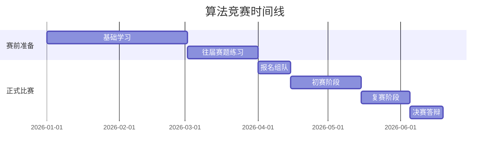

---
tags:
  - 人工智能
  - 竞赛
  - 算法
  - 深度学习
  - 校园竞赛
  - 项目实践
created: 2026-07-03
---

# 人工智能算法精英赛信息汇总 🏅

> 全球校园人工智能算法精英大赛——智青春·算未来

## 📖 定义与解释

**全球校园人工智能算法精英大赛**（Global Campus AI Algorithm Elite Competition）是国内规模和影响力较大的校园 AI 竞赛之一，面向高校学生群体，旨在通过**算法实战**选拔和培养人工智能领域的后备人才。它不是纯理论答题，而是要求选手在**真实或接近真实的数据和场景**下，完成从数据理解、特征工程、模型选型、训练调优到结果评估的完整算法链路。

这类竞赛的价值远超"拿一个奖"——它实质上是**AI 工程师的实战演习**。在课堂上你学的是"分类算法有哪些"，但在竞赛中你真刀真枪地面对：缺失值怎么处理、类别不平衡怎么办、特征怎么组合、模型怎么融合、推理速度怎么优化。这些都是书本不会告诉你答案的问题。

## ❓ 关键信息 Q&A

### Q1: 大赛的基本信息是什么？

- **官网地址**：[www.aicomp.cn](https://www.aicomp.cn)
- **赛事公告**：[智青春·算未来](https://www.aicomp.cn/notice/1827.html)
- **目标群体**：全球高校在校学生（本科生、研究生均可参赛）
- **赛事口号**：智青春·算未来

### Q2: 这类比赛通常考察什么能力？

一般包含以下几类赛道：
1. **图像赛道** ——目标检测、图像分割、图像分类、OCR 等
2. **NLP/文本赛道** ——文本分类、信息抽取、语义匹配、大模型微调等
3. **结构化数据赛道** ——风控预测、用户行为预测、推荐系统等
4. **创新赛道** ——开放命题，鼓励应用创新和跨领域融合

每类赛道通常提供**训练集 + 测试集**，选手在训练集上训练模型，对测试集进行预测，提交结果后由平台根据预设指标（AUC、F1-score、mAP 等）自动评分排名。

### Q3: 参加竞赛的典型时间线是怎样的？

- **赛前准备期**（1-2 个月）：补齐基础、研究往届赛题方案
- **报名组队期**（1-2 周）：寻找互补的队友（算法 + 工程 + 文档/答辩）
- **初赛期**（3-4 周）：快速搭建 Baseline → 持续迭代 → 冲刺上分
- **复赛期**（2-3 周）：深度优化、模型融合、方案验证
- **决赛期**（1-2 周）：代码审查、答辩 PPT、现场展示

### Q4: 新手应该如何准备？

**第一阶段：基础打底**（1-2 个月）
- 掌握 Python 数据处理三件套：NumPy、Pandas、Matplotlib/Seaborn
- 熟悉至少一个深度学习框架：PyTorch（推荐）或 TensorFlow
- 理解常见模型原理：CNN/RNN/Transformer、GBDT/XGBoost/LightGBM
- 学会使用 Kaggle 平台，从 Titanic 和 House Prices 两个入门赛题开始

**第二阶段：针对性训练**（1 个月）
- 在 Kaggle / 天池 / 和鲸社区找 3-5 个与自己主攻方向匹配的历史赛题
- **直接阅读高分方案（Solution Writeup）**，理解别人的思路和 tricks
- 自己复现 1-2 个完整方案，从数据清洗到最终提交

**第三阶段：团队协作**（赛前 2 周）
- 建立代码协作规范（Git + 统一的文件命名 + 结果记录模板）
- 明确分工：谁做特征工程、谁做模型、谁做后处理
- 设定版本迭代节奏：至少每天一次模型更新

### Q5: 竞赛中常见的提分技巧有哪些？

1. **Baseline 先行** 🎯 ——第一天的目标不是拿高分，是提交一个能跑通的结果。有 Baseline 就有了改进的基准线和心理安全网。

2. **特征工程是王道** 🔧 ——在很多结构化数据赛题中，特征工程带来的提升远超换模型。花 60% 的时间在数据分析（EDA）和特征构造上。

3. **交叉验证要严谨** 📐 ——训练集划分方式要尽量接近测试集的真实分布。按时间切分 > 随机切分（当数据有时间属性时）。**本地 CV 分数和排行榜分数方向一致才是有效的验证策略**。

4. **模型融合是最后冲刺** 🔗 ——Stacking、Blending、加权平均是常见融合方式。确保融合的模型具有**多样性**（不同架构、不同特征子集、不同随机种子训练），否则融合效果有限。

5. **TTA（Test Time Augmentation）** ✨ ——在推理时对测试样本做多种增强（翻转、裁剪等），取平均结果。这几乎是图像竞赛的标配操作。

6. **保持记录** 📝 ——用实验管理工具（如 MLflow、WandB 或最简单的 Excel）记录每次实验的参数和结果。别相信自己的大脑——三天后你就会忘记那个 0.912 的模型用的是什么参数。

## 🎯 案例分析：从校赛到国赛的晋级路径

假设一个典型的大学生竞赛进阶路径：
- **大一下**：完成 Python 和机器学习基础学习，在 Kaggle Titanic 上拿到前 30%
- **大二上**：参加校级或省级竞赛，积累第一次完整参赛经验（不管名次）
- **大二下**：参加算法精英赛初赛，目标进入复赛
- **大三上**：冲击国赛名次，同时将竞赛经验转化为论文或项目经历
- **大三下**：担任队长带队参赛，锻炼领导力和代码审查能力

你不需要每一站都拿金牌。**每一次参赛都是认知升级**——第一次理解什么是过拟合，第二次学会特征工程的价值，第三次掌握了模型融合的艺术。这些经验会沉淀为你的算法直觉，而算法直觉 = 快速判断哪些方向值得尝试的能力。

---

## 🔗 相关笔记

[[人工智能学习路线图]]
[[Kaggle竞赛经验总结]]
[[深度学习框架选择：PyTorch vs TensorFlow]]
[[特征工程方法论]]
[[模型融合与集成学习]]
[[交叉验证最佳实践]]
[[实验管理与MLflow]]
[[Python数据处理三件套]]
[[竞赛答辩与方案展示技巧]]
[[从竞赛到论文：成果转化路径]]

🏷️: [[人工智能]] [[竞赛]] [[算法]] [[深度学习]] [[校园竞赛]] [[项目实践]] [[机器学习]]
