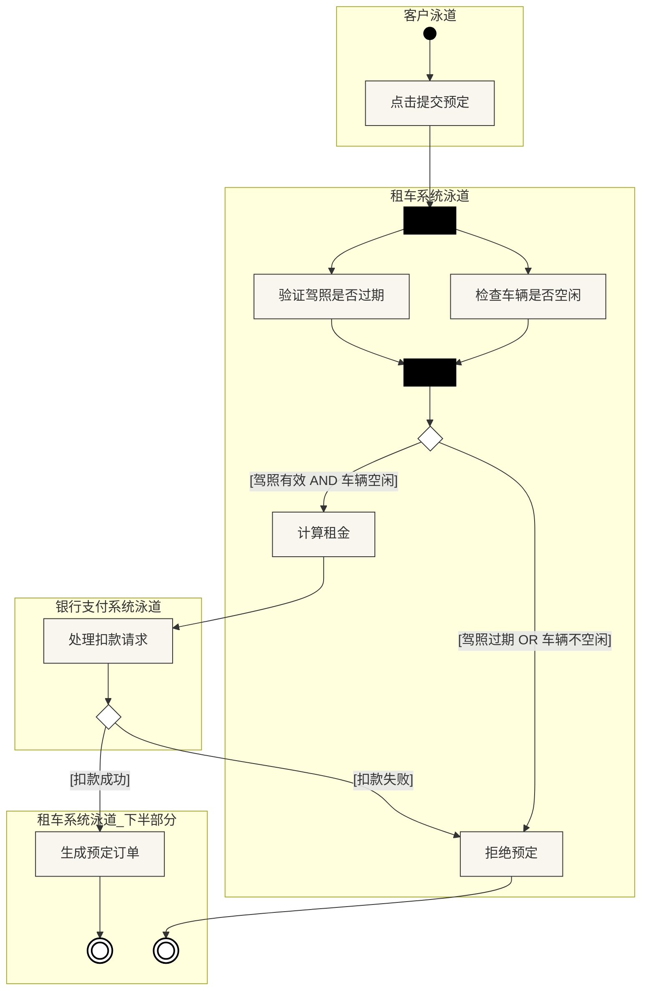

```mermaid
flowchart TD
    %% 定义样式
    classDef action fill:#f9f6f0,stroke:#333,stroke-width:1px;
    classDef condition fill:#fff,stroke:#333,stroke-width:1px,shape:diamond;
    classDef sync fill:#000,stroke:#000,stroke-width:4px;
    classDef startend fill:#000,stroke:#000,shape:circle;
    classDef endpoint fill:#fff,stroke:#000,stroke-width:2px,shape:doublecircle;

    subgraph 客户泳道
        Start(( )):::startend --> A1[点击提交预定]:::action
    end

    subgraph 租车系统泳道
        A1 --> Fork1[ ]:::sync
        
        %% 并发分流
        Fork1 --> B1[验证驾照是否过期]:::action
        Fork1 --> B2[检查车辆是否空闲]:::action
        
        %% 并发汇合
        B1 --> Join1[ ]:::sync
        B2 --> Join1
        
        Join1 --> D1{ }:::condition
        
        %% 成功分支
        D1 -->|"[驾照有效 AND 车辆空闲]"| C1[计算租金]:::action
        
        %% 失败分支1
        D1 -->|"[驾照过期 OR 车辆不空闲]"| C2[拒绝预定]:::action
    end

    subgraph 银行支付系统泳道
        C1 --> B_Pay[处理扣款请求]:::action
        B_Pay --> D2{ }:::condition
    end

    subgraph 租车系统泳道_下半部分
        %% 这里为了排版清晰，把系统内部的回调放在这里
        D2 -->|"[扣款成功]"| C3[生成预定订单]:::action
        
        %% 失败分支2 汇合到同一个“拒绝预定”动作
        D2 -->|"[扣款失败]"| C2
        
        %% 两个终点
        C3 --> End_Success((( ))):::endpoint
        C2 --> End_Fail((( ))):::endpoint
    end
```
