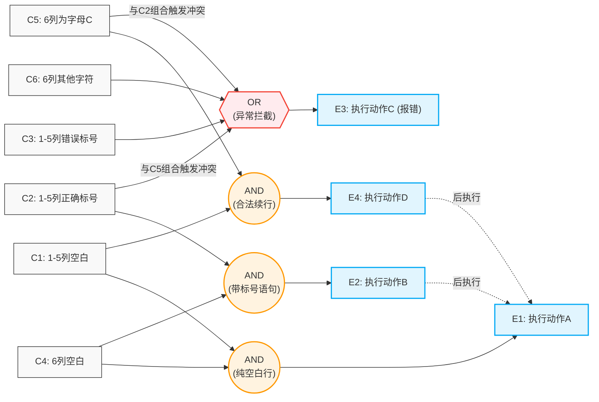

作业2

1.描述集成测试和系统测试的差异。
集成测试和系统测试处于软件测试流程中不同的阶段，关注的对象和测试目标都不一样。集成测试发生在单元测试之后，它关注的是模块与模块之间的接口和交互，检查各个单元组合在一起之后能不能正确地协同工作，数据在模块间传递时有没有丢失或出错，通常由开发人员来完成。而系统测试在整个集成测试完成之后进行，它把整个软件当成一个完整的系统来测，关注的是系统整体是否满足需求规格说明书中定义的功能和非功能要求，包括功能、性能、安全性、兼容性等方面，一般由独立的测试团队来执行。简单说，集成测试是对内的，看零件组装得对不对；系统测试是对外的，看整台机器能不能干好用户要它干的活。

2.何时要进行回归测试？回归测试为什么需要对测试用例进行管理？
回归测试是在软件发生变更之后必须要做的一项工作。具体来说，每次修复了缺陷、增加了新功能、优化了代码结构、或者升级了依赖的组件之后，都需要跑一遍回归测试，目的是确认这次的改动没有把原来已经正常运行的功能给搞坏了。这个工作要求对测试用例进行管理，原因很现实：随着项目的推进，测试用例会越积越多，如果不加管理，每次回归测试都要把所有用例全跑一遍，耗时太长而且很多用例跟本次改动毫无关系。有效的管理意味着要对用例进行分类、标注优先级、建立用例与功能模块之间的对应关系，这样每次回归的时候就能根据改动范围精准地挑选出相关的用例来执行，既保证覆盖了风险区域，又不浪费时间和人力。同时，管理还能帮助发现哪些用例已经过时了需要更新，哪些重复了可以合并，让测试套件始终保持在健康的状态。

3.根据以下程序结构图，描述自底向上渐增式集成测试的过程。
根据程序结构图，整个系统由A、B、C、D、E、F、G七个模块组成，其中A处于最顶层，负责总控调度；中间层有B、C、D三个模块，均被A直接调用；最底层是E、F、G三个模块，E和F被B调用，G被D调用，C不再调用其他模块，属于叶子节点。自底向上渐增式集成测试的流程从最底层开始，分三轮逐步完成。
第一轮，分别对最底层的四个叶子模块C、E、F、G进行单元测试。因为这几个模块都不再调用其他模块，测试时只需要为它们各自编写一个简单的驱动器程序来模拟上层调用、传入测试数据并接收返回结果，不需要写桩模块。逐个验证C、E、F、G各自的功能是否正常，确认底层没有问题之后才能往上走。需要特别注意的是C模块比较特殊，它虽然处于底层，但在结构图中它位于中间列，后续会被顶层的A直接调用，所以这一轮对C的测试要尽量充分。
第二轮，开始集成中间层。这一步要处理两个集成任务：第一个是将B模块与它调用的E和F组装在一起进行测试，此时E和F已经通过了第一轮的单元测试，可以直接使用真实模块，只需为B编写一个驱动器来模拟A对B的调用即可；第二个是将D模块与G组装在一起测试，同样G已经验证过，为D写一个驱动器模拟A的调用。这一轮的核心是检查B与E、F之间的接口是否正确，数据传递有没有问题，以及D与G之间的交互是否顺畅。C模块在这一轮不参与新的集成，因为它没有子模块需要组合。
第三轮，也是最顶层的一轮，把A模块与B、C、D全部组装起来。此时B、D已经带着它们各自的子树完成了集成测试，C也在第一轮通过了单元验证，这三个模块都可以直接用真实版本。为A编写一个总驱动器来模拟整个系统的外部输入，运行后在A的调度下观察B、C、D三条分支能否正常协同。这一轮测的是整个系统的骨架是否贯通，A对各模块的调用顺序和参数传递是否正确。

三轮完成之后，整个系统从最底层的叶子到最顶层的总控模块就全部集成完毕了。这个方法的优点是越底层的模块在集成过程中被调用的次数越多，E和F先在第一轮单测、第二轮跟B集成时又被检验了一遍，G同理，等于越基础的部分越经得起考验，早期暴露问题的概率也比较高。

4.系统要求用户输入以年月表示的日期。假设日期限定在1990年1月至2049年12月，并规定日期由6位数字字符组成，前4位表示年，后2位表示月，中间用“-”隔开。用等价类划分法设计测试用例。
首先要从输入条件中划出有效等价类和无效等价类。年份方面，有效范围是1990到2049，那么小于1990的年份是一个无效等价类，大于2049的年份是另一个无效等价类，1990到2049之间是有效类。月份方面，有效范围是01到12，小于01（即00及以下）是一个无效等价类，大于12是另一个无效等价类。格式方面，输入必须是恰好6位数字字符加一个“-”组成，前4位后2位，那么存在以下几种无效情况：不包含“-”、数字位数不对（比如5位或7位）、含有非数字字符（如字母或特殊符号）、分隔符位置不对（比如“-”出现在了其他位置上）。基于这些等价类，设计以下测试用例来覆盖各种情况。

有效用例方面，选一个中间的典型值，输入“2023-06”，预期结果是通过验证；再考虑边界，输入“1990-01”覆盖年份和月份的最小边界值，预期通过；输入“2049-12”覆盖年份和月份的最大边界值，预期通过。无效用例方面，输入“1989-05”检验年份低于下限的情况，预期拒绝；输入“2050-03”检验年份超出上限的情况，预期拒绝；输入“2020-00”检验月份低于下限的情况，预期拒绝；输入“2020-13”检验月份超出上限的情况，预期拒绝；输入“202006”即缺少分隔符的情况，预期拒绝；输入“20-06”即年份只有两位导致总位数不足的情况，预期拒绝；输入“2020-6”即月份只有一位的情况，预期拒绝；输入“202a-06”即年份含有字母的情况，预期拒绝。通过以上用例，基本可以覆盖所有的有效和无效等价类，保证输入验证逻辑的完整性。

5.FORTRAN语言的语法规定是非常严格的。在一个程序行中，第1－5列是标号区，第6列是续行区。如果前6列是空白，则执行动作A。如果第1－5列有标号且是正确的标号，则执行动作B后再执行动作A；反之，若是错误的标号，则执行动作C。如果第6列不是空白而是字母C，则执行动作D后再执行A；反之，若是错误的标号，则执行动作C。根据以上描述，画出因果图并构建判定表。

下面构建判定表。判定表包含三个条件桩和四个动作桩，共八条逻辑组合规则。其中“前6列全为空白”与另外两个条件同时为Y的情况在逻辑上不可能存在，将其作为不可能项排除后，实际有效的规则共五条：

规则1：Y、N、N。前6列全为空白，直接执行动作A。 规则2：N、Y、N。第1-5列有正确标号且第6列非C，按正常语句执行动作B，再执行动作A。 规则3：N、Y、Y。第1-5列有正确标号且第6列为字母C。此时触发FORTRAN语法冲突，执行动作C进行报错拦截。 规则4：N、N、Y。无正确标号且第6列为字母C，按续行执行动作D，再执行动作A。 规则5：N、N、N。前6列非全空，无正确标号且第6列也不是C。代表遇到错误标号或其他非法字符，属于错误情况，执行动作C。

通过以上五条有效规则，完整覆盖了题目描述的所有情况。

|**条件及动作**|**规则1**|**规则2**|**规则3**|**规则4**|**规则5**|
|---|---|---|---|---|---|
|**条件：前6列全为空白**|Y|N|N|N|N|
|**条件：1-5列有正确标号**|N|Y|Y|N|N|
|**条件：第6列为字母C**|N|N|Y|Y|N|
|**动作：执行动作A**|X|X||X||
|**动作：执行动作B**||X||||
|**动作：执行动作C**|||X||X|
|**动作：执行动作D**||||X||
条件及动作       规则1 规则2 规则3 规则4 规则5
条件：前6列全为空白 Y N N N N 
条件：1-5列有正确标号 N Y Y N N
条件：第6列为字母C N N Y Y N
动作：执行动作A X   X                X
动作：执行动作B      X
动作：执行动作C               X                 X 
动作：执行动作D                        X

