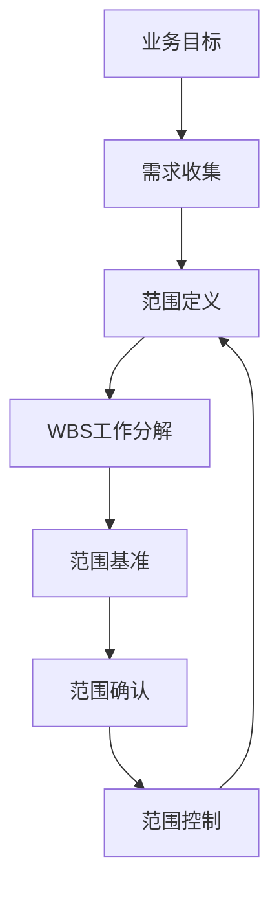
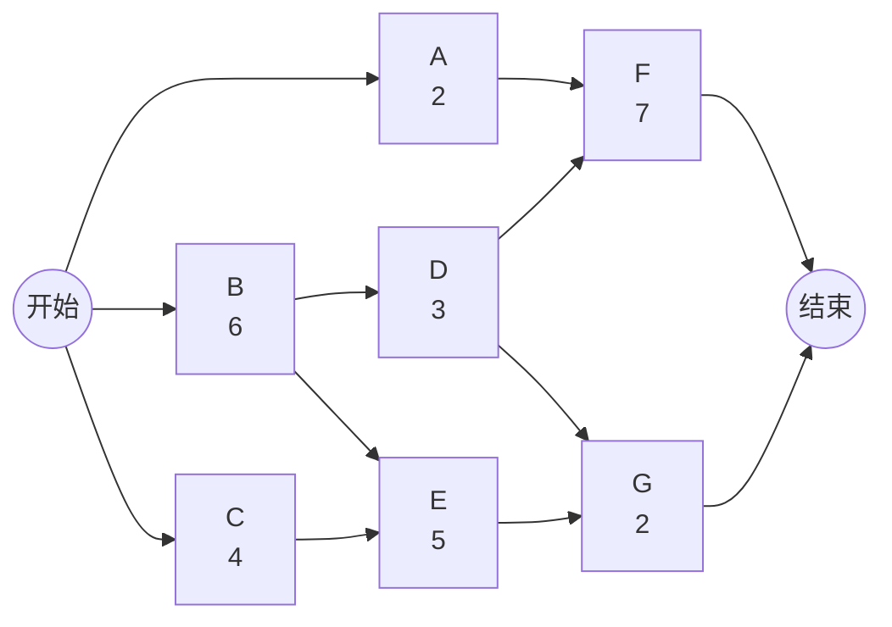
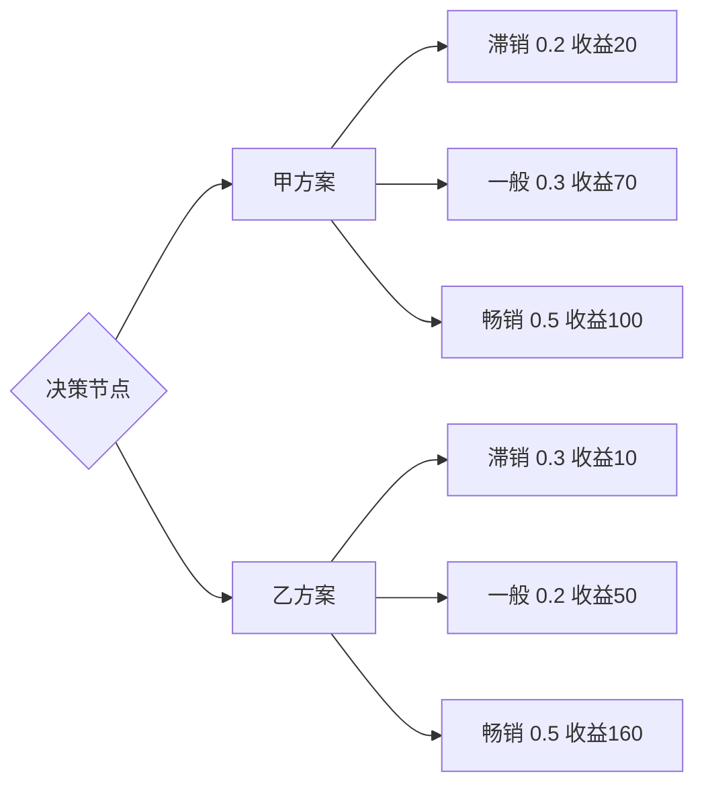

# 软件项目管理期末：教材 Wiki 讲义版

> 定位：这不是“背答案版”，而是开卷考试可查、平时作业可引用、计算题可照着推的知识库笔记。  
> 核心来源：老师最后一讲 PPT《第4章 软件项目进度管理》、去年试卷题型、作业截图指定的教材案例与课后题。  
> 注意：当前没有拿到《软件项目管理微课版》电子教材原文，P262/P298 的完整题干未能从公开网页稳定检索到；本笔记对这些题按课程知识域整理成可迁移答案，拿到原题后只需要替换题干细节。

---

## 0. 这门课真正要掌握的知识地图

软件项目管理不是一套“背概念”的东西，而是围绕软件项目的不确定性，把范围、进度、成本、质量、风险和团队协作组织起来。期末材料里最核心的逻辑链是：


去年试卷只是提醒题型：简答偏概念理解，案例偏“指出管理问题并给措施”，计算偏关键路径、赶工和决策树。真正复习时应把知识点理解成“项目经理怎么做决策”，而不是把每个问题背成固定答案。

---

## 1. 软件项目与项目生存期

### 1.1 软件项目是什么

软件项目是在特定目标、期限、资源和约束下，为开发、维护、升级或交付软件产品/服务而组织的一次性工作。它和一般工程项目相比，不确定性更强：需求会变、技术会变、人员协作复杂、成果不可见、质量问题常常到测试和集成阶段才集中暴露。

软件项目的管理难点主要来自四个方面：

- 需求不稳定：用户很难一次性说清楚所有需求，需求会在沟通和试用中不断变化。
- 过程不可见：软件不像建筑实体那样直观，进度常常被“代码写了多少”误导。
- 人力高度依赖：团队经验、沟通效率、技术能力会直接影响进度和质量。
- 变更成本递增：越到后期发现问题，修复成本越高，进度冲击越大。

### 1.2 软件项目生存期

软件项目生存期是指软件产品从概念提出、需求分析、设计、开发、测试、部署、运行维护直到退役所经历的一系列阶段。它提供的是项目组织方式：什么时候做需求、什么时候设计、什么时候编码、什么时候测试、什么时候交付。

常见模型：

| 模型 | 核心思路 | 适用场景 | 风险 |
|---|---|---|---|
| 瀑布模型 | 阶段顺序执行，前一阶段完成后进入下一阶段 | 需求明确、变化少、文档要求高的项目 | 不适合频繁变更，后期发现问题代价高 |
| 迭代模型 | 分多轮迭代逐步完善产品 | 需求不完全明确，需要逐步探索的项目 | 需要较强版本规划和反馈机制 |
| 敏捷模型 | 小步快跑、持续交付、用户反馈驱动 | 市场变化快、用户反馈重要的项目 | 对团队自组织能力和客户参与度要求高 |

简答可用表达：

软件项目生存期并不是单纯的时间顺序，而是把软件从提出到退役的过程划分为可管理阶段。不同生存期模型的差异，实质上是对需求稳定性、变更频率、交付节奏和风险控制方式的不同选择。

---

## 2. 需求变更管理

需求变更是软件项目中的常见现象。它本身不是坏事，因为软件项目常常需要在用户进一步理解业务、市场变化、技术方案调整后修正目标。真正危险的是“无控制的变更”：没有评估、没有审批、没有同步文档、没有调整进度和资源。

需求变更应注意：

- 明确变更原因和必要性。先判断变更是业务必需、法规要求、质量修正，还是临时想法。
- 评估影响。变更会影响范围、进度、成本、质量、风险和合同承诺。
- 走变更控制流程。变更请求要记录、分析、审批，避免口头变更。
- 更新文档和计划。需求规格说明、设计、测试用例、进度计划、成本估算都可能需要调整。
- 通知干系人。开发、测试、客户、管理层要对变更内容和影响形成一致理解。
- 控制版本和追踪。保留变更记录，确保后续可以追溯“为什么改、谁批准、影响是什么”。

结构化答案：

```text
需求变更管理的重点不是禁止变更，而是让变更受控。
先识别原因，再评估影响，然后审批记录，最后同步计划、文档、测试和干系人。
```

---

## 3. 范围管理：No More, No Less

### 3.1 范围管理的核心

项目范围管理解决的是“项目到底做什么、不做什么”。范围不清会导致两个极端：

- 做少了：交付物不能满足客户真实需求，项目验收失败。
- 做多了：范围蔓延，成本和工期失控，团队把资源花在非必要功能上。

因此范围管理的理想状态就是作业截图里的关键词：**No More, No Less，不多不少**。



### 3.2 WBS：把范围变成可管理结构

WBS（Work Breakdown Structure，工作分解结构）是把项目范围和交付成果逐层分解为更小、更易管理的组成部分。WBS 的重点不是时间，而是“工作和交付成果是否完整覆盖项目范围”。

WBS 的价值：

- 明确项目边界，减少遗漏。
- 支持责任分配，每个工作包可以对应责任人。
- 支持进度、成本、资源估算。
- 支持范围控制，避免额外工作悄悄进入项目。

WBS 和甘特图区别：

| 对比项 | WBS | 甘特图 |
|---|---|---|
| 关注点 | 做什么 | 什么时候做 |
| 表现形式 | 树状/层级分解 | 时间轴条形图 |
| 管理对象 | 范围和交付成果 | 进度和持续时间 |
| 典型用途 | 明确工作边界 | 展示计划与进展 |

### 3.3 作业2：苹果公司范围管理案例，No More, No Less 怎么做到

题干来自截图：参考书中 P82 苹果公司范围管理案例，回答问题3：项目范围管理中的“NoMore, NoLess（不多不少）”，怎样才能做到？

可作为结构化答案：

第一，必须从业务目标出发定义范围。范围不是功能堆砌，而是服务于项目目标。苹果式产品管理强调聚焦，先明确产品要解决什么核心问题、面向什么用户、提供什么关键价值，然后围绕这些目标决定功能取舍。

第二，需求要经过筛选和优先级排序。用户、市场、团队都会提出需求，但不是所有需求都应进入当前版本。可以按业务价值、用户频率、实现成本、技术风险、战略匹配度排序，把“必须有”和“锦上添花”区分开。

第三，建立清晰的范围基准。经过批准的范围说明书、WBS 和 WBS 词典共同构成范围基准。范围基准明确了项目包含哪些交付物，也明确哪些内容不在本期项目范围内。这样才能判断后续需求是正常工作还是范围变更。

第四，严格执行范围确认。阶段性成果要让客户或关键干系人确认，避免团队自以为完成，最后却与客户预期不一致。范围确认关注“交付物是否符合已批准范围”，不是临时增加新需求。

第五，进行范围控制，防止范围蔓延。任何新增功能、需求扩展、质量标准变化都要走变更控制流程，评估对进度、成本、质量和风险的影响。没有经过批准的内容不能随意进入项目。

第六，保持产品克制。No More 不是偷工减料，而是避免做超出目标的功能；No Less 不是少做，而是确保核心需求和承诺交付物完整实现。做到“不多不少”的关键，是用目标、范围基准和变更控制共同约束项目。

一句话总结：

```text
No More 靠范围控制，No Less 靠需求完整性和范围确认。
```

---

## 4. 进度管理总览

进度管理是本次 PPT 的核心。它的主线不是“画一张甘特图”，而是把范围中的工作转化成活动，再通过排序、估算、资源约束和控制形成可执行计划。


### 4.1 时间资源的特点

时间是一种特殊资源，具有单向性、不可重复性和不可替代性。软件项目中的时间损失往往不能通过简单加人完全弥补，因为新增人员会带来学习成本、沟通成本和协调成本。

### 4.2 项目活动

项目活动是为完成工程项目而必须进行的具体工作。WBS 工作包偏“交付成果”，活动偏“完成交付成果所需要采取的行动”。活动是排序、估算、排程和控制的基本对象。

### 4.3 进度管理计划

进度管理计划规定如何制定、执行、管理和控制进度。它包括进度模型、估算准确度、计量单位、绩效测量规则、报告格式和变更控制规则。它回答的是“怎么管进度”，不是“哪天做什么”。

---

## 5. 活动定义、排序与历时估算

### 5.1 活动定义

活动定义是识别并记录为完成项目可交付成果而需采取的具体行动的过程。它把 WBS 工作包转化为可排序、可估算、可分配责任、可跟踪的活动。

常用方法：

- 分解：把工作包拆成更小的活动。
- 滚动式规划：近期详细，远期粗略，随项目推进再细化。
- 专家判断：利用经验减少遗漏，提高估算合理性。

### 5.2 活动排序

活动排序是识别和记录项目活动之间关系的过程。它解决“先做什么、后做什么、哪些可以并行”的问题，输出项目活动网络图。

PDM（紧前关系绘图法）用节点表示活动、箭线表示依赖关系。四种关系：

| 关系 | 含义 |
|---|---|
| FS 完成-开始 | 前一活动完成后，后一活动才能开始 |
| SS 开始-开始 | 前一活动开始后，后一活动才能开始 |
| FF 完成-完成 | 前一活动完成后，后一活动才能完成 |
| SF 开始-完成 | 前一活动开始后，后一活动才能完成 |

### 5.3 活动历时估算

活动历时估算是确定完成每个活动所需时间量。估算依据包括活动清单和活动属性、项目约束和假设条件、资源数量、资源能力、历史信息和风险登记册。

常用方法：

- 专家判断：适合信息不足或复杂活动。
- 类比估算：用类似项目历史数据快速估算，粗略但省时。
- 参数估算：用规模参数和生产率计算，如代码行数 × 单位工作量。
- 三点估算：用乐观、最可能、悲观三个值处理不确定性。

三点估算公式：

$$
TE=\frac{TO+4TM+TP}{6}
$$

$$
\sigma=\frac{TP-TO}{6}
$$

其中 TO 是最乐观时间，TM 是最可能时间，TP 是最悲观时间。TM 权重最大，说明三点估算不是简单平均。

---

## 6. 制定进度计划：CPM、资源优化、压缩与关键链

### 6.1 制定进度计划

制定进度计划是分析活动顺序、持续时间、资源需求和进度制约因素，创建项目进度模型的过程。真正的进度计划必须同时考虑逻辑关系、资源可用性、合同期限和风险缓冲。

### 6.2 关键路径法 CPM

关键路径法（Critical Path Method，CPM）通过活动网络图确定项目中总历时最长的路径。关键路径决定项目最短工期；关键路径上的活动通常没有时差，延误会直接影响项目完成时间。

#### PPT 关键路径截图

![[cpm-ppt-example-slide20.png]]

![[cpm-ppt-discussion-slide23.png]]

#### CPM 计算核心

正推：

$$
EF=ES+\text{活动历时}
$$

$$
ES=\max(\text{所有紧前活动的 }EF)
$$

反推：

$$
LS=LF-\text{活动历时}
$$

$$
LF=\min(\text{所有紧后活动的 }LS)
$$

总时差：

$$
TF=LS-ES=LF-EF
$$

判断：

```text
TF = 0 的活动通常是关键活动。
关键活动连接成从开始到结束的最长路径，即关键路径。
```

#### PPT 第23页网络图的可计算版本



正推表：

| 活动 | 历时 | ES | EF | 说明 |
|---|---:|---:|---:|---|
| A | 2 | 0 | 2 | 起点活动 |
| B | 6 | 0 | 6 | 起点活动 |
| C | 4 | 0 | 4 | 起点活动 |
| D | 3 | 6 | 9 | B 后续 |
| E | 5 | 6 | 11 | max(B=6, C=4) |
| F | 7 | 9 | 16 | max(A=2, D=9) |
| G | 2 | 11 | 13 | max(D=9, E=11) |

反推表：

| 活动 | 历时 | LS | LF | TF |
|---|---:|---:|---:|---:|
| A | 2 | 7 | 9 | 7 |
| B | 6 | 0 | 6 | 0 |
| C | 4 | 5 | 9 | 5 |
| D | 3 | 6 | 9 | 0 |
| E | 5 | 9 | 14 | 3 |
| F | 7 | 9 | 16 | 0 |
| G | 2 | 14 | 16 | 3 |

关键路径：

```text
B -> D -> F
总工期 = 6 + 3 + 7 = 16 天
```

如果合同工期为 18 天，则反推时终点 LF 取 18，而不是 16。此时项目整体多出 2 天缓冲。

### 6.3 资源优化

资源优化用于调整活动开始和完成日期，使计划资源使用等于或少于可用资源。它包括资源平衡和资源平滑。

| 方法 | 含义 | 对工期影响 |
|---|---|---|
| 资源平衡 | 为解决资源不足或过载而调整活动 | 可能改变关键路径和总工期 |
| 资源平滑 | 在浮动时间内调整资源使用，让资源更平稳 | 通常不改变总工期 |

### 6.4 进度压缩

进度压缩是在不缩减项目范围的前提下缩短项目工期。常见方式是赶工和快速跟进。

赶工：

通过增加资源、加班、外包等方式压缩关键路径活动，通常增加成本。

快速跟进：

把原本顺序执行的活动改为部分并行，通常增加返工和沟通风险。

赶工成本公式：

$$
\text{单位时间赶工成本}=\frac{\text{赶工费用}-\text{正常费用}}{\text{正常工期}-\text{赶工工期}}
$$

计算题判断原则：

```text
先找关键路径。
只优先压缩关键路径上的活动。
比较单位时间赶工成本。
先压缩单位时间赶工成本最低的关键活动。
压缩后重新检查关键路径是否变化。
```

### 6.5 帕金森定律与关键链法

帕金森定律在项目进度中表现为：工作会膨胀以填满可用时间。任务如果给了过多安全时间，执行者往往不会提前交付，而是把安全时间消耗掉。

关键链法的思路是压缩单个活动中分散的安全时间，把安全时间集中为项目 buffer 统一管理。它比关键路径法更强调资源约束和缓冲消耗。

| 对比 | 关键路径法 | 关键链法 |
|---|---|---|
| 关注 | 活动逻辑和最长路径 | 活动逻辑、资源约束、缓冲 |
| 安排倾向 | 尽早开始 | 在可控范围内尽量推迟 |
| 安全时间 | 分散在各活动 | 集中为项目 buffer |
| 控制重点 | 关键活动是否延误 | buffer 消耗是否异常 |

---

## 7. 进度计划表达：甘特图、里程碑图、进度基准

甘特图用横向条形图展示活动的开始、结束和持续时间。它适合汇报和跟踪，但不如网络图适合分析复杂依赖。

里程碑图突出关键事件，如需求评审完成、代码冻结、测试结束、版本发布。它适合向管理层和客户展示阶段节点。

进度基准是经过批准的进度计划，用作与实际结果比较的依据。普通计划可以更新，但基准变更通常要经过正式变更控制。

提高进度计划效能的原则：

- 项目经理自己重视计划，而不是把计划当文档作业。
- 团队成员参与计划制定，提高估算准确性和执行认同。
- 计划详略得当，既不能粗到无法执行，也不能细到无法维护。
- 计划要及时更新，并以合适频率发布给干系人。

---

## 8. 进度控制与进度失控原因

进度控制包括监督项目活动状态、更新项目进展、管理进度基准变更，以实现计划。控制不是记录延误，而是发现偏差后采取纠正和预防措施。

常用方法：

- 偏差分析：看实际日期、持续时间、浮动时间和计划差多少。
- 趋势分析：看项目绩效是在改善还是恶化。
- 关键路径法：重点关注关键路径和次关键路径。
- 挣值管理：用绩效指标评价进度偏离程度，并传达给干系人。

软件项目进度失控原因：

- 80-20 现象：前 80% 看似很快，后 20% 集中暴露集成、测试、修复问题。
- 范围、质量、资源、预算变化影响计划。
- 低估技术难度、协调复杂度和环境因素。
- 状态信息失真，不及时、不准确、不完整，甚至报喜不报忧。
- 计划执行不严格，计划变更调整不及时。
- 没有为不可预见事件预留缓冲。

---

## 9. 风险管理：案例题最常用知识模块

风险管理是去年案例题的核心。软件项目风险管理不是项目初期列一个风险清单就结束，而是贯穿项目全过程的循环管理。


风险管理过程：

- 规划风险管理：规定如何开展风险管理，形成风险管理计划。
- 识别风险：发现可能影响项目目标的不确定事件，形成风险清单。
- 风险分析：评估风险概率、影响和优先级。
- 规划风险应对：制定规避、减轻、转移、接受等策略。
- 风险监控：持续跟踪风险变化、应对效果和新风险。

### 9.1 去年风险案例的知识化整理

案例本质：

A 公司运维项目承诺全年非计划中断时间不超过 20 小时。项目经理识别了风险，但只对内部风险制定措施，忽视外部风险；后续客户更换新型网络设备时，没有充分评估兼容性、稳定性、人员培训和回退方案，最终故障导致中断超过承诺。

该案例暴露的问题：

- 外部风险也要管理，不能因为来自客户或供应商就不制定应对措施。
- 风险管理应贯穿项目全过程，不能 3 月底执行完措施就关闭所有风险。
- 风险识别不充分，缺少对新设备、新技术、供应商和兼容性的持续识别。
- 对重大变更缺少风险分析，没有评估新设备上线对 SLA 的影响。
- 风险监控不足，没有持续跟踪风险状态和应对效果。
- 人员培训不足，导致故障恢复时间过长。
- 缺少回退方案，不能及时切回旧设备。

针对新设备上线的应对措施：

- 上线前分析新设备风险，包括稳定性、兼容性、故障概率和影响。
- 对运维人员进行设备操作和故障处理培训。
- 充分测试新设备与主机、存储和业务系统的兼容性。
- 与客户沟通上线窗口和进度，必要时建议延后上线。
- 制定回退方案，新设备出现问题时可快速切回旧设备。
- 设置监控指标和应急响应机制，缩短故障发现和恢复时间。

案例题写法：

```text
不要只说“项目经理判断失误”。
要翻译成管理术语：风险识别不全面、风险应对不足、风险监控缺失、外部风险未纳入管理、重大变更缺少分析。
```

---

## 10. 作业1：P21-P26 案例一的问题2、问题3

> 题干未在本地材料中出现，截图只说明“阅读教材 P21-P26 案例一内容，回答 P26 的问题2和问题3”。以下按软件项目管理第一章常见案例分析逻辑整理，适合作为通用参考答案；拿到原题后可把案例名和细节嵌入。

### 10.1 案例一通常考什么

教材第一章案例一般不考具体公式，而是让你理解“为什么软件项目会失败/成功”“项目经理应该如何管理”“软件项目管理的意义”。回答时要从目标、范围、进度、成本、质量、风险和干系人几个角度分析。

### 10.2 问题2参考答案结构：项目失败/问题原因分析

一个软件项目出现失败或严重偏差，通常不是单一技术问题，而是管理问题和工程问题叠加。可以从以下角度分析：

- 目标不清：项目目标、交付物、验收标准没有明确，导致团队努力方向不一致。
- 需求管理不足：需求获取不充分、变更无控制、客户参与不足，造成返工。
- 范围失控：没有清晰范围基准，功能不断增加，形成范围蔓延。
- 进度估算乐观：低估技术难度和协调复杂度，计划缺乏缓冲。
- 沟通不足：客户、管理层、开发、测试之间信息不同步，问题暴露滞后。
- 风险管理不足：没有提前识别关键风险，也没有制定应对措施。
- 质量控制滞后：测试和评审太晚介入，缺陷到后期集中爆发。
- 项目经理控制不足：缺少持续监控、偏差纠正和变更控制。

段落式答案：

案例中的问题应从项目管理全过程理解。软件项目失败往往不是因为某个程序员没有写好代码，而是因为目标、范围、进度、质量和风险没有被系统管理。若项目初期目标和需求不清，后续范围就容易失控；若进度估算过于乐观，又缺少风险缓冲，项目执行中就会不断延期；若客户和团队沟通不足，问题会在后期集中暴露。因此，项目经理需要通过范围管理、进度管理、质量管理、风险管理和沟通管理把项目纳入可控状态。

### 10.3 问题3参考答案结构：如何改进项目管理

改进措施可以按“事前规划、过程控制、持续反馈”组织：

- 明确项目目标和验收标准，使所有干系人对成功标准达成一致。
- 做好需求分析和需求确认，建立变更控制流程。
- 建立 WBS，把项目范围分解为可估算、可分配、可跟踪的工作包。
- 制定进度计划，使用网络图、关键路径法和里程碑控制关键节点。
- 建立沟通机制，定期同步项目状态、风险和问题。
- 提前识别风险，制定应对措施，并在项目全过程监控风险。
- 加强质量保证，尽早开展评审、测试和缺陷跟踪。
- 对偏差及时采取纠正措施，必要时调整范围、资源或进度基准。

一句话总结：

```text
软件项目管理的目的，是把不确定的软件开发过程变成目标明确、范围可控、进度可跟踪、风险可应对的项目过程。
```

---

## 11. 课本 P262 问题1、问题2：按风险/控制类题整理

> 未拿到 P262 原题。结合课程试卷和 P298 案例题位置，这里按“风险管理/项目控制”类课后题整理。若原题属于其他章节，后续可替换标题，但答题素材仍可迁移。

### 11.1 问题1参考：为什么软件项目必须进行风险管理

软件项目具有需求不确定、技术不确定、人员协作复杂、外部环境变化快等特点，因此风险管理是项目成功的重要保障。风险管理可以帮助项目团队提前发现可能影响范围、进度、成本和质量的事件，评估其概率和影响，制定应对措施，并在项目执行过程中持续监控。没有风险管理，项目团队往往只能在问题发生后被动救火，导致延期、超支、质量下降甚至项目失败。

可以展开为：

- 风险管理能提高项目可预见性。
- 风险管理能降低重大问题发生概率和影响。
- 风险管理能帮助项目经理合理配置资源。
- 风险管理能支持进度、成本和质量控制。
- 风险管理能增强客户和管理层对项目的信心。

### 11.2 问题2参考：软件项目风险管理过程

软件项目风险管理通常包括规划风险管理、识别风险、风险分析、规划风险应对和风险监控。规划风险管理确定风险管理的方法、角色、责任和模板；识别风险发现可能影响项目目标的风险并形成风险清单；风险分析评估风险发生概率和影响程度，确定优先级；规划风险应对为重要风险制定规避、减轻、转移或接受策略；风险监控在项目全过程跟踪风险变化、应对措施效果和新风险。

简洁版：

```text
规划风险管理 -> 识别风险 -> 分析风险 -> 制定应对 -> 监控风险
```

---

## 12. 课本 P298 案例分析第一问：风险案例问题识别模板

> 未拿到 P298 原题。去年试卷的案例题高度像教材风险管理案例，第一问通常是“指出项目风险管理中存在的问题”。下面给出可直接迁移的答题模板。

如果案例要求“指出存在的问题”，按以下维度找：

- 是否只做了风险识别，没有做风险应对。
- 是否只管内部风险，忽视外部风险。
- 是否把风险管理当一次性活动，没有贯穿项目全过程。
- 是否没有评估风险概率、影响和优先级。
- 是否没有明确风险责任人和应对资源。
- 是否没有对重大变更进行风险分析。
- 是否缺少监控、预警、应急和回退方案。
- 是否在风险发生后只被动处理，没有预防措施。

段落式答案：

案例中的主要问题在于风险管理不完整、不持续。项目团队虽然进行了风险识别，但风险识别范围不全面，对外部风险、技术风险、供应商风险和变更风险考虑不足；在风险应对方面，只针对部分风险制定措施，缺少对高影响风险的应急预案和责任分配；在风险监控方面，项目经理过早关闭风险清单，没有在项目生命周期内持续跟踪风险变化；当环境或方案发生重大变化时，也没有重新进行风险分析，导致风险最终转化为实际损失。

---

## 13. 计算题专题：关键路径、赶工、决策树

### 13.1 去年计算题原卷截图

![[exam-calculation-page3.png]]

### 13.2 关键路径题的标准流程

计算题一定要把过程写出来：

```text
1. 根据网络图列出活动和依赖关系。
2. 正推计算 ES、EF。
3. 得到项目最早完成时间。
4. 反推计算 LS、LF。
5. 计算总时差 TF。
6. TF=0 的活动组成关键路径。
7. 写出关键路径和总工期。
```

公式汇总：

$$
EF=ES+t
$$

$$
ES=\max(EF_{\text{紧前活动}})
$$

$$
LS=LF-t
$$

$$
LF=\min(LS_{\text{紧后活动}})
$$

$$
TF=LS-ES=LF-EF
$$

### 13.3 赶工压缩题

去年题型是：给正常工期、赶工工期、正常费用、赶工费用，问如果总工期需要缩短，应首先压缩哪个活动。

做法：

1. 先找关键路径。
2. 只看关键路径上的活动。
3. 计算关键路径活动的单位时间赶工成本。
4. 选择单位时间赶工成本最低者。
5. 说明压缩后要重新判断关键路径。

公式：

$$
\text{单位时间赶工成本}=\frac{\text{赶工费用}-\text{正常费用}}{\text{正常工期}-\text{赶工工期}}
$$

答题句：

```text
应首先压缩关键路径上的活动，因为只有压缩关键路径才可能缩短项目总工期。
在关键路径活动中，应优先选择单位时间赶工成本最低的活动。
```

### 13.4 决策树与期望收益 EMV

决策树用于在多个方案和不确定状态下选择期望收益更大的方案。



公式：

$$
EMV=\sum(\text{概率}\times \text{收益})
$$

去年题：

$$
EMV_{\text{甲}}=0.2\times20+0.3\times70+0.5\times100=75
$$

$$
EMV_{\text{乙}}=0.3\times10+0.2\times50+0.5\times160=93
$$

因为乙方案期望收益 93 大于甲方案 75，所以选择乙方案。

---

## 14. 考场检索目录

| 题目类型 | 直接看 |
|---|---|
| 生存期模型 | 第1节 |
| 需求变更 | 第2节 |
| WBS/范围管理/No More No Less | 第3节 |
| 活动定义、排序、历时估算 | 第5节 |
| CPM/关键路径/ES EF LS LF | 第6节、第13节 |
| 资源优化/进度压缩/关键链 | 第6节 |
| 进度失控原因 | 第8节 |
| 风险管理过程 | 第9节 |
| 平时作业1 | 第10节 |
| P262/P298 风险题 | 第11-12节 |
| 决策树 EMV | 第13.4节 |

