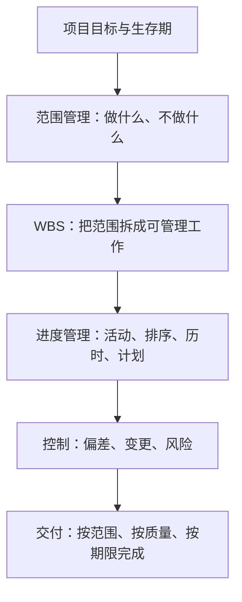
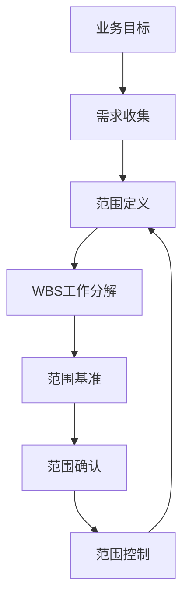
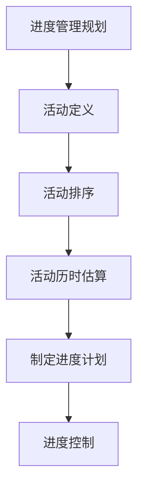
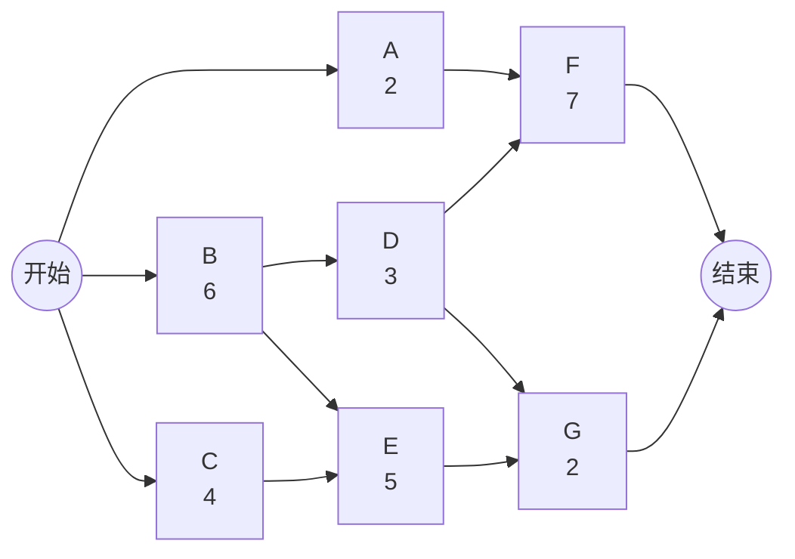
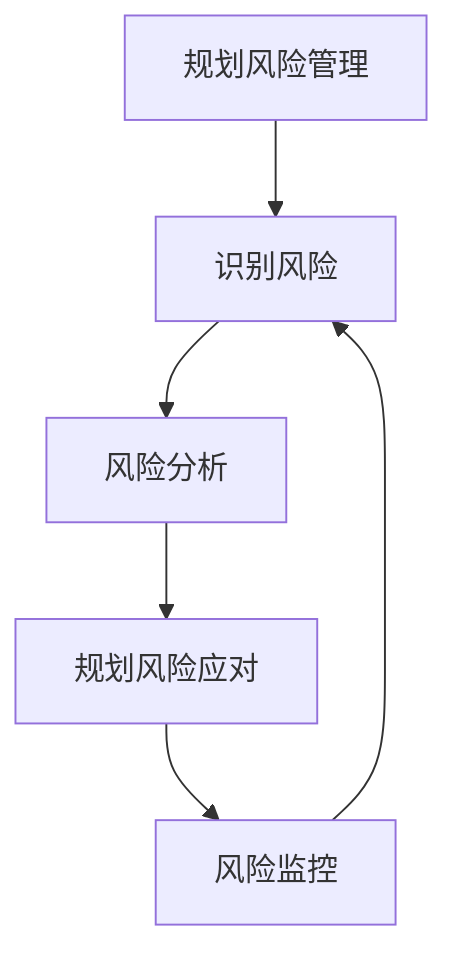
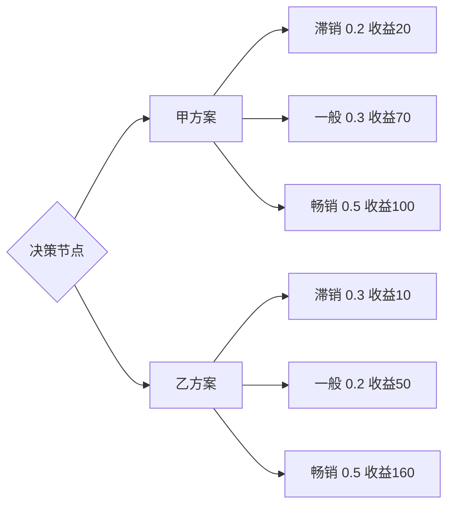

# 软件项目管理期末：教材 Wiki 讲义版

> 定位：这不是“背答案版”，而是开卷考试可查、平时作业可引用、计算题可照着推的知识库笔记。  
> 核心来源：老师最后一讲 PPT《第4章 软件项目进度管理》、去年试卷题型、作业截图指定的教材案例与课后题。  
> 这版已结合你补充的目录照片与作业案例照片，把上一版中不确定的案例模块替换为确定版，并补齐整本书可能涉及的简答概念。

---

## 0. 这门课真正要掌握的知识地图

软件项目管理不是一套“背概念”的东西，而是围绕软件项目的不确定性，把范围、进度、成本、质量、风险和团队协作组织起来。期末材料里最核心的逻辑链是：



去年试卷只是提醒题型：简答偏概念理解，案例偏“指出管理问题并给措施”，计算偏关键路径、赶工和决策树。真正复习时应把知识点理解成“项目经理怎么做决策”，而不是把每个问题背成固定答案。

### 0.1 标准参照：为什么按这些模块补全

项目管理行业通常把项目拆成若干管理域：整合、范围、进度、成本、质量、资源/团队、沟通、风险、采购、干系人等。PMBOK 的价值不在于让你背英文术语，而在于提醒你：项目失败通常不是某一个环节失败，而是多个管理域相互牵动。ISO/IEC/IEEE 12207 则强调软件生命周期过程不是固定阶段模板，而是一组可裁剪、可重复使用的过程：计划、评估、控制、风险、配置、信息、质量保证，以及需求、设计、实现、集成、验证、确认、运行、维护、退役等技术过程。

所以这份笔记后面补全的逻辑是：

```text
先用生命周期理解软件项目；
再用范围、进度、成本、质量控制项目基线；
再用团队、沟通、风险、采购处理执行中的不确定性；
最后用监控、变更、收尾把项目闭环。
```

---

## 1. 软件项目与项目生存期

### 1.1 软件项目是什么

软件项目是在特定目标、期限、资源和约束下，为开发、维护、升级或交付软件产品/服务而组织的一次性工作。它和一般工程项目相比，不确定性更强：需求会变、技术会变、人员协作复杂、成果不可见、质量问题常常到测试和集成阶段才集中暴露。

软件项目的管理难点主要来自四个方面：

- 需求不稳定：用户很难一次性说清楚所有需求，需求会在沟通和试用中不断变化。
- 过程不可见：软件不像建筑实体那样直观，进度常常被“代码写了多少”误导。
- 人力高度依赖：团队经验、沟通效率、技术能力会直接影响进度和质量。
- 变更成本递增：越到后期发现问题，修复成本越高，进度冲击越大。

### 1.2 软件项目生存期

软件项目生存期是指软件产品从概念提出、需求分析、设计、开发、测试、部署、运行维护直到退役所经历的一系列阶段。它提供的是项目组织方式：什么时候做需求、什么时候设计、什么时候编码、什么时候测试、什么时候交付。

常见模型：

| 模型 | 核心思路 | 适用场景 | 风险 |
|---|---|---|---|
| 瀑布模型 | 阶段顺序执行，前一阶段完成后进入下一阶段 | 需求明确、变化少、文档要求高的项目 | 不适合频繁变更，后期发现问题代价高 |
| 迭代模型 | 分多轮迭代逐步完善产品 | 需求不完全明确，需要逐步探索的项目 | 需要较强版本规划和反馈机制 |
| 敏捷模型 | 小步快跑、持续交付、用户反馈驱动 | 市场变化快、用户反馈重要的项目 | 对团队自组织能力和客户参与度要求高 |

简答可用表达：

软件项目生存期并不是单纯的时间顺序，而是把软件从提出到退役的过程划分为可管理阶段。不同生存期模型的差异，实质上是对需求稳定性、变更频率、交付节奏和风险控制方式的不同选择。

---

## 2. 需求变更管理

需求变更是软件项目中的常见现象。它本身不是坏事，因为软件项目常常需要在用户进一步理解业务、市场变化、技术方案调整后修正目标。真正危险的是“无控制的变更”：没有评估、没有审批、没有同步文档、没有调整进度和资源。

需求变更应注意：

- 明确变更原因和必要性。先判断变更是业务必需、法规要求、质量修正，还是临时想法。
- 评估影响。变更会影响范围、进度、成本、质量、风险和合同承诺。
- 走变更控制流程。变更请求要记录、分析、审批，避免口头变更。
- 更新文档和计划。需求规格说明、设计、测试用例、进度计划、成本估算都可能需要调整。
- 通知干系人。开发、测试、客户、管理层要对变更内容和影响形成一致理解。
- 控制版本和追踪。保留变更记录，确保后续可以追溯“为什么改、谁批准、影响是什么”。

结构化答案：

```text
需求变更管理的重点不是禁止变更，而是让变更受控。
先识别原因，再评估影响，然后审批记录，最后同步计划、文档、测试和干系人。
```

---

## 2A. 全书简答概念扩展：按目录补齐的知识库

这一节是为了防止老师从整本书抽简答。它不是按题目背诵，而是按“概念-作用-展开点”的方式补齐主要章节。

### 2A.1 项目整合管理

项目整合管理是把项目中的范围、进度、成本、质量、团队、沟通、风险、采购等管理活动协调为一个整体的过程。它强调项目经理不能只看某一个局部指标，而要在项目目标、资源约束和干系人期望之间做综合平衡。

核心知识点：

- 项目章程：正式批准项目存在，授权项目经理使用组织资源。
- 项目管理计划：整合各分计划形成项目执行、监控和收尾的统一依据。
- 指导与管理项目工作：按照项目管理计划组织团队执行项目活动。
- 监控项目工作：跟踪、审查和报告项目进展，发现偏差。
- 实施整体变更控制：对范围、进度、成本、质量等变更进行统一评估和审批。
- 项目收尾：完成验收、移交成果、总结经验、释放资源。

简答展开：

项目整合管理的难点在于项目各目标之间存在冲突。例如，增加范围会影响进度和成本，提高质量可能增加测试时间，压缩工期可能增加风险。项目经理需要通过整体变更控制和项目管理计划，把局部调整放到整体目标中评估，避免某个部门单方面优化导致整体项目失控。

### 2A.2 项目范围管理

范围管理解决“项目做什么、不做什么”。它的核心目标是确保项目包括完成目标所需的全部工作，并且只包括必要工作。

关键概念：

- 需求收集：识别干系人的需求和期望。
- 范围定义：把需求转化为明确的项目范围说明。
- WBS 创建：将项目交付成果分解为工作包。
- 范围确认：由客户或干系人正式验收已完成的交付物。
- 范围控制：管理范围变更，防止范围蔓延。

范围管理的核心矛盾：

```text
No Less：不能遗漏核心需求和承诺交付物。
No More：不能无限添加功能，避免范围蔓延。
```

范围蔓延是指未经正式控制的范围扩大。它常常表现为客户临时增加需求、团队顺手添加功能、管理层改变目标但不调整工期和预算。控制范围蔓延的关键是范围基准、变更控制和需求优先级管理。

### 2A.3 项目成本管理

成本管理是对项目所需费用进行估算、预算和控制，使项目在批准预算内完成。它和进度管理、范围管理高度相关：范围增加通常带来成本增加，进度压缩通常也会增加成本。

核心概念：

- 成本估算：估计完成项目活动所需费用。
- 成本预算：把估算成本汇总并形成成本基准。
- 成本控制：监督成本状态，管理成本基准变更。
- 直接成本：可直接归属于项目的费用，如项目人员工资、专用设备。
- 间接成本：不能直接归属于单一项目的共享费用，如管理费用、办公场地。
- 固定成本：总额不随工作量直接变化，如一次性采购软件工具。
- 可变成本：随工作量变化而变化，如云资源、外包工时。

简答展开：

软件项目成本管理不能只在项目结束时算账，而要在计划阶段进行估算和预算，在执行阶段持续跟踪实际成本与成本基准的偏差。成本超支常常来自需求变更、返工、估算乐观、人员效率不足和风险事件。项目经理应把成本控制和范围控制、进度控制结合起来，而不是孤立地压缩费用。

### 2A.4 项目质量管理

质量管理关注项目交付物是否满足明确和隐含需求。软件质量不等于“没有 bug”，还包括功能正确性、可靠性、易用性、性能效率、可维护性、安全性、兼容性和可移植性等。

核心概念：

- 质量规划：确定质量标准、质量目标和质量活动。
- 质量保证：关注过程，确保项目按照合适流程和标准执行。
- 质量控制：关注结果，通过检查、测试、评审发现缺陷。
- 预防胜于检查：越早发现问题，修复成本越低。
- 验证：确认产品是否符合规格说明。
- 确认：确认产品是否满足用户真实需要。

暴雪游戏质量案例可以对应这一节：高质量不是后期测试“测出来”的，而是从理念、设计、实现、测试到团队文化全过程内建出来的。

### 2A.5 项目团队管理

团队管理关注如何获得、建设、激励和管理项目团队。软件项目高度依赖人的知识、经验和协作，因此团队管理直接影响进度、质量和风险。

核心概念：

- 组织规划：明确项目角色、责任、汇报关系。
- 团队组建：获取项目所需人员。
- 团队建设：提高团队能力、信任和协作水平。
- 团队管理：跟踪成员绩效，解决冲突，提供反馈和激励。
- 培训与开发：提升团队技术能力和管理能力。
- 激励：通过目标、责任、认可、成长机会提高成员投入度。

简答展开：

优秀团队不是简单把高手放在一起，而是需要清晰目标、合理分工、有效沟通、信任关系和共同的工程规范。项目经理既要关注任务完成，也要关注团队士气、冲突处理和能力成长。

### 2A.6 项目沟通管理

沟通管理是为了确保项目信息能够及时、准确、完整地生成、收集、分发、存储、检索和使用。软件项目中的很多问题不是技术不会做，而是信息没有传到正确的人手里。

核心概念：

- 沟通需求分析：确定谁需要什么信息、何时需要、通过什么方式获得。
- 沟通方法：会议、邮件、即时消息、项目管理系统、报告等。
- 沟通模型：发送者、编码、媒介、噪声、解码、接收者、反馈。
- 信息发布：按计划向干系人分发项目信息。
- 干系人期望管理：识别并管理干系人的关注点和满意度。
- 冲突管理：识别冲突来源，通过合作、妥协、缓和、强制等方式处理。

简答展开：

项目沟通管理的目标不是“多开会”，而是让正确的人在正确时间获得正确粒度的信息。沟通失效会导致需求误解、进度信息失真、风险暴露滞后和干系人不满意。

### 2A.7 项目风险管理

风险是不确定事件或条件，一旦发生会对项目目标产生正面或负面影响。软件项目更常讨论负面风险，如需求变化、技术难题、人员流失、供应商延误、质量缺陷、兼容性问题等。

风险管理过程：

```text
规划风险管理 -> 风险识别 -> 定性风险分析 -> 定量风险分析 -> 风险应对规划 -> 风险监控
```

风险应对策略：

- 规避：改变计划以消除风险源。
- 减轻：降低风险发生概率或影响。
- 转移：把风险影响转移给第三方，如保险、外包、合同条款。
- 接受：承认风险存在，准备应急储备或被动接受。

简答展开：

风险管理必须贯穿项目全过程。项目初期识别出的风险会随环境变化而变化，新的风险也会不断出现。风险清单不是一次性文档，而是需要持续更新、跟踪和监控的管理工具。

### 2A.8 项目采购管理

采购管理关注从组织外部获取产品、服务或成果。软件项目中的采购可能包括外包开发、云服务、第三方组件、测试工具、咨询服务、硬件设备等。

核心概念：

- 采购规划：决定买什么、何时买、如何买。
- 自制或外购分析：比较内部开发与外部采购的成本、风险、能力和时间。
- 合同类型：固定总价、成本补偿、工料合同等。
- 供应商选择：根据价格、能力、经验、质量和风险选择供应商。
- 合同管理：监督供应商履约，处理变更、验收和付款。
- 合同收尾：确认交付完成，完成结算和归档。

简答展开：

采购管理不是简单买东西，而是把外部供应商纳入项目整体计划。采购会影响范围、进度、质量和风险，特别是外包或第三方技术一旦延误，会直接影响项目交付。

### 2A.9 项目监控、变更与收尾

项目监控是持续跟踪项目实际表现并与计划比较。变更控制是对项目基准变化进行统一评估和批准。项目收尾是确认项目或阶段完成，并完成移交、归档、总结和资源释放。

核心概念：

- 项目工作监控：跟踪范围、进度、成本、质量、风险等状态。
- 整体变更控制：统一评估变更对多个目标的影响。
- 项目验收：确认交付物满足验收标准。
- 经验教训总结：沉淀项目中的成功做法和失败原因。
- 资源释放：释放团队成员、设备和预算。
- 合同收尾：确认供应商履约并完成结算。

简答展开：

项目收尾不是“项目做完就散”，而是一个正式管理过程。没有正式收尾，容易出现交付物未确认、文档缺失、经验无法复用、合同遗留问题和责任不清。

---

## 3. 范围管理：No More, No Less

### 3.1 范围管理的核心

项目范围管理解决的是“项目到底做什么、不做什么”。范围不清会导致两个极端：

- 做少了：交付物不能满足客户真实需求，项目验收失败。
- 做多了：范围蔓延，成本和工期失控，团队把资源花在非必要功能上。

因此范围管理的理想状态就是作业截图里的关键词：**No More, No Less，不多不少**。



### 3.2 WBS：把范围变成可管理结构

WBS（Work Breakdown Structure，工作分解结构）是把项目范围和交付成果逐层分解为更小、更易管理的组成部分。WBS 的重点不是时间，而是“工作和交付成果是否完整覆盖项目范围”。

WBS 的价值：

- 明确项目边界，减少遗漏。
- 支持责任分配，每个工作包可以对应责任人。
- 支持进度、成本、资源估算。
- 支持范围控制，避免额外工作悄悄进入项目。

WBS 和甘特图区别：

| 对比项 | WBS | 甘特图 |
|---|---|---|
| 关注点 | 做什么 | 什么时候做 |
| 表现形式 | 树状/层级分解 | 时间轴条形图 |
| 管理对象 | 范围和交付成果 | 进度和持续时间 |
| 典型用途 | 明确工作边界 | 展示计划与进展 |

### 3.3 作业2：苹果公司范围管理案例，No More, No Less 怎么做到

题干来自截图：参考书中 P82 苹果公司范围管理案例，回答问题3：项目范围管理中的“NoMore, NoLess（不多不少）”，怎样才能做到？

可作为结构化答案：

第一，必须从业务目标出发定义范围。范围不是功能堆砌，而是服务于项目目标。苹果式产品管理强调聚焦，先明确产品要解决什么核心问题、面向什么用户、提供什么关键价值，然后围绕这些目标决定功能取舍。

第二，需求要经过筛选和优先级排序。用户、市场、团队都会提出需求，但不是所有需求都应进入当前版本。可以按业务价值、用户频率、实现成本、技术风险、战略匹配度排序，把“必须有”和“锦上添花”区分开。

第三，建立清晰的范围基准。经过批准的范围说明书、WBS 和 WBS 词典共同构成范围基准。范围基准明确了项目包含哪些交付物，也明确哪些内容不在本期项目范围内。这样才能判断后续需求是正常工作还是范围变更。

第四，严格执行范围确认。阶段性成果要让客户或关键干系人确认，避免团队自以为完成，最后却与客户预期不一致。范围确认关注“交付物是否符合已批准范围”，不是临时增加新需求。

第五，进行范围控制，防止范围蔓延。任何新增功能、需求扩展、质量标准变化都要走变更控制流程，评估对进度、成本、质量和风险的影响。没有经过批准的内容不能随意进入项目。

第六，保持产品克制。No More 不是偷工减料，而是避免做超出目标的功能；No Less 不是少做，而是确保核心需求和承诺交付物完整实现。做到“不多不少”的关键，是用目标、范围基准和变更控制共同约束项目。

一句话总结：

```text
No More 靠范围控制，No Less 靠需求完整性和范围确认。
```

---

## 4. 进度管理总览

进度管理是本次 PPT 的核心。它的主线不是“画一张甘特图”，而是把范围中的工作转化成活动，再通过排序、估算、资源约束和控制形成可执行计划。



### 4.1 时间资源的特点

时间是一种特殊资源，具有单向性、不可重复性和不可替代性。软件项目中的时间损失往往不能通过简单加人完全弥补，因为新增人员会带来学习成本、沟通成本和协调成本。

### 4.2 项目活动

项目活动是为完成工程项目而必须进行的具体工作。WBS 工作包偏“交付成果”，活动偏“完成交付成果所需要采取的行动”。活动是排序、估算、排程和控制的基本对象。

### 4.3 进度管理计划

进度管理计划规定如何制定、执行、管理和控制进度。它包括进度模型、估算准确度、计量单位、绩效测量规则、报告格式和变更控制规则。它回答的是“怎么管进度”，不是“哪天做什么”。

制定进度管理计划的依据：

- 项目管理计划：保证进度管理与范围、成本、质量、风险等分计划协调一致。
- 项目章程：提供项目目标、里程碑、总体约束和项目经理授权。
- 事业环境因素：包括组织结构、资源市场、工具平台、法规制度、行业环境等。
- 组织过程资产：包括历史项目进度数据、模板、经验教训、标准流程和报告格式。

进度管理计划的核心内容：

- 项目进度模型：例如活动网络图、关键路径模型、进度计划软件模型。
- 准确度：说明历时估算允许的误差范围和应急储备。
- 计量单位：统一使用人天、人周、人月、日历天等单位。
- 绩效测量规则：规定如何比较计划与实际，如何计算偏差。
- 报告格式：规定进度报告的内容、频率、对象和模板。
- 进度更新与变更控制规则：规定进度基准如何调整、由谁审批。

---

## 5. 活动定义、排序与历时估算

### 5.1 活动定义

活动定义是识别并记录为完成项目可交付成果而需采取的具体行动的过程。它把 WBS 工作包转化为可排序、可估算、可分配责任、可跟踪的活动。

常用方法：

- 分解：把工作包拆成更小的活动。
- 滚动式规划：近期详细，远期粗略，随项目推进再细化。
- 专家判断：利用经验减少遗漏，提高估算合理性。

主要输出：

- 活动清单：列出项目需要执行的全部活动，是排序、估算、资源安排和进度控制的基础。
- 里程碑清单：列出项目中的重要时点或事件，如需求评审完成、代码冻结、测试结束、版本发布。里程碑通常表示节点，不表示一段持续工作。

### 5.2 活动排序

活动排序是识别和记录项目活动之间关系的过程。它解决“先做什么、后做什么、哪些可以并行”的问题，输出项目活动网络图。

PDM（紧前关系绘图法）用节点表示活动、箭线表示依赖关系。四种关系：

| 关系 | 含义 |
|---|---|
| FS 完成-开始 | 前一活动完成后，后一活动才能开始 |
| SS 开始-开始 | 前一活动开始后，后一活动才能开始 |
| FF 完成-完成 | 前一活动完成后，后一活动才能完成 |
| SF 开始-完成 | 前一活动开始后，后一活动才能完成 |

### 5.3 活动历时估算

活动历时估算是确定完成每个活动所需时间量。估算依据包括活动清单和活动属性、项目约束和假设条件、资源数量、资源能力、历史信息和风险登记册。

常用方法：

- 专家判断：适合信息不足或复杂活动。
- 类比估算：用类似项目历史数据快速估算，粗略但省时。
- 参数估算：用规模参数和生产率计算，如代码行数 × 单位工作量。
- 三点估算：用乐观、最可能、悲观三个值处理不确定性。

三点估算公式：

$$
TE=\frac{TO+4TM+TP}{6}
$$

$$
\sigma=\frac{TP-TO}{6}
$$

其中 TO 是最乐观时间，TM 是最可能时间，TP 是最悲观时间。TM 权重最大，说明三点估算不是简单平均。

---

## 6. 制定进度计划：CPM、资源优化、压缩与关键链

### 6.1 制定进度计划

制定进度计划是分析活动顺序、持续时间、资源需求和进度制约因素，创建项目进度模型的过程。真正的进度计划必须同时考虑逻辑关系、资源可用性、合同期限和风险缓冲。

### 6.2 关键路径法 CPM

关键路径法（Critical Path Method，CPM）通过活动网络图确定项目中总历时最长的路径。关键路径决定项目最短工期；关键路径上的活动通常没有时差，延误会直接影响项目完成时间。

#### PPT 关键路径截图

![[cpm-ppt-example-slide20.png]]

![[cpm-ppt-discussion-slide23.png]]

#### CPM 计算核心

正推：

$$
EF=ES+\text{活动历时}
$$

$$
ES=\max(\text{所有紧前活动的 }EF)
$$

反推：

$$
LS=LF-\text{活动历时}
$$

$$
LF=\min(\text{所有紧后活动的 }LS)
$$

总时差：

$$
TF=LS-ES=LF-EF
$$

判断：

```text
TF = 0 的活动通常是关键活动。
关键活动连接成从开始到结束的最长路径，即关键路径。
```

#### ES、EF、LS、LF 的 8 条计算规则

1. 除非另外说明，项目起始时间定为 0。
2. 任一活动的最早开始时间 ES，等于所有紧前活动最早完成时间 EF 的最大值。
3. 活动最早完成时间 EF，等于该活动 ES 加上活动历时。
4. 项目的最早完成时间，等于项目活动网络中最后节点的最早完成时间。
5. 如果项目最晚完成时间没有明确给定，则项目最晚完成时间通常取项目最早完成时间。
6. 如果项目最终期限为 tp，则项目终点的 LF 取 tp。
7. 任一活动的最晚完成时间 LF，等于所有紧后活动最晚开始时间 LS 的最小值。
8. 活动最晚开始时间 LS，等于该活动 LF 减去活动历时。

计算口诀：

```text
正推求最早：遇到汇合取最大。
反推求最晚：遇到分叉取最小。
```

#### PPT 第23页网络图的可计算版本



正推表：

| 活动 | 历时 | ES | EF | 说明 |
|---|---:|---:|---:|---|
| A | 2 | 0 | 2 | 起点活动 |
| B | 6 | 0 | 6 | 起点活动 |
| C | 4 | 0 | 4 | 起点活动 |
| D | 3 | 6 | 9 | B 后续 |
| E | 5 | 6 | 11 | max(B=6, C=4) |
| F | 7 | 9 | 16 | max(A=2, D=9) |
| G | 2 | 11 | 13 | max(D=9, E=11) |

反推表：

| 活动 | 历时 | LS | LF | TF |
|---|---:|---:|---:|---:|
| A | 2 | 7 | 9 | 7 |
| B | 6 | 0 | 6 | 0 |
| C | 4 | 5 | 9 | 5 |
| D | 3 | 6 | 9 | 0 |
| E | 5 | 9 | 14 | 3 |
| F | 7 | 9 | 16 | 0 |
| G | 2 | 14 | 16 | 3 |

关键路径：

```text
B -> D -> F
总工期 = 6 + 3 + 7 = 16 天
```

如果合同工期为 18 天，则反推时终点 LF 取 18，而不是 16。此时项目整体多出 2 天缓冲。

### 6.3 资源优化

资源优化用于调整活动开始和完成日期，使计划资源使用等于或少于可用资源。它包括资源平衡和资源平滑。

| 方法 | 含义 | 对工期影响 |
|---|---|---|
| 资源平衡 | 为解决资源不足或过载而调整活动 | 可能改变关键路径和总工期 |
| 资源平滑 | 在浮动时间内调整资源使用，让资源更平稳 | 通常不改变总工期 |

### 6.4 进度压缩

进度压缩是在不缩减项目范围的前提下缩短项目工期。常见方式是赶工和快速跟进。

赶工：

通过增加资源、加班、外包等方式压缩关键路径活动，通常增加成本。

快速跟进：

把原本顺序执行的活动改为部分并行，通常增加返工和沟通风险。

赶工成本公式：

$$
\text{单位时间赶工成本}=\frac{\text{赶工费用}-\text{正常费用}}{\text{正常工期}-\text{赶工工期}}
$$

计算题判断原则：

```text
先找关键路径。
只优先压缩关键路径上的活动。
比较单位时间赶工成本。
先压缩单位时间赶工成本最低的关键活动。
压缩后重新检查关键路径是否变化。
```

### 6.5 帕金森定律与关键链法

帕金森定律在项目进度中表现为：工作会膨胀以填满可用时间。任务如果给了过多安全时间，执行者往往不会提前交付，而是把安全时间消耗掉。

关键链法的思路是压缩单个活动中分散的安全时间，把安全时间集中为项目 buffer 统一管理。它比关键路径法更强调资源约束和缓冲消耗。

| 对比 | 关键路径法 | 关键链法 |
|---|---|---|
| 关注 | 活动逻辑和最长路径 | 活动逻辑、资源约束、缓冲 |
| 安排倾向 | 尽早开始 | 在可控范围内尽量推迟 |
| 安全时间 | 分散在各活动 | 集中为项目 buffer |
| 控制重点 | 关键活动是否延误 | buffer 消耗是否异常 |

---

## 7. 进度计划表达：甘特图、里程碑图、进度基准

甘特图用横向条形图展示活动的开始、结束和持续时间。它适合汇报和跟踪，但不如网络图适合分析复杂依赖。

里程碑图突出关键事件，如需求评审完成、代码冻结、测试结束、版本发布。它适合向管理层和客户展示阶段节点。

进度基准是经过批准的进度计划，用作与实际结果比较的依据。普通计划可以更新，但基准变更通常要经过正式变更控制。

提高进度计划效能的原则：

- 项目经理自己重视计划，而不是把计划当文档作业。
- 团队成员参与计划制定，提高估算准确性和执行认同。
- 计划详略得当，既不能粗到无法执行，也不能细到无法维护。
- 计划要及时更新，并以合适频率发布给干系人。

---

## 8. 进度控制与进度失控原因

进度控制包括监督项目活动状态、更新项目进展、管理进度基准变更，以实现计划。控制不是记录延误，而是发现偏差后采取纠正和预防措施。

常用方法：

- 偏差和趋势分析：偏差分析看实际开始/完成日期、实际持续时间、浮动时间与计划差多少；趋势分析看项目绩效是在改善还是恶化。
- 关键路径法跟踪：重点关注关键路径和次关键路径，防止次关键路径因延误变成新的关键路径。
- 挣值管理：用进度绩效指标评价偏离初始进度基准的程度，并传达给干系人。

软件项目进度失控原因：

1. 80-20 原则错觉与过于乐观的进度估计：前 80% 看似很快，后 20% 集中暴露集成、测试、修复和收尾问题。
2. 范围因素影响进度：需求增加、范围蔓延、需求变更频繁会直接拉长工期。
3. 质量因素影响进度：质量目标提高、缺陷过多、返工增加会压缩原有计划空间。
4. 资源和预算变更影响进度：人员不足、关键人员离开、预算削减或工具资源不到位都会破坏计划。
5. 低估软件项目实现条件：低估技术难度、人员能力限制、协调复杂度和用户/行业/组织环境。
6. 项目状态信息收集失真：信息不及时、不准确、不完整，甚至团队成员报喜不报忧。
7. 执行计划不严格：计划没有成为项目行动基础，团队随意执行，导致基准失去控制作用。
8. 计划变更调整不及时或未考虑不可预见事件：需求细化、设计变化、外部突发事件发生后，没有及时调整计划和预留缓冲。

---

## 9. 风险管理：案例题最常用知识模块

风险管理是去年案例题的核心。软件项目风险管理不是项目初期列一个风险清单就结束，而是贯穿项目全过程的循环管理。



风险管理过程：

- 规划风险管理：规定如何开展风险管理，形成风险管理计划。
- 识别风险：发现可能影响项目目标的不确定事件，形成风险清单。
- 风险分析：评估风险概率、影响和优先级。
- 规划风险应对：制定规避、减轻、转移、接受等策略。
- 风险监控：持续跟踪风险变化、应对效果和新风险。

### 9.1 去年风险案例的知识化整理

案例本质：

A 公司运维项目承诺全年非计划中断时间不超过 20 小时。项目经理识别了风险，但只对内部风险制定措施，忽视外部风险；后续客户更换新型网络设备时，没有充分评估兼容性、稳定性、人员培训和回退方案，最终故障导致中断超过承诺。

该案例暴露的问题：

- 外部风险也要管理，不能因为来自客户或供应商就不制定应对措施。
- 风险管理应贯穿项目全过程，不能 3 月底执行完措施就关闭所有风险。
- 风险识别不充分，缺少对新设备、新技术、供应商和兼容性的持续识别。
- 对重大变更缺少风险分析，没有评估新设备上线对 SLA 的影响。
- 风险监控不足，没有持续跟踪风险状态和应对效果。
- 人员培训不足，导致故障恢复时间过长。
- 缺少回退方案，不能及时切回旧设备。

针对新设备上线的应对措施：

- 上线前分析新设备风险，包括稳定性、兼容性、故障概率和影响。
- 对运维人员进行设备操作和故障处理培训。
- 充分测试新设备与主机、存储和业务系统的兼容性。
- 与客户沟通上线窗口和进度，必要时建议延后上线。
- 制定回退方案，新设备出现问题时可快速切回旧设备。
- 设置监控指标和应急响应机制，缩短故障发现和恢复时间。

案例题写法：

```text
不要只说“项目经理判断失误”。
要翻译成管理术语：风险识别不全面、风险应对不足、风险监控缺失、外部风险未纳入管理、重大变更缺少分析。
```

---

## 10. 作业案例确定版

这一节来自你补充的“作业案例”图片。这里按图片中已经确认的题目和答案重写成更清楚的知识库版本。

### 10.1 作业1-问题2：华为管理文化的培养及其优点

题目：华为管理文化的培养及其优点简述。

华为项目管理文化的特点，可以概括为“理念、制度、行为”三层联动。第一层是理念文化，华为长期强调以客户为中心、以奋斗者为本、长期艰苦奋斗。这些理念不是口号，而是被持续转化为项目决策和管理标准。第二层是制度文化，华为通过规范化的项目管理体系、明确的能力框架、组织架构和流程制度，使项目管理有章可循。第三层是行为文化，华为通过培训、项目实践、绩效牵引和领导示范，把管理要求落到日常工作中，形成稳定的项目管理习惯。

这种文化的优点在于系统性和实践性强。它不是只要求员工“努力”，而是通过流程、角色、指标和责任把努力转化为可执行的管理行为。华为强调“猛将必发于卒伍”，说明项目管理能力要从真实项目和基层实践中锻炼出来，而不是只靠理论学习。它还把项目 KPI 与个人绩效绑定，形成责任闭环，使项目经理和团队成员对项目结果负责。

从软件项目管理角度看，华为管理文化的价值在于：第一，能统一组织目标和项目目标；第二，能用规范流程降低项目对个人经验的过度依赖；第三，能通过持续培训和实战提升团队能力；第四，能通过绩效机制强化责任意识；第五，能在复杂环境中保持组织执行力和项目韧性。

可直接引用的总结句：

```text
华为项目管理文化的本质，是把客户价值、流程制度、人才培养和绩效责任结合起来，使项目管理从个人经验上升为组织能力。
```

### 10.2 作业1-问题3：结合华为人才培养方式的职业生涯规划

题目：结合华为人才培养方式，谈职业生涯规划。

可以借鉴华为“士兵到将军”的成长路径，把个人职业规划分为三个阶段。

第一阶段是基层历练期，约 1-3 年。重点是扎根一线，通过参与真实项目积累实践经验，熟悉 WBS、甘特图、需求分析、进度计划、质量控制等基础工具。在这一阶段，不应急于管理别人，而要先建立系统的项目管理知识体系，培养按规则做事、按事实沟通、按结果复盘的职业习惯。

第二阶段是进阶融合期，约 3-7 年。重点是主动承担跨部门协作、小规模团队管理和问题协调任务，提升沟通、协调、风险识别和资源整合能力。此时需要加强对“四类知识”的理解：技术知识、业务知识、管理知识和组织知识，从单纯执行者逐步转向项目骨干或小组负责人。

第三阶段是理论沉淀期，约 7 年以上。目标是从“会做项目”升级为“会管理项目体系”。这一阶段要把行业趋势、项目管理方法和数字化工具结合起来，通过复盘、方法沉淀和团队培养，形成个人的管理思想，最终成为所在领域的项目管理专家。

规划核心：

```text
先实践，再总结；先一线，再管理；先掌握工具，再形成方法论。
```

### 10.3 作业2：No More, No Less 与范围管理

题目：如何做到项目范围管理中的 “No More, No Less”？

No More, No Less 是项目范围管理的核心挑战。No More 意味着不能超出项目范围，避免范围蔓延和镀金行为；No Less 意味着不能遗漏核心需求，必须保证承诺交付物完整实现。

要做到这一点，首先要在项目早期通过深入的干系人沟通明确项目范围，形成清晰的范围说明书，并建立遵循 100% 原则的 WBS，确保所有工作既无遗漏也无冗余。其次，要对需求进行优先级管理，区分“必须有”和“可以有”，把核心需求作为最高优先级纳入范围基准。再次，要建立正式的变更控制机制，任何功能增减都必须经过影响评估和审批，防止非理性功能堆砌。

在执行和监控阶段，需要持续进行范围核查、里程碑评审和基准对比，确保最终交付物与范围基准一致。同时，还要培养团队的范围意识，让团队理解客户需求与技术炫技之间的边界，避免“好心办坏事”。因此，No More 靠范围控制和变更控制，No Less 靠需求完整性和范围确认。

简洁记忆：

```text
No More：不镀金、不蔓延、不乱加功能。
No Less：不遗漏、不缩水、不偏离核心需求。
```

### 10.4 作业3-问题1：暴雪公司如何保证游戏开发质量

题目：暴雪公司如何保证游戏开发的质量？

暴雪公司保证游戏质量的核心，在于构建“理念、设计、技术”三位一体的开发体系。首先，在项目启动初期就确立明确的游戏理念，使整个开发团队对产品方向形成一致理解。清晰理念能减少后期反复修改和无效返工，避免因为方向不明导致质量波动。

其次，在游戏设计阶段，暴雪强调内容丰富性和游戏体验，无论是场景、世界观还是玩法，都必须服务于最初的产品理念，而不是为了表现技术而堆砌功能。这样可以保证产品体验的一致性。

最后，在技术实现层面，暴雪通过招聘顶尖人才和高水平团队，确保设计要求能在技术上被高质量实现。案例中强调暴雪坚持由开发人员而不是商人主导产品方向，这说明高质量软件产品需要尊重专业判断，而不是只追求短期商业速度。

从软件质量管理角度看，暴雪案例说明质量不是后期测试才产生的，而是从需求理念、产品设计、技术实现和团队文化全过程内建出来的。

### 10.5 作业3-问题2：软件项目质量管理的核心

题目：通过案例，软件项目质量管理的核心是什么？

软件项目质量管理的核心不是后期代码测试或缺陷修复，而是“理念驱动下的全过程一致性”。质量管理应从需求分析和理念确立阶段开始，贯穿设计、实现、测试、交付全过程。只有当最初的创意构思、中期的过程设计和后期的技术实现保持一致，软件产品质量才真正有保障。

质量管理的核心包括三个层面：

第一，需求和目标层面的质量。项目要明确用户真正需要什么，避免产品方向不清。

第二，过程层面的质量。项目要建立评审、测试、配置管理、缺陷跟踪和持续改进机制，使质量活动嵌入开发过程。

第三，人员和文化层面的质量。高质量软件依赖专业人员对质量的敬畏、团队协作和持续改进文化。

案例启示：

```text
质量不是测出来的，而是规划出来、设计出来、实现出来、控制出来的。
```

### 10.6 立达公司/Clearnet 项目案例：项目为什么失败

题目：该项目没有达到预期目标，最终失败，原因主要是什么？

立达公司项目失败的核心原因，是把商业承诺建立在不可靠的技术和管理基础上。销售阶段缺乏严谨的工程评估，为了赢得竞争而给予客户过度承诺，使合同目标与实际技术能力之间出现落差。这种前期承诺失真，埋下了后续履约风险。

项目还存在严重的信息沟通和需求管理问题。立达公司在未与 Clearnet 公司充分确认技术可行性的情况下，单方面向客户做出超范围承诺。当技术指标无法达成时，开发周期被迫延长，项目陷入“延期-升级-再延期”的循环。

成本控制也完全失效。为了弥补前期过度承诺，项目后期投入大量人力进行支持、差旅、沟通、公关和贴现，额外支出吞噬了原本项目的利润空间，使项目经济指标全面恶化。

供应链和外部合作风险没有被系统管理。项目依赖 Clearnet 的技术支持，但立达公司没有对合作伙伴稳定性、响应能力和替代方案进行充分评估。一旦 Clearnet 因内部原因中断中国业务，立达公司就失去底层技术支撑，项目进入无法收尾的困境。

因此，该项目失败不是单点技术失败，而是范围承诺、风险管理、供应商管理、成本控制和沟通管理共同失控的结果。

### 10.7 立达公司/Clearnet 项目案例：风险管理不足与改进

题目：项目经理在识别和处理风险方面有哪些不足？为了降低项目风险，应该怎样做？

项目经理的不足主要体现在风险管理滞后。项目启动或实施早期就已经出现合同承诺与实际技术能力不匹配的风险，但项目经理没有把它识别为核心风险并提前准备应对方案，而是任由事态发展，最终由商务问题演变为技术危机。

第二，对供应链连续性缺少预警意识。项目依赖 Clearnet 的技术能力和业务支持，但没有制定替代供应商、技术备份或本地化支持方案。一旦合作方中断业务，项目便失去关键支撑。

第三，在处理客户投诉时采取被动补救方式，如技术升级、项目延期等，而不是从合同边界、需求变更和技术可行性角度建立正式控制机制。

降低风险的措施：

- 在项目早期进行合同、技术建议书、实际产品指标的一致性审查。
- 对超出系统实际能力的需求，必须通过正式变更控制或合同重谈处理。
- 建立需求变更和边界管理机制，避免无条件满足额外需求。
- 将核心供应商纳入风险评估矩阵，签订更有约束力的服务等级协议。
- 准备本地化技术储备、替代方案和应急预案。
- 建立成本与里程碑绑定机制，及时发现项目经济性恶化。
- 通过阶段验收和可量化交付标准压缩收尾模糊空间。

一句话总结：

```text
该案例的风险根源是“承诺先行、评估滞后”；正确做法应是技术可行性、合同范围和风险应对同步确认。
```

---

## 11. 计算题专题：关键路径、赶工、决策树

### 11.1 去年计算题原卷截图

![[exam-calculation-page3.png]]

### 11.2 关键路径题的标准流程

计算题一定要把过程写出来：

```text
1. 根据网络图列出活动和依赖关系。
2. 正推计算 ES、EF。
3. 得到项目最早完成时间。
4. 反推计算 LS、LF。
5. 计算总时差 TF。
6. TF=0 的活动组成关键路径。
7. 写出关键路径和总工期。
```

公式汇总：

$$
EF=ES+t
$$

$$
ES=\max(EF_{\text{紧前活动}})
$$

$$
LS=LF-t
$$

$$
LF=\min(LS_{\text{紧后活动}})
$$

$$
TF=LS-ES=LF-EF
$$

### 11.3 赶工压缩题

去年题型是：给正常工期、赶工工期、正常费用、赶工费用，问如果总工期需要缩短，应首先压缩哪个活动。

做法：

1. 先找关键路径。
2. 只看关键路径上的活动。
3. 计算关键路径活动的单位时间赶工成本。
4. 选择单位时间赶工成本最低者。
5. 说明压缩后要重新判断关键路径。

公式：

$$
\text{单位时间赶工成本}=\frac{\text{赶工费用}-\text{正常费用}}{\text{正常工期}-\text{赶工工期}}
$$

答题句：

```text
应首先压缩关键路径上的活动，因为只有压缩关键路径才可能缩短项目总工期。
在关键路径活动中，应优先选择单位时间赶工成本最低的活动。
```

### 11.4 决策树与期望收益 EMV

决策树用于在多个方案和不确定状态下选择期望收益更大的方案。



公式：

$$
EMV=\sum(\text{概率}\times \text{收益})
$$

去年题：

$$
EMV_{\text{甲}}=0.2\times20+0.3\times70+0.5\times100=75
$$

$$
EMV_{\text{乙}}=0.3\times10+0.2\times50+0.5\times160=93
$$

因为乙方案期望收益 93 大于甲方案 75，所以选择乙方案。

---

## 12. 考场检索目录

| 题目类型 | 直接看 |
|---|---|
| 生存期模型 | 第1节 |
| 需求变更 | 第2节 |
| 整合/成本/质量/团队/沟通/采购/收尾 | 第2A节 |
| WBS/范围管理/No More No Less | 第3节 |
| 活动定义、排序、历时估算 | 第5节 |
| CPM/关键路径/ES EF LS LF | 第6节、第11节 |
| 资源优化/进度压缩/关键链 | 第6节 |
| 进度失控原因 | 第8节 |
| 风险管理过程 | 第9节 |
| 华为管理文化与职业规划 | 第10.1-10.2节 |
| No More, No Less 作业 | 第10.3节 |
| 暴雪质量案例 | 第10.4-10.5节 |
| 立达/Clearnet 风险案例 | 第10.6-10.7节 |
| 决策树 EMV | 第11.4节 |

---

## 13. 资料来源与校准依据

本笔记的直接材料来自：

- 老师 PPT《第4章 软件项目进度管理》。
- 去年项目管理试卷及答案。
- `简答题概念大全` 目录照片：用于补齐全书简答覆盖范围。
- `作业案例` 手写答案照片：用于确定化替换华为、No More/No Less、暴雪、立达/Clearnet 案例。

术语校准参考：

- PMBOK/PMI 项目管理框架：用于校准范围、进度、成本、质量、资源、沟通、风险、采购、干系人等管理域。
- ISO/IEC/IEEE 12207 软件生命周期过程：用于校准软件项目不是单一开发阶段，而是由管理过程、技术过程和支持过程共同构成。
- ISO 21502 项目管理指南：用于校准项目启动、计划、执行、监控、收尾的通用管理逻辑。
