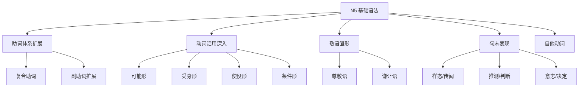

# N4 语法索引概览 📌 从 N5 到 N4 的语法进阶地图

## 定义与解释

**N4 语法**是日语能力考试（JLPT）的第二级，位于 N5（入门）与 N3（中级）之间。从 N5 到 N4 的跳跃，是日语学习者从"看路标、做简单自我介绍"进阶到"能进行日常对话、读懂简单文章"的关键阶段。N4 语法的核心特征可以概括为：**在 N5 基础上系统扩展功能表达，引入更多复合助词、接续表达、敬语雏形、以及更多样的句末表现**。

本索引概览旨在建立一个从 N5 到 N4 的语法进阶路线图，帮助学习者在掌握 N5 基础后，清晰地看到 N4 阶段需要拓展的方向。

## N5 → N4 语法进阶方向 🧭

### 方向一：助词体系的扩展 🔗

N5 阶段学习了基础格助词（が・を・に・へ・と・で・から・まで）和少量副助词（や・だけ）及接续助词（ても・から）。N4 在此基础上扩展：

- **复合助词**：「について」「にとって」「によって」「に対して」——这些由"助词 + 动词て形"组成的复合表达，让日语表达更加精确
- **副助词扩展**：「ばかり」「ほど」「ぐらい」「でも」「しか～ない」
- **接续助词扩展**：「ので」「のに」「たら」「なら」「ば」

### 方向二：动词活用体系的深入 🔄

N5 掌握了辞书形、ます形、て形、た形、ない形、意志形。N4 进一步引入：

- **可能形**（～られる/～れる）：日本語が話**せる**
- **受身形**（～られる）：先生に褒め**られた**
- **使役形**（～させる）：母は私に勉強**させる**
- **条件形**（～ば・～たら・～なら・～と）的系统区分
- **意向形 + とする**（～うとする）：出かけ**ようとした**

### 方向三：敬语体系的初探 🎌

N5 只涉及了最基本的丁寧語（です・ます），N4 开始引入尊敬语和谦让语的雏形：

- **尊敬语表达**：
  - お/ご + 名词（お名前、ご意見）
  - お/ご + 动词连用形 + になる（お読みになる）
  - 特殊尊敬动词（いらっしゃる、おっしゃる、ご覧になる）

- **谦让语表达**：
  - お/ご + 动词连用形 + する（お待ちする）
  - 特殊谦让动词（申す、参る、いただく）

### 方向四：句末表现的多样化 🎭

N5 句末主要是「です/ます」「ました/ません」等基础形式。N4 极大丰富了句末表达：

| 表达 | 含义 | 例句 |
|------|------|------|
| ～ようだ | 好像、似乎 | 雨が降るようだ |
| ～そうだ（样态） | 看起来…… | おいしそうだ |
| ～そうだ（传闻） | 听说…… | 明日は雨だそうだ |
| ～らしい | 据说、典型 | 彼は日本人らしい |
| ～はずだ | 应该、理应 | 彼は来るはずだ |
| ～かもしれない | 也许 | 雨が降るかもしれない |
| ～つもりだ | 打算 | 日本に行くつもりだ |
| ～ことにする | 決定 | 毎日勉強することにした |

### 方向五：自他动词的系统化 ⚖️

N5 初步接触了自他动词的区别（開く/開ける）。N4 阶段需要系统掌握常见的自他动词对，理解它们在句子结构中的不同作用。

## N4 语法学习路线图 🗺️

## N4 核心语法清单 📋

### 1. 助词类
- [[N4-复合助词-について]]
- [[N4-复合助词-にとって]]
- [[N4-副助词-ばかり]]
- [[N4-副助词-ほど]]
- [[N4-副助词-しかない]]

### 2. 接续类
- [[N4-接续-ので]]
- [[N4-接续-のに]]
- [[N4-条件-たら]]
- [[N4-条件-ば]]
- [[N4-条件-なら]]

### 3. 活用类
- [[N4-可能形]]
- [[N4-受身形]]
- [[N4-使役形]]

### 4. 表达类
- [[N4-ようだ]]
- [[N4-そうだ]]
- [[N4-らしい]]
- [[N4-はずだ]]
- [[N4-つもりだ]]

### 5. 敬语类
- [[N4-尊敬语基础]]
- [[N4-谦让语基础]]

## 从 N5 到 N4 的学习建议 💡

1. **先巩固再拓展**：确保 N5 的助词、て形、た形、ない形等基本功扎实后再进入 N4
2. **重视自他动词**：N4 阶段自他动词是重要考点，建议制作自己的自他动词对照表
3. **敬语不是死记硬背**：理解敬语的逻辑（抬高对方 vs 降低自己），比单纯记忆单词更有效
4. **通过例句记忆**：每个 N4 语法点找 3~5 个典型例句反复朗读，形成肌肉记忆
5. **逐渐接触原版材料**：NHK 简易新闻、初级漫画、儿童读物都是 N4 水平的理想练习材料

## 相关笔记

[[N5-助词-格助词-121-格助词と]]
[[N5-助词-格助词-121-格助词を]]
[[N5-助词-格助词-121-格助词へ]]
[[动词]]
[[动词适用]]
[[形容词]]
[[形容词活用]]
[[名词敬体化]]
[[陈述句]]
[[祈使句]]

🏷️: [[N4语法]] [[语法索引]] [[日语语法]] [[进阶路线]] [[JLPT]] [[敬语]] [[复合助词]]
