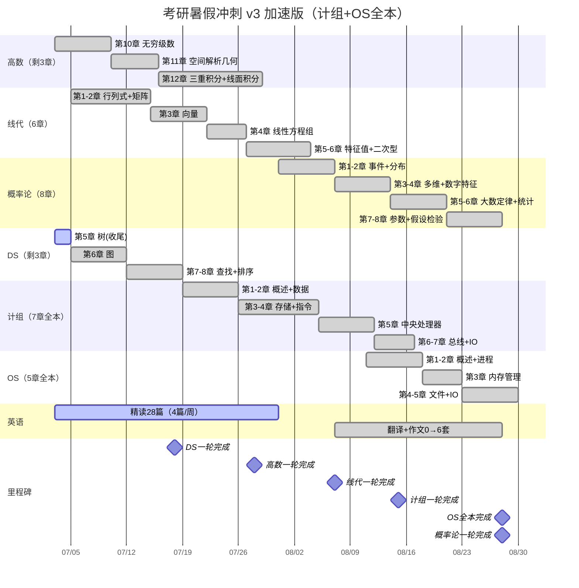

# 考研暑假计划

> 计组7章全本 + OS 5章全本 均于暑假内完成
> 手段：计组压缩至4周、OS压缩至3周、两科部分并行

---

## 一、真实章节划分

### 高数（武忠祥体系，数一12章）
```
1-8章 ✅已完成  9.二重积分 ✅已完成
10.无穷级数  11.空间解析几何  12.多元积分学及其应用
→ 剩余3章，W1-W4完成
```

### 线性代数（6章，未开始）
```
1.行列式  2.矩阵  3.向量  4.线性方程组  5.特征值与特征向量  6.二次型
→ W1-W5完成
```

### 概率论（8章，未开始）
```
1.事件与概率  2.随机变量分布  3.多维分布  4.数字特征
5.大数定律与中心极限  6.数理统计概念  7.参数估计  8.假设检验
→ W5-W8完成
```

### 408 DS（8章，第5章收尾中）
```
✅1.绪论  ✅2.线性表  ✅3.栈队列数组  ✅4.串  🔄5.树与二叉树（两天收尾）
6.图  7.查找  8.排序
→ W1-W3完成✅
```

### 408 计组（7章）🆕 暑假全本
```
1.概述  2.数据表示运算  3.存储系统  4.指令系统  5.中央处理器  6.总线  7.I/O
→ W3-W6完成
```

### 408 OS（5章）🆕 暑假全本
```
1.概述  2.进程管理  3.内存管理  4.文件管理  5.I/O管理
→ W6-W8完成
```

---

## 二、甘特图



---

## 三、周详细表

| 周 | 日期 | 高数 | 线代 | 概率论 | 408-DS | 408-计组 | 408-OS | 英语 |
|:--:|------|:---:|:---:|:---:|:---:|:---:|:---:|------|
| W1 | 7.03→7.09 | **10章：无穷级数** | 1-2章（行列式+矩阵） | — | 🔄树收尾→**6章：图** | — | — | 阅读→14篇 |
| W2 | 7.10→7.16 | **11章：空间解析几何** | 2-3章（矩阵续+向量） | — | 6章续→**7-8章：查找+排序** | — | — | 阅读→18篇 |
| W3 | 7.17→7.23 | **12章(上)：三重积分+曲线积分** | 3-4章（向量续+方程组） | — | ✅DS完成 | **1-2章：概述+数据表示** | — | 阅读→22篇 |
| W4 | 7.24→7.30 | **12章(下)：曲面积分+场论✅** | 4-5章（方程组续+特征值） | — | — | **3-4章：存储系统+指令系统** | — | 阅读→26篇 |
| W5 | 7.31→8.06 | 高数回顾 | 5-6章（特征值续+二次型）✅ | **1-2章**（事件+分布） | — | **5章：中央处理器** | — | 阅读→30篇 |
| W6 | 8.07→8.13 | — | — | **3-4章**（多维+数字特征） | — | 6-7章（总线+IO）✅ | **1-2章：概述+进程管理** | 翻译作文2套 |
| W7 | 8.14→8.20 | — | — | **5-6章**（大数定律+统计） | — | — | **3章：内存管理** | 翻译作文4套 |
| W8 | 8.21→8.28 | — | — | **7-8章**（参数+假设检验）✅ | — | — | **4-5章：文件+I/O管理✅** | 翻译作文6套 |

---

## 四、版本演进

| | v1 | v2 | v3（加速版） |
|---|:--:|:--:|:--:|
| DS完成 | 8.13 | 7.18 | 7.18 |
| 计组完成 | 8.28（7章） | 8.26 | **8.15**（提前10天） |
| OS完成 | 未排 | 3章 | **5章全本✅** |
| 408成果 | 2.5本 | 3本+ | **4本完整（DS/计组/OS）** |

---

## 五、关键风险（v3加速版）

| 风险 | 级别 | 说明 |
|------|:---:|------|
| 计组第3章存储系统 | 🔴 | Cache映射+虚存是一轮最耗时的章节，和指令系统挤在W4 | 
| OS压缩到3周5章 | 🔴 | 进程管理+内存管理是大题重点，不能跳过——但5章全塞进W6-W8意味着每天OS不能落下 |
| 高数第12章两周 | 🟡 | 三重积分+曲线+曲面积分+场论，两周无缓冲 |
| W6并行三线 | 🟡 | 概率论3-4章 + 计组收尾 + OS启动，注意别串线 |
| 英语翻译作文7月无产出 | 🟢 | 8月才开始翻译作文，前提是阅读基础打得好 |

---

## 六、B站UP主

| UP主 | 角色 | 时机 |
|------|------|------|
| **澄潇宇**（B站 UID:6536560，25.5万粉） | 大题技巧+速成 | 真题冲刺前：线代大题颗秒、积分应用大观 |
| **没咋了** | 880精讲+线代救命 | 线代输入阶段：做完一章看对应讲解 |
| **武忠祥** | 高数主线 | 全程 |
| **李永乐** | 线代辅导讲义 | 配合武忠祥线代 |
