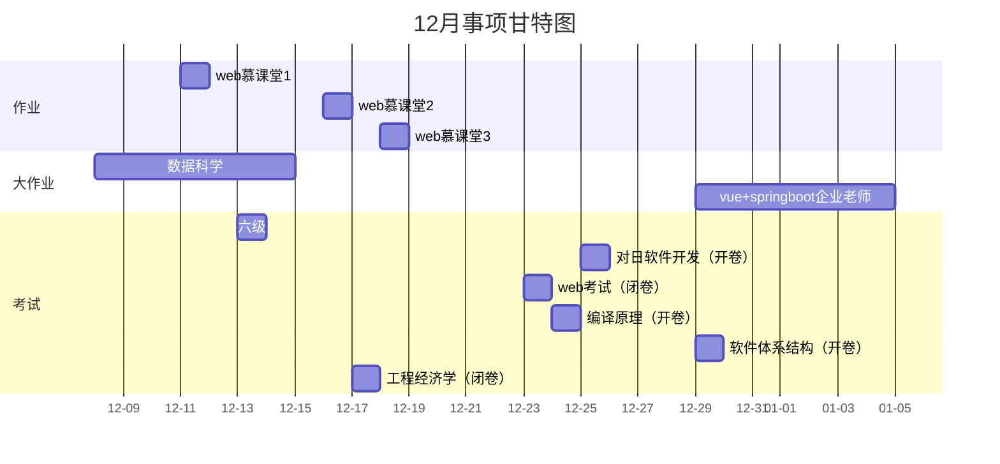

---
~~对日软件开发（周四3-4节 天枢楼a406） :2025-12-25, 1d
web考试（周二3-4节 天枢a306） :2025-12-23, 1d
编译原理（周三3-4节 天枢B405） :2025-12-24, 1d~~
~~工程经济学（周三1-2节 天枢a107） :2025-12-17, 1d~~
软件体系结构（周一9:30-11:30 天枢B107） :2025-12-29, 1d
复习策略：
1.先入门，从软件体系结构各大原则、画模型图所需的各大要素开始
2.看完第一个入门视频，将所有模式按组件的生命周期分三大类
3.将其中的主要几种模式理解

---
4.按照书进行扩展（书上16种模式全覆盖）（脑图）

---
5.费曼学习（利用提示词模版完成每一种模式的闭环学习（从概念-逻辑-结构逐层理解，接着利用测试效应达到80%的理解程度即可）重点是快速过完知识点且留下认知锚点）

