# 英语语法结构树图 English Grammar Structure Tree

> [!info] 设计理念
> 本图参照中文语法拆解的"分层递进+树状展开"逻辑，将英语语法体系从核心到细节层层拆解。
> 原始参考图：![[附件/90分钟！清华博士带你一口气搞懂人工智能和神经网络PT54M19.158S.webp]]

---

## 全景树状图

```mermaid
graph TD
    ROOT["🌳 英语语法体系<br/>English Grammar System"]

    ROOT --> M["🟢 词法 Morphology<br/>词类与词形变化"]
    ROOT --> S["🔵 句法 Syntax<br/>句子结构与基本句型"]
    ROOT --> CS["🟣 复合句法 Complex Syntax<br/>从句与高级结构"]
    ROOT --> SP["🟠 特殊句式 Special Structures<br/>特殊语法结构"]

    %% 词法分支
    M --> M1["名词与代词<br/>Nouns & Pronouns"]
    M --> M2["形容词<br/>Adjectives"]
    M --> M3["动词分类<br/>Verb Types"]
    M --> M4["动词时态<br/>Tenses"]
    M --> M5["语态<br/>Voice"]
    M --> M6["情态动词<br/>Modal Verbs"]
    M --> M7["非谓语动词<br/>Non-finite Verbs"]
    M --> M8["副词与比较级<br/>Adverbs & Comparison"]
    M --> M9["介词<br/>Prepositions"]
    M --> M10["连词<br/>Conjunctions"]
    M --> M11["冠词与数量词<br/>Articles & Quantifiers"]

    %% 句法分支
    S --> S1["五大基本句型<br/>5 Basic Patterns"]
    S --> S2["主语从句<br/>Subject Clause"]
    S --> S3["宾语从句<br/>Object Clause"]

    %% 复合句法分支
    CS --> CS1["定语从句<br/>Attributive Clause"]
    CS --> CS2["非谓语从句<br/>Non-finite Clause"]
    CS --> CS3["同位语从句<br/>Appositive Clause"]
    CS --> CS4["状语从句<br/>Adverbial Clause"]
    CS --> CS5["there be 句型<br/>There Be"]
    CS --> CS6["形式主语/宾语<br/>Formal Subject/Object"]

    %% 特殊句式分支
    SP --> SP1["强调句与感叹句<br/>Emphasis & Exclamation"]
    SP --> SP2["so/such...that<br/>Result Clause"]
    SP --> SP3["倒装句<br/>Inversion"]
    SP --> SP4["as...as 结构<br/>Comparison"]
    SP --> SP5["with 复合结构<br/>With Structure"]
    SP --> SP6["虚拟语气<br/>Subjunctive Mood"]

    %% 词法细节展开
    M1 --> M1a["可数/不可数"]
    M1 --> M1b["人称代词 主格/宾格"]
    M1 --> M1c["指示/不定代词"]

    M3 --> M3a["及物 vt. / 不及物 vi."]
    M3 --> M3b["系动词 Linking Verbs"]
    M3 --> M3c["助动词 Auxiliary"]

    M4 --> M4a["一般时态 Simple"]
    M4 --> M4b["进行时态 Continuous"]
    M4 --> M4c["完成时态 Perfect"]
    M4 --> M4d["完成进行 Perfect Continuous"]

    M7 --> M7a["不定式 to do"]
    M7 --> M7b["动名词 doing"]
    M7 --> M7c["分词 doing/done"]

    %% 样式
    style ROOT fill:#e74c3c,color:#fff,stroke:#c0392b
    style M fill:#2ecc71,color:#fff,stroke:#27ae60
    style S fill:#3498db,color:#fff,stroke:#2980b9
    style CS fill:#9b59b6,color:#fff,stroke:#8e44ad
    style SP fill:#e67e22,color:#fff,stroke:#d35400
```



---

## 层级对照表

| 层级 | 分类 | 对应笔记 | 知识点数 |
|------|------|----------|----------|
| L0 | 英语语法体系 | [[000-英语（这辈子唯一需要听的语法课3.0）]] | 总纲 |
| L1 | 词法 Morphology | [[101-名词与代词]] ~ [[111-冠词与数量词]] | 11 |
| L2 | 句法 Syntax | [[201-五大基本句型]] ~ [[203-宾语从句]] | 3 |
| L3 | 复合句法 Complex Syntax | [[204-定语从句]] ~ [[209-形式主语与形式宾语]] | 6 |
| L4 | 特殊句式 Special Structures | [[301-强调句与感叹句]] ~ [[306-虚拟语气]] | 6 |

---

## 拆解逻辑说明

> [!tip] 中文 vs 英文语法结构对比
>
> **中文语法特点**：
> - 语序为主要语法手段，词形变化少
> - 虚词（助词、介词）承担语法功能
> - 意合为主，句子结构灵活
>
> **英文语法特点**：
> - 严格的词形变化（时态、语态、数、格）
> - 严格的句法结构（SVO 语序 + 从句嵌套）
> - 形合为主，逻辑连接词不可省略
>
> **拆解逻辑**（金字塔结构）：
> ```
> L0: 语法体系（最高抽象）
>  └─ L1: 词法（最小单位→词）
>      └─ L2: 句法（词→句）
>          └─ L3: 复合句法（句→复合句）
>              └─ L4: 特殊句式（高级变体）
> ```

---

## 关联资源

- Canvas认知地图：在 Obsidian 中打开 `英语语法知识体系认知地图.canvas`
- 学习总览：[[00-英语学习总览]]
- 原始课程笔记：[[000-英语（这辈子唯一需要听的语法课3.0）]]
