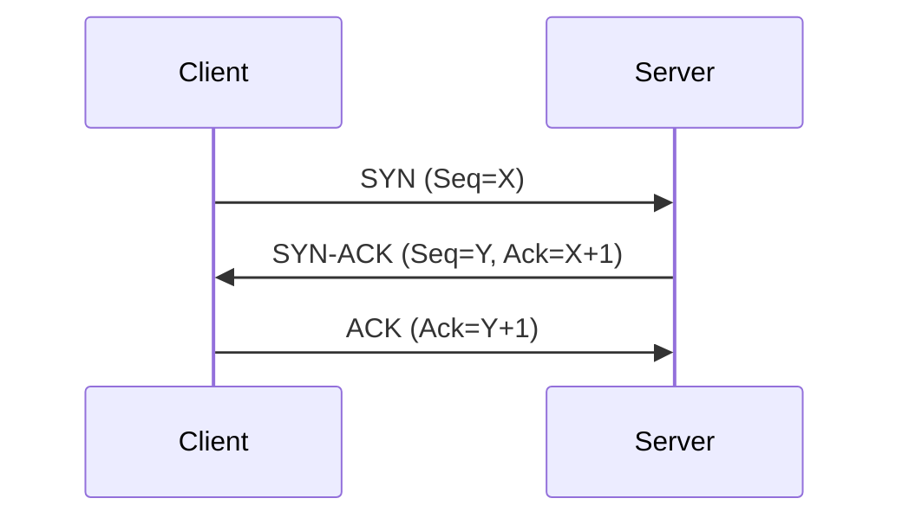
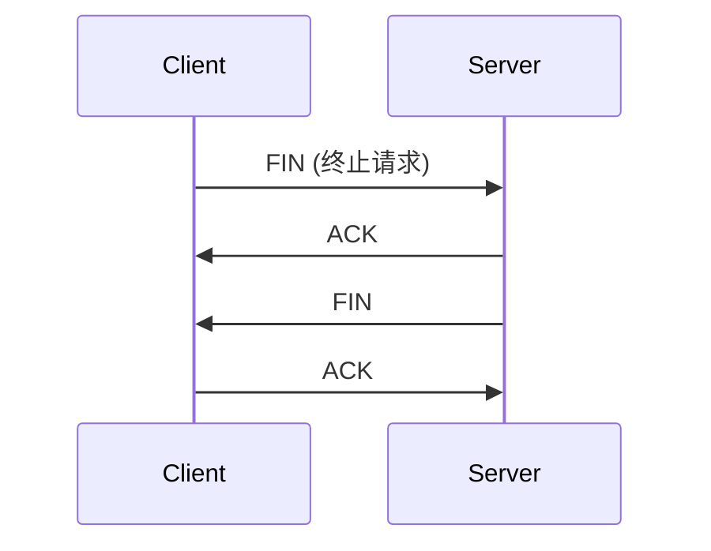
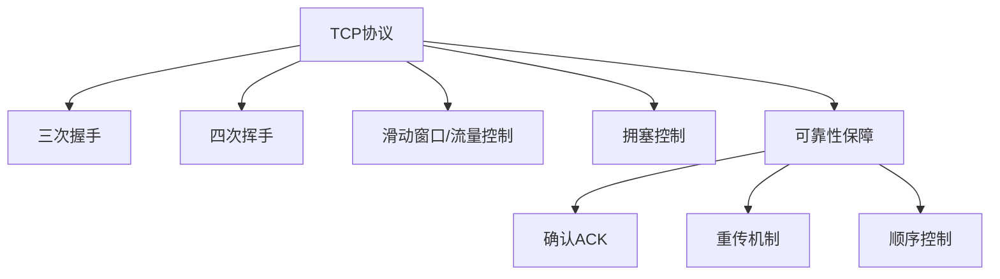

---
tags:
  - 计算机网络
  - TCP
---
TCP（Transmission Control Protocol，传输控制协议）是互联网协议族中**传输层的核心协议之一**，它提供**面向连接、可靠传输、顺序控制和拥塞控制**的机制。以下是对 TCP 协议的全面解析，并结合图示帮助理解其核心特征。

---

## 一、TCP 协议的核心特性

|特性|描述|
|---|---|
|**连接导向**|必须在通信前建立连接（三次握手）|
|**可靠性**|通过确认应答、超时重传、序列号等机制保证数据完整性|
|**面向字节流**|发送的是连续的数据流，不保留应用层报文的边界|
|**全双工通信**|通信双方可以同时进行数据发送与接收|
|**流量控制**|通过滑动窗口机制，控制发送方速度，避免接收方被压垮|
|**拥塞控制**|通过慢启动、拥塞避免、快重传、快恢复等机制应对网络拥塞|

---

## 二、TCP 三次握手（连接建立）流程



- **SYN**：同步序列编号，用于建立连接。
    
- **ACK**：确认应答。
    
- 建立连接的目的是确保双方都准备好开始通信，并同步初始序列号。
    

---

## 三、TCP 四次挥手（连接释放）流程



- 每一方都需要独立释放连接，保障剩余数据能被完整传输。
    

---

## 四、TCP 首部结构（20~60字节）

```text
0                   1                   2                   3   
0 1 2 3 4 5 6 7 8 9 0 1 2 3 4 5 6 7 8 9 0 1 2 3 4 5 6 7 8 9 0 1 
+-+-+-+-+-+-+-+-+-+-+-+-+-+-+-+-+-+-+-+-+-+-+-+-+-+-+-+-+-+-+-+-+
|     源端口      |     目标端口     |
+-+-+-+-+-+-+-+-+-+-+-+-+-+-+-+-+-+-+-+-+-+-+-+-+-+-+-+-+-+-+-+-+
|                     序列号（Sequence Number）                |
+-+-+-+-+-+-+-+-+-+-+-+-+-+-+-+-+-+-+-+-+-+-+-+-+-+-+-+-+-+-+-+-+
|                  确认号（Acknowledgment Number）            |
+-+-+-+-+-+-+-+-+-+-+-+-+-+-+-+-+-+-+-+-+-+-+-+-+-+-+-+-+-+-+-+-+
|数据偏移|保留|标志位|   窗口大小    |
+-+-+-+-+-+-+-+-+-+-+-+-+-+-+-+-+-+-+-+-+-+-+-+-+-+-+-+-+-+-+-+-+
|    校验和     |   紧急指针（Urgent Pointer） |
+-+-+-+-+-+-+-+-+-+-+-+-+-+-+-+-+-+-+-+-+-+-+-+-+-+-+-+-+-+-+-+-+
|               选项（可选）和填充              |
+-+-+-+-+-+-+-+-+-+-+-+-+-+-+-+-+-+-+-+-+-+-+-+-+-+-+-+-+-+-+-+-+
```

**常见标志位**：SYN、ACK、FIN、RST、PSH、URG

---

## 五、与 UDP 的比较（简要回顾）

|特性|TCP|UDP|
|---|---|---|
|是否连接|是（三次握手）|否|
|是否可靠|是（重传机制）|否（尽力交付）|
|数据单位|字节流|数据报（Datagram）|
|传输速度|较慢（开销大）|较快（开销小）|
|典型应用|HTTP, FTP, SSH 等|DNS, VoIP, 流媒体 等|

---

## 六、典型应用协议（基于 TCP）

- **HTTP/HTTPS**：网页访问
    
- **FTP**：文件传输
    
- **SSH**：安全远程登录
    
- **SMTP/POP3**：电子邮件传输
    
- **MySQL**：数据库连接
    

---

## 七、应用场景理解图（可视化）



---

