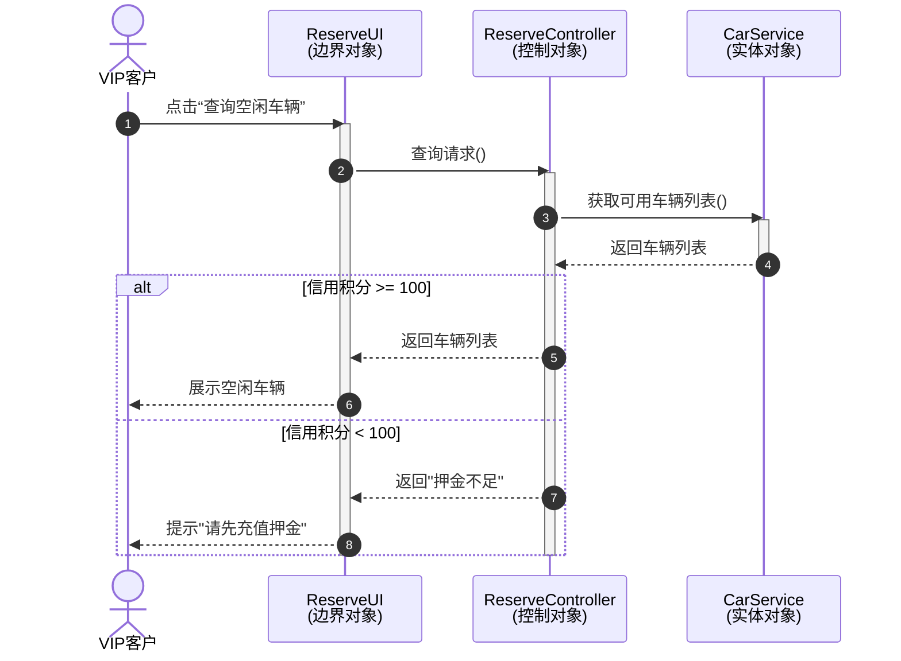

```mermaid
sequenceDiagram
    autonumber
    actor VIP as VIP客户
    
    %% 声明 BCE 对象参与者
    participant UI as ReserveUI<br/>(边界对象)
    participant Ctrl as ReserveController<br/>(控制对象)
    participant Svc as CarService<br/>(实体对象)

    %% 发送请求 (实线 + 实心箭头 ->>)
    VIP ->> UI: 点击“查询空闲车辆”
    activate UI
    
    UI ->> Ctrl: 查询请求()
    activate Ctrl
    
    Ctrl ->> Svc: 获取可用车辆列表()
    activate Svc
    
    %% 返回结果 (虚线 + 开放箭头 -->>)
    Svc -->> Ctrl: 返回车辆列表
    deactivate Svc

    %% alt 组合片段 (互斥条件)
    alt 信用积分 >= 100
        Ctrl -->> UI: 返回车辆列表
        UI -->> VIP: 展示空闲车辆
    else 信用积分 < 100
        Ctrl -->> UI: 返回"押金不足"
        UI -->> VIP: 提示"请先充值押金"
    end
    
    deactivate Ctrl
    deactivate UI
```
