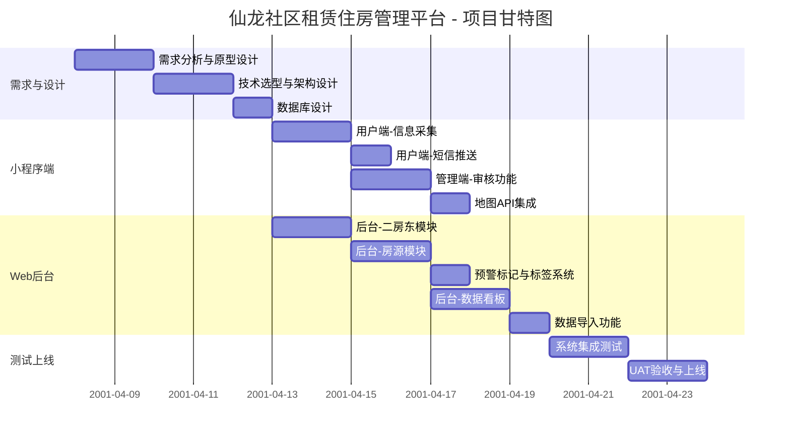
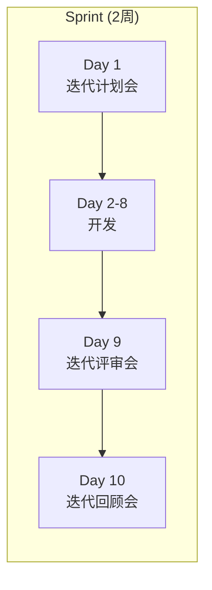
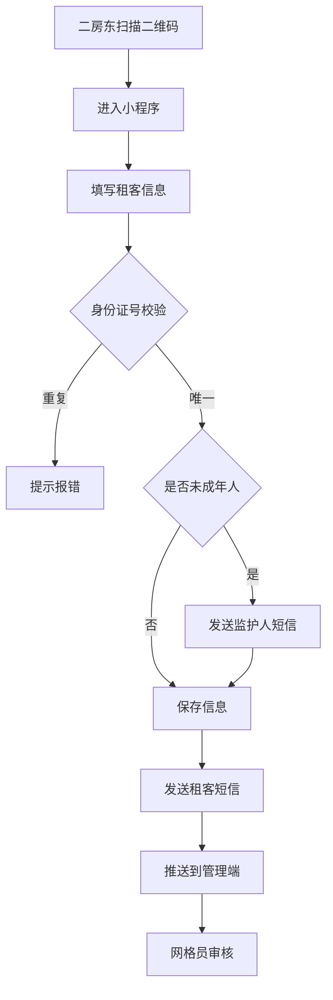
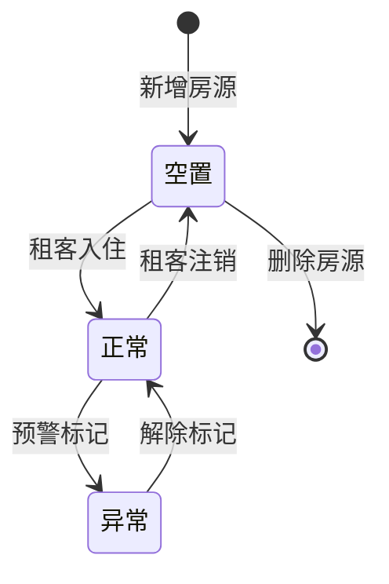

# 仙龙社区租赁住房管理平台 项目开发计划

> **文档版本**：v1.0  
> **创建日期**：2026-04-08  
> **迭代周期**：2周/Sprint  
> **项目总周期**：8周（4个Sprint）

---

## 1. 项目概况

### 1.1 项目信息

| 项目 | 内容 |
|------|------|
| 项目名称 | 仙龙社区租赁住房管理平台 |
| 开发模式 | 敏捷开发（Scrum） |
| 迭代周期 | 2周/Sprint |
| 总迭代数 | 4个Sprint |
| 项目周期 | 8周 |
| 开始日期 | Sprint 1 启动日 |

### 1.2 团队角色

| 角色 | 职责 |
|------|------|
| 产品负责人（PO） | 需求确认、优先级排序、验收确认 |
| Scrum Master | 迭代管理、风险控制、障碍清除 |
| 开发团队 | 设计、开发、测试 |

### 1.3 交付物清单

| 交付物        | 说明         |
| ---------- | ---------- |
| 微信小程序（用户端） | 二房东信息采集    |
| 微信小程序（管理端） | 网格员审核、地图展示 |
| H5 Web管理后台 | 数据看板、全局管理  |
| 接口文档       | 后端API文档    |
| 部署文档       | 云服务器部署说明   |

---

## 2. 整体里程碑

---

## 3. Sprint 详细计划

### Sprint 1：基础架构搭建（第1-2周）

**目标**：完成技术选型、数据库设计、小程序用户端核心功能

#### 3.1.1 Sprint 1 任务分解

| 任务 | 预估工时 | 负责人 | 完成标准 |
|------|----------|--------|----------|
| 需求说明书定稿 | 8h | PO | 文档评审通过 |
| 数据库ER图设计 | 8h | 后端 | 评审通过 |
| 后端项目初始化 | 4h | 后端 | 项目可运行 |
| 小程序项目初始化 | 4h | 前端 | 项目可运行 |
| 租客信息录入页面 | 16h | 前端 | 表单可提交 |
| 身份证唯一性校验接口 | 4h | 后端 | 接口可用 |
| 租客信息CRUD接口 | 8h | 后端 | 接口可用 |
| 前后端联调 | 8h | 全栈 | 信息可录入数据库 |

#### 3.1.2 Sprint 1 交付物

- [x] 需求说明书（草稿）
- [ ] 数据库设计文档
- [ ] 小程序用户端-信息采集页面

#### 3.1.3 Sprint 1 验收标准

- 二房东可通过小程序录入租客信息
- 身份证号重复时提示报错
- 信息成功保存到数据库

---

### Sprint 2：核心功能开发（第3-4周）

**目标**：完成短信推送、管理端审核、地图可视化

#### 3.2.1 Sprint 2 任务分解

| 任务 | 预估工时 | 负责人 | 完成标准 |
|------|----------|--------|----------|
| 短信服务集成 | 8h | 后端 | 可发送短信 |
| 录入成功短信推送 | 4h | 后端 | 录入后自动发送 |
| 未成年人录入通知 | 4h | 后端 | 18岁以下触发 |
| 操作日志记录 | 4h | 后端 | 日志可查询 |
| 管理端审核页面 | 8h | 前端 | 可审核/驳回 |
| 审核接口开发 | 4h | 后端 | 接口可用 |
| 百度地图API集成 | 8h | 前端 | 地图可展示 |
| 楼栋点击交互 | 8h | 前端 | 弹出单元信息 |

#### 3.2.2 Sprint 2 交付物

- [ ] 短信推送功能
- [ ] 操作日志功能
- [ ] 小程序管理端-审核功能
- [ ] 地图可视化展示

#### 3.2.3 Sprint 2 验收标准

- 信息录入后租客收到短信通知
- 网格员可审核待处理信息
- 地图可展示楼栋，点击查看户型

---

### Sprint 3：Web后台开发（第5-6周）

**目标**：完成Web管理后台核心模块

#### 3.3.1 Sprint 3 任务分解

| 任务 | 预估工时 | 负责人 | 完成标准 |
|------|----------|--------|----------|
| H5项目初始化 | 4h | 前端 | 项目可运行 |
| 二房东列表页 | 8h | 前端 | 列表可展示 |
| 二房东详情页 | 8h | 前端 | 详情可查看 |
| 房源列表页 | 8h | 前端 | 列表可展示 |
| 房源颜色标记 | 4h | 前端 | 颜色正确显示 |
| 标签管理功能 | 8h | 前后端 | 可增删改查标签 |
| 预警标记功能 | 4h | 前后端 | 可标记异常 |
| 一键注销功能 | 4h | 后端 | 注销后状态更新 |

#### 3.3.2 Sprint 3 交付物

- [ ] Web后台-二房东模块
- [ ] Web后台-房源模块
- [ ] 标签分级管理系统

#### 3.3.3 Sprint 3 验收标准

- 管理员可查看二房东及其房源
- 房源可按状态显示不同颜色
- 可对人员进行预警标记

---

### Sprint 4：收尾与上线（第7-8周）

**目标**：完成数据看板、数据导入、测试上线

#### 3.4.1 Sprint 4 任务分解

| 任务 | 预估工时 | 负责人 | 完成标准 |
|------|----------|--------|----------|
| 数据看板设计 | 4h | 前端 | 设计稿确认 |
| 数据看板开发 | 16h | 前端 | 看板可展示 |
| 统计接口开发 | 8h | 后端 | 接口可用 |
| Excel导入功能 | 8h | 后端 | 可导入数据 |
| 数据校验处理 | 4h | 后端 | 异常数据处理 |
| 集成测试 | 16h | 测试 | 测试用例通过 |
| Bug修复 | 8h | 开发 | 无阻塞性Bug |
| 部署上线 | 4h | 运维 | 系统可访问 |
| 用户培训 | 4h | PO | 培训完成 |

#### 3.4.2 Sprint 4 交付物

- [ ] Web后台-数据看板
- [ ] Excel数据导入功能
- [ ] 测试报告
- [ ] 部署文档
- [ ] 用户操作手册

#### 3.4.3 Sprint 4 验收标准

- 数据看板正确展示统计数据
- 初始数据成功导入系统
- 系统通过UAT验收

---

## 4. 迭代节奏

### 4.1 Sprint 节奏图

### 4.2 会议节奏

| 会议 | 频率 | 时长 | 参与者 |
|------|------|------|--------|
| 每日站会 | 每日 | 15min | 开发团队 |
| 迭代计划会 | Sprint开始 | 2h | 全员 |
| 迭代评审会 | Sprint结束 | 1h | 全员+甲方 |
| 迭代回顾会 | Sprint结束 | 1h | 开发团队 |

---

## 5. 风险管理

### 5.1 风险清单

| 风险 | 概率 | 影响 | 应对措施 |
|------|------|------|----------|
| 需求变更频繁 | 中 | 高 | 每Sprint冻结需求，变更放入下一Sprint |
| 第三方API限制 | 低 | 中 | 提前申请百度地图配额 |
| 短信费用超支 | 中 | 低 | 设定月度预算预警 |
| 人员变动 | 低 | 高 | 代码规范+文档沉淀 |
| 数据安全风险 | 中 | 高 | 严格权限控制+审计日志 |

### 5.2 依赖清单

| 依赖 | 提供方 | 风险 | 缓解措施 |
|------|--------|------|----------|
| 百度地图API Key | 开发团队 | 配额限制 | 提前申请企业版 |
| 短信服务账号 | 甲方 | 费用问题 | 提前沟通预算 |
| 初始数据Excel | 甲方 | 格式不匹配 | 提前约定模板 |
| 云服务器 | 甲方 | 费用问题 | 提前采购 |

---

## 6. 沟通计划

### 6.1 甲方对接节奏

| 时间点 | 形式 | 内容 |
|--------|------|------|
| Sprint 1 结束 | 原型演示 | 确认需求理解正确 |
| Sprint 2 结束 | 功能演示 | 确认审核流程 |
| Sprint 3 结束 | 功能演示 | 确认后台功能 |
| Sprint 4 结束 | UAT验收 | 确认系统可上线 |

### 6.2 沟通渠道

| 渠道 | 用途 |
|------|------|
| 微信群 | 日常沟通、问题快速响应 |
| 邮件 | 正式文档、会议纪要 |
| 腾讯会议 | 远程会议、演示 |

---

## 7. 质量保障

### 7.1 代码质量

- 代码评审：所有代码合并前需评审
- 单元测试：核心业务逻辑覆盖率 > 70%
- 静态检查：ESLint / Pylint 检查通过

### 7.2 测试策略

| 测试类型 | 负责人 | 时间点 |
|----------|--------|--------|
| 单元测试 | 开发 | 开发过程中 |
| 集成测试 | 测试 | Sprint结束前 |
| UAT测试 | 甲方 | Sprint 4 |

---

## 附录：Mermaid 流程图

### A. 信息采集流程

### B. 房源状态流转

---

**文档修订记录**：

| 版本 | 日期 | 修订人 | 修订内容 |
|------|------|--------|----------|
| v1.0 | 2026-04-08 | 项目组 | 初稿 |
