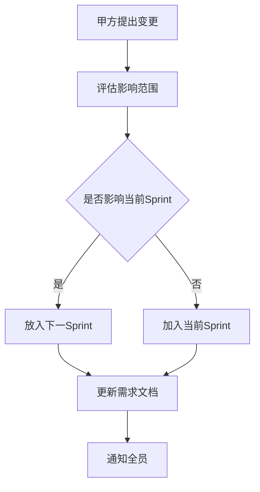
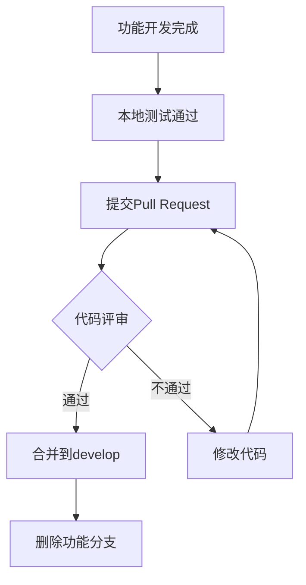
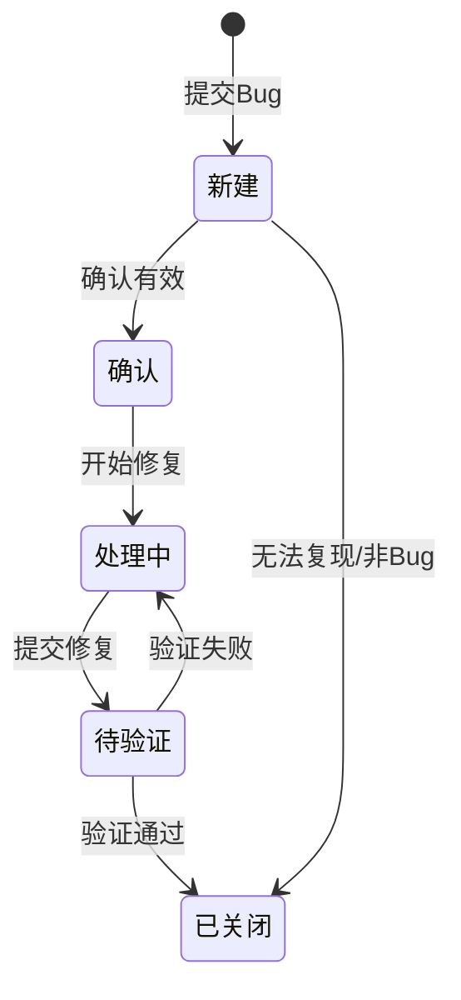
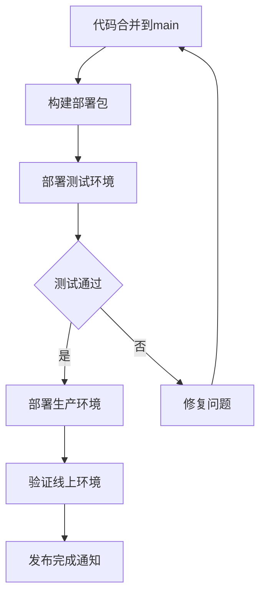

# 仙龙社区租赁住房管理平台 项目开发规范

> **文档版本**：v1.0  
> **创建日期**：2026-04-08  
> **适用范围**：项目全体开发人员

---

## 1. 总则

### 1.1 目的

为保证项目开发质量，统一团队开发标准，提高协作效率，特制定本规范。

### 1.2 适用对象

- 前端开发工程师
- 后端开发工程师
- 测试工程师
- 项目管理人员

### 1.3 规范执行

- 代码评审时检查规范执行情况
- 违反规范的代码不予合并
- 规范更新需团队评审通过

---

## 2. 敏捷开发流程规范

### 2.1 Sprint 周期

| 阶段 | 时间 | 活动内容 |
|------|------|----------|
| Sprint 启动 | Day 1 | 迭代计划会，确认Sprint目标 |
| Sprint 执行 | Day 2-8 | 开发、测试、每日站会 |
| Sprint 收尾 | Day 9-10 | 评审会、回顾会 |

### 2.2 会议规范

#### 2.2.1 每日站会

**时间**：每个工作日 10:00，时长 15 分钟

**内容**：每人回答三个问题：
1. 昨天完成了什么？
2. 今天计划做什么？
3. 有什么阻碍？

**规范**：
- 不解决问题，只暴露问题
- 不讨论技术细节
- 准时开始，准时结束

#### 2.2.2 迭代计划会

**时间**：Sprint 第1天上午，时长 2 小时

**内容**：
1. 确认Sprint目标
2. 评审并确认需求优先级
3. 任务拆分与认领
4. 工时预估

**输出**：Sprint Backlog

#### 2.2.3 迭代评审会

**时间**：Sprint 倒数第2天，时长 1 小时

**内容**：
1. 演示本次迭代完成的功能
2. 收集甲方反馈
3. 确认验收标准

**参与**：全员 + 甲方代表

#### 2.2.4 迭代回顾会

**时间**：Sprint 最后一天，时长 1 小时

**内容**：
1. 本Sprint做得好的
2. 本Sprint做得不好的
3. 下Sprint改进措施

---

## 3. 需求管理规范

### 3.1 需求变更流程



### 3.2 需求冻结规则

- **Sprint 内冻结**：Sprint 开始后，不接受影响当前 Sprint 目标的变更
- **变更窗口**：Sprint 结束前 3 天开放下一 Sprint 需求调整
- **紧急变更**：需 PO + SM 双方签字确认

### 3.3 需求文档管理

| 文档 | 负责人 | 更新时机 |
|------|--------|----------|
| 需求说明书 | PO | 需求变更时 |
| 原型设计稿 | 前端 | 需求变更时 |
| API接口文档 | 后端 | 接口变更时 |

---

## 4. 代码规范

### 4.1 前端代码规范（Vue/小程序）

#### 4.1.1 命名规范

| 类型 | 规范 | 示例 |
|------|------|------|
| 文件名 | 小写-连字符 | `tenant-form.vue` |
| 组件名 | PascalCase | `<TenantForm />` |
| 变量名 | camelCase | `tenantInfo` |
| 常量名 | UPPER_SNAKE_CASE | `API_BASE_URL` |
| CSS类名 | 小写-连字符 | `.form-container` |

#### 4.1.2 目录结构

```
src/
├── pages/              # 页面
│   ├── index/          # 首页
│   ├── tenant/         # 租客管理
│   └── house/          # 房源管理
├── components/         # 公共组件
├── api/                # 接口封装
├── utils/              # 工具函数
├── store/              # 状态管理
└── assets/             # 静态资源
```

#### 4.1.3 注释规范

```javascript
/**
 * 提交租客信息
 * @param {Object} data - 租客信息
 * @param {string} data.name - 姓名
 * @param {string} data.idCard - 身份证号
 * @returns {Promise<Object>} 提交结果
 */
async function submitTenant(data) {
  // 实现逻辑
}
```

### 4.2 后端代码规范（Python）

#### 4.2.1 命名规范

| 类型 | 规范 | 示例 |
|------|------|------|
| 文件名 | 小写_下划线 | `tenant_service.py` |
| 类名 | PascalCase | `TenantService` |
| 函数名 | snake_case | `get_tenant_by_id` |
| 变量名 | snake_case | `tenant_info` |
| 常量名 | UPPER_SNAKE_CASE | `MAX_TENANTS_PER_ROOM` |

#### 4.2.2 目录结构

```
app/
├── api/                # API路由
│   ├── tenant.py       # 租客接口
│   └── house.py        # 房源接口
├── models/             # 数据模型
├── services/           # 业务逻辑
├── utils/              # 工具函数
├── config/             # 配置文件
└── tests/              # 单元测试
```

#### 4.2.3 API 响应格式

**成功响应**：
```json
{
  "code": 200,
  "message": "success",
  "data": {
    "id": "xxx",
    "name": "张三"
  }
}
```

**失败响应**：
```json
{
  "code": 400,
  "message": "身份证号已存在",
  "data": null
}
```

### 4.3 数据库规范

#### 4.3.1 表命名

- 小写字母 + 下划线
- 复数形式，如 `tenants`、`houses`
- 关联表格式：`tenant_house`

#### 4.3.2 字段命名

- 小写字母 + 下划线
- 主键：`id`
- 外键：`关联表_id`，如 `tenant_id`
- 时间字段：`create_time`、`update_time`

#### 4.3.3 必备字段

每张表必须包含：

| 字段 | 类型 | 说明 |
|------|------|------|
| id | VARCHAR(32) | 主键，UUID |
| create_time | DATETIME | 创建时间 |
| update_time | DATETIME | 更新时间 |
| is_deleted | TINYINT | 逻辑删除标记 |

---

## 5. Git 规范

### 5.1 分支管理

```
main (生产分支)
  └── develop (开发分支)
        ├── feature/tenant (功能分支)
        ├── feature/house (功能分支)
        └── bugfix/xxx (修复分支)
```

### 5.2 分支命名规范

| 分支类型 | 命名格式 | 示例 |
|----------|----------|------|
| 功能分支 | feature/功能名 | `feature/tenant-form` |
| 修复分支 | bugfix/问题描述 | `bugfix/idcard-validation` |
| 发布分支 | release/版本号 | `release/v1.0.0` |
| 热修复分支 | hotfix/问题描述 | `hotfix/crash-fix` |

### 5.3 Commit 规范

**格式**：`<type>(<scope>): <subject>`

| Type | 说明 | 示例 |
|------|------|------|
| feat | 新功能 | `feat(tenant): 添加租客信息录入功能` |
| fix | 修复Bug | `fix(valid): 修复身份证校验逻辑` |
| docs | 文档更新 | `docs(api): 更新接口文档` |
| style | 代码格式 | `style: 格式化代码` |
| refactor | 重构 | `refactor(tenant): 重构租客服务` |
| test | 测试 | `test(tenant): 添加租客服务单元测试` |

### 5.4 代码合并流程



### 5.5 Pull Request 规范

**标题格式**：`[模块] 功能描述`

**内容模板**：
```markdown
## 变更说明
简要描述本次变更的内容

## 变更类型
- [ ] 新功能
- [ ] Bug修复
- [ ] 重构
- [ ] 文档更新

## 测试情况
- [ ] 单元测试通过
- [ ] 本地测试通过

## 相关Issue
#123
```

---

## 6. 测试规范

### 6.1 测试类型

| 测试类型 | 负责人 | 覆盖率要求 |
|----------|--------|------------|
| 单元测试 | 开发 | 核心业务 > 70% |
| 接口测试 | 开发 | 100% 接口覆盖 |
| 集成测试 | 测试 | 主流程 100% |
| UAT测试 | 甲方 | 验收标准覆盖 |

### 6.2 测试用例规范

**用例格式**：

| 编号 | 模块 | 用例名称 | 前置条件 | 操作步骤 | 预期结果 |
|------|------|----------|----------|----------|----------|
| TC001 | 租客录入 | 身份证重复校验 | 已存在租客A | 录入相同身份证号 | 提示"身份证号已存在" |

### 6.3 Bug 管理规范

**Bug 等级**：

| 等级 | 定义 | 处理时效 |
|------|------|----------|
| P0-阻塞 | 系统崩溃、数据丢失 | 2小时内 |
| P1-严重 | 核心功能不可用 | 1天内 |
| P2-一般 | 功能异常但有替代方案 | Sprint内 |
| P3-建议 | 优化建议 | 下Sprint |

**Bug 生命周期**：



---

## 7. 文档规范

### 7.1 文档清单

| 文档 | 负责人 | 更新频率 |
|------|--------|----------|
| 需求说明书 | PO | 需求变更时 |
| 项目开发计划 | SM | 每Sprint初 |
| API接口文档 | 后端 | 接口变更时 |
| 数据库设计文档 | 后端 | 结构变更时 |
| 测试报告 | 测试 | 每Sprint末 |
| 部署文档 | 运维 | 上线前 |
| 用户操作手册 | PO | 上线前 |

### 7.2 文档命名规范

```
文档名称_v版本号_状态.md

示例：
需求说明书_v1.0_草稿.md
需求说明书_v1.0_正式版.md
```

### 7.3 文档存储位置

```
/docs
├── 01_需求文档/
├── 02_设计文档/
├── 03_接口文档/
├── 04_测试文档/
├── 05_部署文档/
└── 06_会议纪要/
```

---

## 8. 安全规范

### 8.1 敏感数据处理

| 数据类型 | 存储方式 | 传输方式 |
|----------|----------|----------|
| 身份证号 | 加密存储 | HTTPS |
| 手机号 | 加密存储 | HTTPS |
| 密码 | 哈希存储 | 不传输 |

### 8.2 权限控制

- 最小权限原则
- 关键操作需二次确认
- 敏感操作记录审计日志

### 8.3 接口安全

- 所有接口需 Token 鉴权
- 接口限流：单IP 100次/分钟
- 输入参数校验

---

## 9. 发布规范

### 9.1 发布流程



### 9.2 发布窗口

- 正常发布：每周五下午
- 紧急发布：需 SM 审批

### 9.3 版本号规范

**格式**：`v主版本号.次版本号.修订号`

- 主版本号：重大架构变更
- 次版本号：新功能发布
- 修订号：Bug修复

示例：`v1.0.0` → `v1.1.0`（新功能）→ `v1.1.1`（Bug修复）

---

## 10. 附则

### 10.1 规范更新

- 本规范每Sprint回顾会时评估是否需要更新
- 更新需团队投票通过（> 2/3）

### 10.2 规范执行

- 违反规范的个人需在回顾会上说明原因
- 多次违反规范将影响绩效评估

---

**文档修订记录**：

| 版本 | 日期 | 修订人 | 修订内容 |
|------|------|--------|----------|
| v1.0 | 2026-04-08 | 项目组 | 初稿 |
