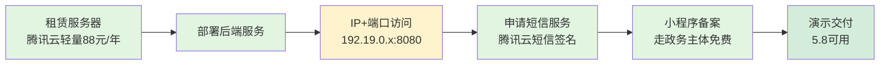
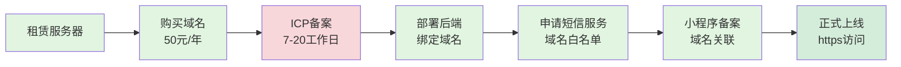
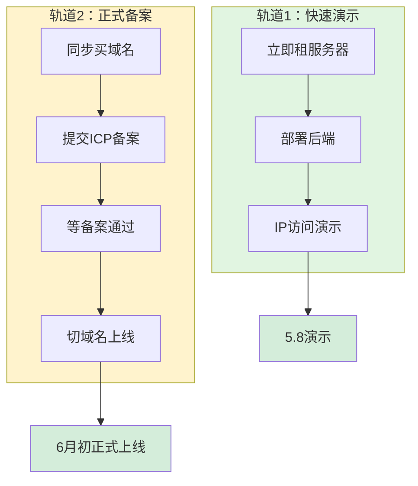

# 反诈小程序需求访谈信息对齐清单

> 梳理日期：2026-05-08
> 依据文档：11_需求访谈双方信息对齐模版.md + 09_需求最终对齐.md + 10_项目费用估算.md

---

## 一、具体问题：解决预案

### 1.1 域名和备案
| 具体问题 | 甲方诉求 | 解决预案 |
|---------|---------|---------|
| 域名和备案几号能有结果？ | 甲方急迫想知道时间节点 | 乙方回复：流程要个把月，资料已提交，预计6月上旬能有结果 |

### 1.2 短信服务
| 具体问题 | 甲方诉求 | 解决预案 |
|---------|---------|---------|
| 短信服务商是谁？联系情况？ | 需对接短信服务 | 乙方技术已调好，暂未对接，需甲方提供对接人信息，下一个版本能用上，最晚5月15号 |

### 1.3 官方报备材料
| 具体问题          | 甲方诉求   | 解决预案                       |
| ------------- | ------ | -------------------------- |
| 甲方需小程序准备哪些材料？ | 配合政务备案 | 乙方整理：需要甲方提供所里资质和授权文件，登录小程序 |

### 1.4 服务器租赁
| 具体问题 | 甲方诉求 | 解决预案 |
|---------|---------|---------|
| 服务器租赁费用和时间？ | 需明确预算 | 乙方方案：已用内部学生优惠服务器，目前够用；演示测试预算300元，正式上线首年约800元 |

---

## 二、人员（干系人）

| 角色         | 职责                       | 备注          |
| ---------- | ------------------------ | ----------- |
| 甲方（派出所/政府） | 提供政务资质、授权材料、对接人信息、数据录入人员 | 需安排人员签署保密协议 |
| 乙方（开发方）    | 系统开发、部署、政务对接、材料整理        | 带测试版和材料过去   |
| 网格员        | 生成二房东账号、指导二房东使用小程序       | 账号分发权限      |
| 二房东        | 信息录入（小程序端）               | 仅录入权限，无注销权限 |
| 数据录入员      | 手动录入学生会人员信息              | 需签保密协议      |

---

## 三、时间安排（按Sprint排）

### Sprint 1（5.6-5.12）
- [ ] 服务器购买 + 域名注册 + 提交ICP备案
- [ ] 确定短信服务商对接人
- [ ] 甲方准备资质和授权材料

### Sprint 2（5.13-5.19）
- [ ] ICP备案审核中
- [ ] 短信签名申请 + 小程序政务认证申请
- [ ] 微信小程序注册信息提供（甲方）
- [ ] 对接会议

### Sprint 3（5.20-5.26）
- [ ] ICP备案通过（预计）
- [ ] 提交公安备案
- [ ] 系统部署

### Sprint 4（5.27-6.2）
- [ ] 小程序提交审核
- [ ] 试运行（目标：6月初可演示）

---

## 四、会议议程（5月8日）

### 需现场解决
1. [x] 微信小程序政务备案注册（提供微信账号信息）
2. [x] 后续事项当面聊透
3. [x] 测试版演示 + 材料交接

### 会议话术
> "8号我们这边下午都有空，您定个时间就行，我带测试版和材料过去，咱们当面把后续的事都聊透。"

---

## 五、当前项目进度

| 模块     | 状态    | 备注           |
| ------ | ----- | ------------ |
| 系统可演示  | ✅已完成  | 待5.8现场演示     |
| 短信服务   | 🔶接入中 | 技术已调好，需对接服务商 |
| ICP备案  | 🔶提交中 | 预计6月上旬       |
| 域名/服务器 | 🔶落实中 | 预算已估算        |
| 小程序备案  | ⛔阻塞   | 需要甲方提供微信账号信息 |
| 数据     | 阻塞    | 需要后面人工录入     |

---

## 六、待甲方对接任务项

- [x] 提供微信账号信息（小程序注册）
- [x] 提供所里资质和授权文件（如果需要）
- [ ] 提供短信服务商对接人信息
- [x] 安排数据录入人员（签保密协议）
- [x] 确认会议时间（5月8日下午）

---

## 附录：关键路径流程图（Mermaid）

> 核心问题：已完成小程序+后端开发，接下来最短路径是什么？

### 方案A：IP+端口演示（最快，1-3天）

**最短路径：租赁服务器 → 部署后端 → IP访问 → 短信服务 → 小程序备案 → 演示**

| 步骤 | 耗时 | 依赖 | 阻塞风险 |
|------|------|------|---------|
| 租赁服务器 | 1小时 | 无 | 无 |
| 部署后端 | 2-4小时 | 服务器就绪 | 无 |
| IP+端口访问 | 即时 | 部署完成 | 无 |
| 短信服务申请 | 1-2工作日 | 需单位资质+签名 | ⚠️ 需甲方提供单位证明 |
| 小程序备案 | 3-5工作日 | 需微信账号+服务器IP | ⚠️ 需甲方提供账号信息 |
| **总耗时** | **3-5天** | | |

> ⚠️ **关键澄清**：短信服务和小程序备案是**并行任务**，不是串行依赖。短信只需单位资质，小程序只需微信账号，两者可同步申请。

---

### 方案B：公网域名URL访问（标准，15-30天）

**标准路径：租赁服务器 → 购买域名 → ICP备案 → 部署后端 → 短信服务 → 小程序备案 → 上线**

| 步骤 | 耗时 | 依赖 | 阻塞风险 |
|------|------|------|---------|
| 租赁服务器 | 1小时 | 无 | 无 |
| 购买域名 | 1小时 | 无 | 无 |
| ICP备案 | 7-20工作日 | 域名+服务器+单位资质 | **硬骨头，时间不可控** |
| 部署后端 | 2-4小时 | 服务器就绪（IP可先部署） | 无 |
| 短信服务 | 1-2工作日 | 单位资质（不需等ICP） | 可与ICP并行 |
| 小程序备案 | 3-5工作日 | 需微信账号+服务器 | 可与ICP并行 |
| **总耗时** | **15-30天** | | |

> ⚠️ **关键澄清**：
> - 短信服务只需要**单位资质**，不需要等ICP备案完成
> - 小程序备案只需要**微信账号+服务器IP**，不需要等域名
> - 真正阻塞的只有**ICP备案**（7-20天），其他都可并行

---

### 双方案对比

| 维度 | 方案A：IP+端口 | 方案B：公网域名 |
|------|--------------|---------------|
| **上线速度** | 3-5天 | 15-30天 |
| **成本** | 88元（服务器） | 138元（服务器+域名） |
| **访问方式** | IP:端口（不美观） | 域名（专业） |
| **甲方接受度** | 演示可用，领导可能在意 | 正式交付标准 |
| **短信服务** | 可用（IP白名单） | 可用（域名白名单） |
| **小程序审核** | 可用（IP访问） | 需域名备案通过 |
| **长期维护** | 不适合生产 | 标准方案 |
| **真正阻塞项** | 无 | 仅ICP备案（7-20天） |

---

### 推荐策略：双轨并行

**结论**：
- **5月8日演示**：走方案A（IP+端口），1-2天搞定
- **6月正式交付**：走方案B（域名+ICP），同步推进不阻塞
- **关键动作**：今天立刻租服务器+买域名，双线并行

---

## 七、风险与备注

### 风险点
1. ICP备案时间不可控，可能超时 → Plan B：IP+端口演示
2. 微信小程序类目需企业/政务认证建议走政务主体（免费）
3. 百度地图API白名单需添加服务器IP

### 备注
- 甲方情绪需安抚：强调"快准稳"而非"高大上"
- 演示策略：静态数据+动态演示结合，展示"成品感"
- 数据安全：录入人员需签保密协议