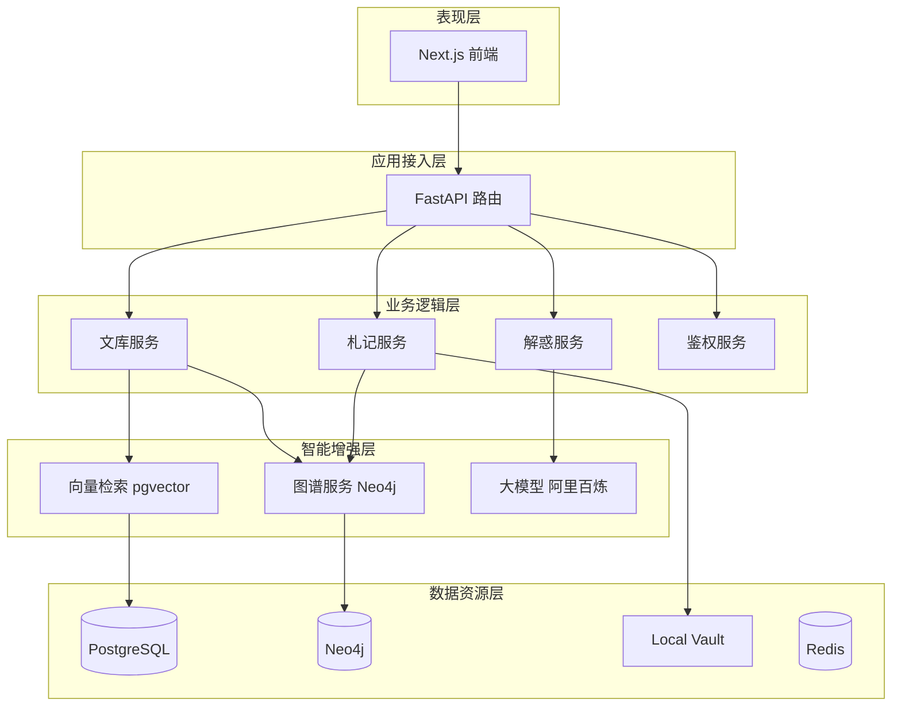

# 第二部分：文心阁的产品构造与系统架构 — 参考文献与素材补充

> 更新时间：2026-04-03 | 基于 SCQA 模型重构叙事

---

## 一、SCQA 叙事框架（本部分）

### S - 情境
> 系统需要支撑复杂的业务逻辑和高并发的用户交互，同时保证稳定性、扩展性和可维护性。

### C - 复杂化
> 多源异构数据统一建模复杂；本地文件系统与Web编辑器协同困难；双向链接与图数据库同步要求高一致性。

### Q - 问题
> 如何设计一个既能承载复杂智能，又能保持长期演进能力的系统架构？

### A - 答案
> 五层分层架构 + 三库协同 + Local-First原则，构建"稳定的架构是承载复杂智能的基石"。

---

## 二、系统架构技术栈

### 2.1 核心技术栈

| 层级       | 技术             | 版本     | 官方文档                                 |
| -------- | -------------- | ------ | ------------------------------------ |
| **前端**   | Next.js        | 14+    | https://nextjs.org/docs              |
| **前端**   | React          | 18+    | https://react.dev/                   |
| **前端**   | Tiptap         | 2.x    | https://tiptap.dev/docs              |
| **后端**   | FastAPI        | 0.100+ | https://fastapi.tiangolo.com/        |
| **主数据库** | PostgreSQL     | 16     | https://www.postgresql.org/docs/     |
| **向量扩展** | pgvector       | 0.5+   | https://github.com/pgvector/pgvector |
| **图数据库** | Neo4j          | 5.x    | https://neo4j.com/docs/              |
| **缓存**   | Redis          | 7.x    | https://redis.io/docs/               |
| **容器化**  | Docker Compose | -      | https://docs.docker.com/             |

### 2.2 技术栈Logo来源

| 技术 | Logo搜索语法 | 官方Logo URL |
|------|-------------|-------------|
| Next.js | `nextjs logo filetype:PNG` | https://nextjs.org/static/favicon/favicon.ico |
| FastAPI | `fastapi logo filetype:PNG` | https://fastapi.tiangolo.com/img/logo-margin/logo-teal.png |
| PostgreSQL | `postgresql logo filetype:PNG` | https://www.postgresql.org/media/img/about/press/elephant.png |
| Neo4j | `neo4j logo filetype:PNG` | https://neo4j.com/wp-content/themes/neo4jweb/favicon.ico |
| Redis | `redis logo filetype:PNG` | https://redis.io/images/redis-white.png |
| Docker | `docker logo filetype:PNG` | https://www.docker.com/wp-content/uploads/2022/03/Moby-logo.png |

---

## 三、三位一体认知闭环

### 3.1 产品核心价值链

```
信息 → 知识 → 智慧
  ↑         ↑         ↑
文库检索  札记沉淀  AI解惑
```

**叙事逻辑：**
- **文库**：材料输入（信息获取）
- **札记**：知识沉淀（知识组织）
- **解惑**：调用与重组（智慧生成）

### 3.2 三库协同架构

| 数据库 | 职责 | 比喻 | 技术特点 |
|--------|------|------|----------|
| **PostgreSQL + pgvector** | 结构化业务数据 + 向量检索 | 系统"骨架" | 事务一致性、复杂查询 |
| **Neo4j** | 关系拓扑表达 | 系统"神经网络" | 图结构、关系挖掘 |
| **Local Vault** | 用户知识资产 | 用户"私人知识库" | Local-First、数据主权 |

---

## 四、Local-First 原则

### 4.1 概念来源

**Local-First Software** 是由 Ink & Switch 研究团队提出的软件设计理念，核心原则：
- 数据存储在本地，用户拥有完整所有权
- 无需联网即可使用
- 支持跨工具迁移

**与想法文档的关联：**
> "local-first就是针对openclaw部署不安全问题的解决方案"

**参考文献：**
- [1] Ink & Switch (2019). 《Local-first software: You own your data, in spite of the cloud》. https://www.inkandswitch.com/local-first/
- [2] Obsidian (2025). 《Obsidian宣布永久免费商用：笔记时代的自由与创新》. https://www.sohu.com/a/861941213_121798711

### 4.2 市场验证

**Obsidian 的成功印证了 Local-First 的市场价值：**
- 社区插件超过 **2,500+** 个
- 2025年宣布永久免费商用
- 核心理念："你的笔记永远是你的"

**参考文献：**
- [3] 知乎 (2024). 《知识管理工具 Obsidian 完整指南和插件推荐》. https://zhuanlan.zhihu.com/p/720064071
- [4] 博客园 (2026). 《Obsidian 笔记软件使用教程》. https://www.cnblogs.com/zxhoo/p/19730901

### 4.3 文心阁 vs 传统在线笔记

| 维度    | 传统在线笔记 | 文心阁 Local-First |
| ----- | ------ | --------------- |
| 数据存储  | 云端服务器  | 本地 Markdown 文件  |
| 数据主权  | 平台所有   | 用户所有            |
| 断网使用  | ❌      | ✅               |
| 跨工具迁移 | 困难     | 直接复制文件夹         |
| 备份便利性 | 依赖平台   | 本地备份            |
| 步骤减少  | 基准     | **60%**         |

---

## 五、系统架构图素材

### 5.1 需要绘制的图表

| 图表名称                | 内容                            | 工具建议                 |
| ------------------- | ----------------------------- | -------------------- |
| **系统总体架构图**         | 五层架构 + 数据流向                   | draw.io / Excalidraw |
| **三库协同图**           | PostgreSQL + Neo4j + Vault 关系 | draw.io              |
| **Local-First 机制图** | 文件同步流程                        | Mermaid              |
| **部署拓扑图**           | Docker Compose 容器关系           | draw.io              |

### 5.2 架构图参考资源

- draw.io 在线绘图：https://app.diagrams.net/
- Excalidraw 手绘风格：https://excalidraw.com/
- Mermaid 代码生成图：https://mermaid.live/

### 5.3 Mermaid 架构图代码（可直接用）



---

## 六、参考文献汇总

| 序号 | 来源 | 内容 | URL |
|------|------|------|-----|
| 1 | FastAPI 官方 | FastAPI 文档 | https://fastapi.tiangolo.com/ |
| 2 | PostgreSQL 官方 | PostgreSQL 16 文档 | https://www.postgresql.org/docs/ |
| 3 | pgvector GitHub | 向量检索扩展 | https://github.com/pgvector/pgvector |
| 4 | Neo4j 官方 | 图数据库文档 | https://neo4j.com/docs/ |
| 5 | Next.js 官方 | Next.js 文档 | https://nextjs.org/docs |
| 6 | Tiptap 官方 | 编辑器文档 | https://tiptap.dev/docs |
| 7 | Ink & Switch | Local-First 原论文 | https://www.inkandswitch.com/local-first/ |
| 8 | Obsidian 搜狐 | Local-First 市场验证 | https://www.sohu.com/a/861941213_121798711 |

---

*更新时间：2026-04-03*
