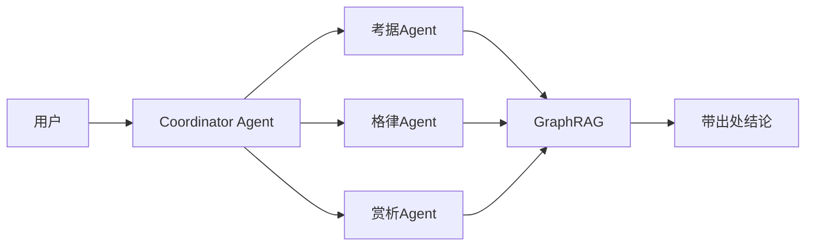

# 第五部分：展望未来的创新与发展 — 参考文献与素材补充

> 更新时间：2026-04-03 | 基于 SCQA 模型重构叙事

---

## 一、SCQA 叙事框架（本部分）

### S - 情境
> 项目已完成核心功能建设，具备向更高层级演进的基础。

### C - 复杂化
> 单一Copilot无法满足复杂研究场景；需要从"智能工具"向"数字人文实验室"演进。

### Q - 问题
> 未来，文心阁将如何继续演进，为古典文学研究带来更大价值？

### A - 答案
> 四大演进方向：多模态古籍语义提取 → 文学时空地理信息系统 → 多智能体协同实验室 → 垂直领域模型微调。

---

## 二、未来演进路线

### 2.1 多模态古籍语义提取

**技术方向：**
- Layout-Aware OCR：针对古籍版式优化的OCR技术
- 从物理文献影像到结构化知识图谱的自动映射

**应用场景：**
- 古籍全文自动识别
- 异体字自动校正
- 版式结构自动分析

**参考文献：**
- [1] 企鹅号 (2026). 《端午古籍数字化痛点》. https://so.html5.qq.com/page/real/search_news?docid=70000021_4756964dd0a50252
- [2] 光明网 (2025). 《数字时代，让古典文学成为"活的传统"》. https://news.gmw.cn/2025-05/05/content_38006568.htm

---

### 2.2 文学时空地理信息系统

**技术方向：**
- GIS：Geographic Information System
- 将知识图谱嵌入历史地理坐标

**应用场景：**
- 诗人迁徙路径可视化
- 文学意象空间演变
- 诗意地理引擎

**参考文献：**
- [3] 腾讯研究院 (2024). 《中国文化遗产数字化研究报告2023-2024》. https://www.sohu.com/a/835346724_121734021

---

### 2.3 多智能体协同实验室

**技术方向：**
- Multi-Agent System
- 升级单一Copilot为"数字学者集群"

**智能体分工：**
| 智能体 | 职责 |
|--------|------|
| 考据Agent | 文献考证、版本比对 |
| 格律Agent | 诗词格律分析 |
| 赏析Agent | 文学赏析与解读 |
| 问答Agent | 综合问答与推理 |

**核心能力：**
- Graph-enhancing RAG 提供带出处、可追溯的结论
- 分工协作，模拟真实学术研究流程

---

### 2.4 垂直领域模型与学术共同体

**技术方向：**
- LoRA：Low-Rank Adaptation 微调
- 基于Local-First积累的数据进行LLM领域微调

**应用场景：**
- 开放API接口
- 高校与研究机构共建
- 分布式"数字文学共同体"

**参考文献：**
- [4] CSDN (2025). 《RAG检索增强生成最新进展2024-2025》. https://blog.csdn.net/weixin_37763484/article_details/148407621

---

## 三、演进路线图

```
2026 ──────────────────────────────────────────────────────►
  │
  ├── Q1-Q2: 多模态古籍语义提取 (Layout-Aware OCR)
  │
  ├── Q3-Q4: 文学时空地理信息系统 (GIS)
  │
  ├── 2027: 多智能体协同实验室
  │
  └── 2028: 垂直领域模型 + 学术共同体
```

---

## 四、总结陈述

### 4.1 核心成果

> "文心阁成功构建'检索-沉淀-解惑'一体化智能研究闭环，有效解决当前古典文学研究工具的核心痛点。"

### 4.2 能力深化

- 优化体验与管理：持续优化检索结果的解释性
- 提升札记的结构化管理能力
- 打造更流畅的研究工作流

### 4.3 证据强化

- 进一步完善知识图谱结构
- 引入更多权威古籍与研究数据源
- 为结论提供可追溯的坚实证据

### 4.4 场景扩展

- 探索高校课程教学场景
- 探索专题学术研读场景
- 将技术红利辐射至更广泛的学术圈层

### 4.5 收尾金句

> "文心阁的旅程才刚刚开始，未来将继续致力于为人文研究插上技术的翅膀。"

---

## 五、需要的图表素材

### 5.1 演进路线图

| 图表 | 工具 |
|------|------|
| 四大演进方向图 | Mermaid / draw.io |
| 时间线图 | Mermaid |

### 5.2 多智能体协作图



---

## 六、参考文献汇总

| 序号 | 来源 | 内容 | URL |
|------|------|------|-----|
| 1 | 企鹅号 | 古籍数字化痛点 | https://so.html5.qq.com/page/real/search_news?docid=70000021_4756964dd0a50252 |
| 2 | 光明网 | 数字时代古典文学 | https://news.gmw.cn/2025-05/05/content_38006568.htm |
| 3 | 腾讯研究院 | 文化遗产数字化报告 | https://www.sohu.com/a/835346724_121734021 |
| 4 | CSDN | RAG最新进展 | https://blog.csdn.net/weixin_37763484/article_details/148407621 |

---

*更新时间：2026-04-03*
